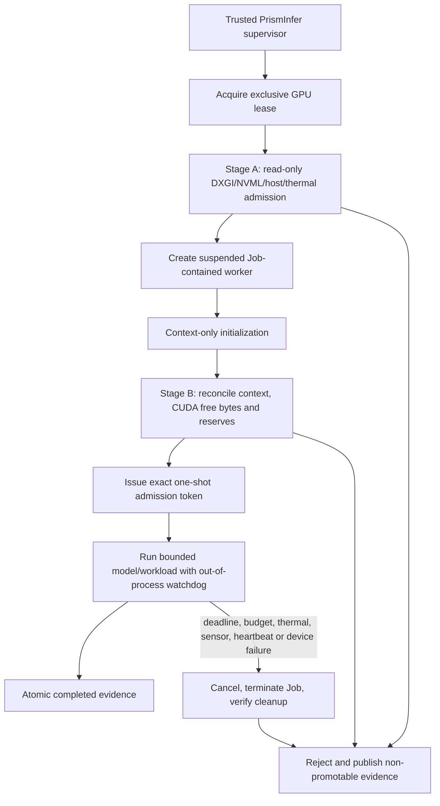

# PrismInfer Final Plan

Status: Adaptive Runtime V2 governance active; M0 and M1 complete. Packet B is
the next implementation packet under the conservative packet order.
Last reconciled: 2026-07-18 (M1)
Operational tracker: [GitHub Project #2](https://github.com/users/Gravelaw/projects/2)

## Authority and Change Control

This file is the single program-control source for thesis, scope, dependency
order, clearances, current status, and phase exit. The authority order is:

1. `AGENTS.md` for safety and repository-operation invariants;
2. this `Plan.md` for program order and clearance;
3. GitHub Project #2 and linked issues for live execution status;
4. `docs/adaptive-runtime-v2/` and phase documents for detailed contracts;
5. source, schemas, tests, and retained evidence for what is actually
   implemented or proven.

If these disagree, no hardware/model promotion may proceed. Reconcile this
file, the affected detailed contract, issue body, and Project fields in the
same change. Project status cannot waive an `AGENTS.md` stop rule. A local or
unmerged document is not implementation evidence.

## Frozen Thesis

> PrismInfer is a safety-supervised, calibration-driven control plane and plan
> executor over a pinned llama.cpp/GGML/GGUF substrate. For one exact
> hardware/runtime/model/service cell, it performs two-stage resource
> admission, measures real execution, enumerates only implemented and
> acknowledged actuators, builds one conservative static plan offline, and
> replays that plan deterministically inside a contained worker.

The first objective is truthful, safe selection and replay—not a clean-sheet
runtime and not a mandatory speedup. The controller may select the strongest
upstream plan or abstain. A speedup claim requires a fresh same-cell win over
the strongest measured upstream sweep.

Kernel selection, staging/prefetch, KV or architecture-state compression,
progressive weights, speculative offload, and structured compute are separate
optional hypotheses. None repairs a failed safety/evidence substrate or a
failed static-controller thesis.

## Success and Falsification Taxonomy

| Thesis | Pass condition | Valid negative conclusion |
|---|---|---|
| Safety/evidence substrate | Containment, two-stage admission, cleanup, watchdog, checked arithmetic, telemetry-loss, crash, timeout, budget-drop, thermal and device-fatal tests pass; promoted unknown bytes are zero. | Automatic hardware/model execution remains disabled. |
| Static controller | An exact-cell plan is executable and acknowledged, stays inside the effective cap, preserves the same quantized-model semantics, meets frozen overhead/regret gates, and abstains outside support. | PrismInfer remains an admission/evidence tool rather than an automatic optimizer. |
| Optimization benefit | Fresh held-out same-cell evidence beats the strongest upstream sweep under cap, quality and tail-latency gates. | Safe selection/replay is retained without a speedup claim. |
| Large-model feasibility | An exact artifact passes optimistic capacity, bandwidth and service-envelope admission before execution. | That exact 30B/70B/90B cell is rejected or classified slow/offline without being loaded. |

### Evidence and claim classes

- **Observed:** directly measured under one declared exact cell.
- **Inferred:** derived from observed values with a named method and uncertainty.
- **Simulated:** produced without the target runtime or hardware path.
- **Capacity-only:** reduces admitted peak bytes but does not meet the
  end-to-end performance gate.
- **Performance:** passes the frozen same-cell end-to-end continuation rule.
- **Quality-preserving:** passes the frozen paired fixtures and statistical
  rule.
- **Rejected/not admitted:** stopped by a predeclared resource, safety,
  evidence, quality, or performance bound.
- **Unsupported:** required evidence is missing or contradictory.

Negative, rejected, research-only, measured-non-certified, slow/offline and
validated results are first-class outcomes. The program must stop instead of
changing thresholds after observing a failure.

## Current Executable Baseline

| Area | Current truth |
|---|---|
| Phases 0–5 | Governance, telemetry, lifecycle, manifests, fake/process backend scaffolding, KV/quality/offload policies, claim taxonomy, comparator and a toy q4 CPU/CUDA scaffold exist. Historical milestone closure does not imply production readiness. |
| Phase 6 branch | Manifest/config foundations and the completed #73 tiny synthetic CUDA launch/copy-back lane are merged. The CUDA path uses toy nibble-plus-scale semantics, not exact selected-artifact GGML quant semantics. |
| Allocation safety | CUDA context creation precedes reservation; a rejected context reservation can be recorded without immediately ending the run. The 16 GiB value is only a policy ceiling. |
| Backend boundary | The llama adapter invokes a shell command through `std::system`; there is no native Job-contained worker, bounded cancellation, or child-tree evidence. |
| Hardware safety | No exclusive GPU lease, staged admission token, live WDDM/host/thermal watchdog, or atomic abort/cleanup state exists. |
| Host admission | #109 supplies authoritative Windows physical/commit telemetry and a pure workload-relative admission primitive. #103 must still integrate it into staged tokens, the watchdog and cancellation before C2. No fixed free-RAM prerequisite is valid. |
| Model evidence | Packet A pins one approved offline Llama 3.1 8B Q4_K_M artifact identity and complete per-tensor inventory under the recorded one-time acquisition exception. Ornith remains an immutable unsupported-converter negative descriptor, and 30B/70B/90B selection remains deferred. No model execution, quality, capacity, calibration or performance evidence exists. |
| Adaptive runtime | Actuator, recovery, optimizer and evidence contracts are documented; the in-process adapter, calibration store, selector and plan executor are proposed, not implemented. |
| Worktree/PR | PRs #72, #104, #105, #106, #108, #110 and #113 establish the pre-M1 merged baseline. PR #111 carries the exact-head-reviewed Packet A closeout for #74/#75/#80; its merge makes M1 repository evidence. Draft PR #112 remains the separate Packet B branch with reviewable #81/#82 work and provisional #103 supervisor/admission work. Packet A grants no model execution, calibration, performance, C2 or sustained-hardware clearance. |

## Frozen Scope

### Core implementation

- checked arithmetic, bounded configuration and release-active validation;
- native worker launch, Job containment, approved artifact roots and identity;
- trusted outer supervisor, exclusive GPU lease and two-stage admission;
- effective GPU/host/pinned/storage budgets with nonzero reserves;
- exact artifact catalog and architecture-state descriptors;
- secure external upstream baseline and worker-contained libllama/GGML adapter;
- actual allocation, operator/path, state, transfer and child-tree evidence;
- pinned actuator, acknowledgement and R0/R1/R2 recovery inventory;
- immutable raw calibration observations and conservative cost tables;
- one static plan per exact non-semantic service profile;
- deterministic replay, drift invalidation, abstention and bounded recovery;
- foundation confirmation, Ornith stress, then 30B static truth or rejection.

### Optional independently falsified providers

- per-shape upstream/custom kernel dispatch and matmul candidates;
- bounded staging and prefetch;
- full-attention KV placement/quantization and architecture-specific state
  policies;
- activation-transfer compression or a static progressive-weight artifact;
- exact committed-output-aware speculative offload;
- structured-compute oracle, followed by router/adaptation only if admitted;
- joint optimization only after at least two mechanisms pass independently.

### Out of scope for this implementation program

- replacing llama.cpp/GGML wholesale;
- global online optimization or learned exploration in the token path;
- per-query recompression of immutable weights;
- prompt-only permanent neuron/layer disabling without an adapted artifact;
- individual-neuron CPU/GPU transfers;
- Mojo as the native Windows runtime (it may be an isolated C ABI provider);
- unadmitted 70B/90B execution;
- multi-GPU, distributed serving or general multi-tenant scheduling;
- broad model training or benchmark-score claims copied from model cards.

## Model and Quantization Cells

| Cell | Frozen role | Gate |
|---|---|---|
| Tiny deterministic artifact | Parser, schema, lifecycle, fault and CPU/tiny-CUDA correctness. | Pin before automated safety tests. |
| Llama 3.1 8B Instruct | Preferred conventional text/GQA foundation if license/access, pinned llama.cpp support, self-produced GGUF and quality baseline are accepted. | #80 final immutable selection. |
| Gemma 2 9B | Optional architecture-aware transformer control only; its alternating local/global attention must be modeled. It is not a globally full-attention control. | Separate exact cell if retained. |
| Ornith-1.0-9B | Secondary capability and hybrid Qwen3.5-family stress cell. Text main artifact, MTP, mmproj and multimodal scope are distinct. | Attempt only after foundation clearance and converter/operator/state coverage. |
| Qwen3.5-9B | Ornith lineage and architecture reference, not an independent conventional control. | Metadata/support comparison only unless separately admitted. |
| Exact 30B | First heterogeneous static-placement truth cell. | #84 admission, then #90. |
| Exact 70B/90B | Capacity/resource-DAG lower bounds first. | #97 refreshed admission; #99/#100 activate independently only if admitted. |

Primary requested constrained tiers are 10 GiB and 12 GiB. The 8 GiB tier is
stress-diagnostic only. Requested tier, policy ceiling, pre-context cap,
post-context cap, and observed peak are separate fields; a live effective cap
may be lower than the requested tier.

`Q4_K_M` is a quantization recipe/file-type label that can contain multiple
per-tensor `ggml_type` values. #74 must inventory every type in the pinned
artifact, provide exact reference fixtures for every type used by a claimed
path, and acknowledge upstream fallback for unsupported tensors. A custom
kernel may claim only its eligible tensor subset. Full FP16 materialization is
never hidden behind a constrained-VRAM claim.

## Supervisor and Worker Boundary



Pre-context admission is conservative because it cannot know the exact CUDA
context footprint. Model/workload allocation is allowed only after the second
post-context reconciliation succeeds. A rejected/stale token or allocator
reservation ends the transition immediately.

## Clearance Matrix

| Clearance | Required closure/evidence | Newly permitted work |
|---|---|---|
| C0 CPU and simulation | Current dependency preflight and CPU verification. | Documentation, schemas, unit/fuzz fixtures, offline planning and simulated breaches. |
| C1 tiny attended CUDA | #73 lane, hardware preflight, serial 60-second fixture and required sanitizer result. | Tiny deterministic correctness only; no sustained/model work. |
| C2 hardware-safety prerequisite | #81 secure Job worker + #82 safety evidence subset + #103 supervisor/admission fault suite. | Supervised tiny CUDA and a separately admitted small smoke artifact. Not 8B/9B or calibration. |
| C3 supervised model-evidence run | C2 plus #74/#75/#76 tooling, #80 artifact pin and #84 exact admission. | The short attended #77 foundation warmup/baseline only, under its exact one-shot admission token; #77 owns the resulting evidence. |
| C4 calibration readiness | #78 Phase 6 audit, #83 actuator inventory, #85 actual-path adapter, #86 frozen sample plans and drift rules. | Designed supervised foundation calibration. |
| C5 calibrated static replay | #87 selector/oracle gates and #88 immutable acknowledged replay/recovery tests. | First safe calibrated static foundation replay. |
| C6 Phase 7 exact-cell clearance | #89 fresh confirmation and security/evidence/claim audit. | Exact foundation result; Ornith only as its separately admitted stress cell. |
| C7 30B static truth | #84 exact 30B admission and accepted #90 result or rejection. | Independent issue-specific #91–#95 optional-mechanism entries; no joint work. |
| C8 optional-mechanism decisions | #90 plus each mechanism's own #91–#95 entry and evidence gate; #96 audit. | Packet G refreshed admission and only separately admitted dynamic, joint, or scale cells. |
| C9 final program classification | #97 refreshed admission, conditional #98–#100, #101 and #102. | Publication of the retained final classifications; no new hardware/model clearance. |

No issue, milestone or Project status may skip a clearance row.

## Canonical Dependency Matrix

Dependencies, not phase numbers, determine execution order. Safety work from
Phase 7 may therefore execute before model-backed Phase 6 evidence.

| Issue | Responsibility | Required predecessors | Planned state at freeze |
|---|---|---|---|
| #73 | Tiny synthetic CUDA correctness only. | C0 and attended hardware preflight. | Done |
| #74 | Exact per-tensor GGML quant semantics/fixtures. | #73 for CUDA reuse; CPU reference work may start now. | Done in Packet A PR #111 |
| #75 | Strict manifest-emitting evidence runner. | Provisional on #74's reviewed CPU checkpoint; final acceptance remains packet-gated. | Done in Packet A PR #111 |
| #76 | Mandatory quality fixtures; optional offline KV evaluator remains separately classified. | #80 for final artifact; model execution also requires C2 and #84. | Ready |
| #77 | Supervised same-cell upstream and PrismInfer foundation evidence; no mandatory custom-kernel/KV win. | #73-#76, #80-#82, #84 and #103. | Blocked |
| #78 | Phase 6 evidence and claim audit. | #77. | Blocked |
| #79 | Final council, root Plan and tracker freeze. | Current repository/session evidence. | Done |
| #80 | Pin foundation, Ornith stress and smoke artifacts. | #79 plus Phase 6 artifact rules. | Done in Packet A PR #111 |
| #81 | Secure native external worker/Job boundary. | #79 and pinned external executable identity. | Review in draft PR #112 |
| #82 | Minimum live Windows/WDDM/host/file/transfer evidence. | #79; integrates #81. | Review in draft PR #112 |
| #83 | Pinned actuator/acknowledgement/recovery inventory. | #79 and pinned runtime source/build. | Ready |
| #84 | Exact 8B/9B/30B/70B/90B capacity and bandwidth admission. | #74, #80, #82 and #103. | Blocked |
| #85 | Worker-contained in-process adapter and actual-path trace. | #78, #80-#83 and #103. | Blocked |
| #86 | Fingerprint, immutable calibration store and metric sample plans. | #84, #85 and #103. | Blocked |
| #87 | Static resource-DAG selector and feasible-oracle comparison. | #83 and #86. | Blocked |
| #88 | Immutable acknowledged plan replay and R0/R1/R2 recovery. | #83, #87 and #103. | Blocked |
| #89 | Foundation confirmation, Ornith stress and Phase 7 audit. | #78, #80, #84, #88 and #103. | Blocked |
| #90 | Exact 30B static heterogeneous placement or rejection. | #84 and #89. | Backlog |
| #91 | Optional kernel dispatch and bounded staging hypotheses. | #90 and #88. | Backlog |
| #92 | Optional KV/architecture-state policy. | #90 and approved #76 offline evidence. | Backlog |
| #93 | Optional committed-output-aware speculative offload. | #90 and #88. | Backlog |
| #94 | Optional progressive representation hypotheses. | #90 plus security/provider/quality approval. | Backlog |
| #95 | Optional structured-compute oracle, then router gate. | #90 plus privacy/quality approval. | Backlog |
| #96 | Independent optional decisions and Phase 8 audit. | #90 and a pass/reject/not-admitted record for #91-#95. | Backlog |
| #97 | Refresh exact scale admission. | #84 and #96. | Backlog |
| #98 | Optional admitted 30B dynamic result. | #90 and #97. | Backlog |
| #99 | Exact admitted 70B result/rejection. | #97 admission of that artifact. | Blocked |
| #100 | Exact admitted 90B result/rejection. | #97 admission of that artifact. | Blocked |
| #101 | Portability, invalidation and recalibration. | #98 plus each activated/rejected #99/#100 record. | Backlog |
| #102 | Final security, evidence and claim audit. | #96 and #101. | Backlog |
| #103 | Fail-closed hardware supervisor and staged admission boundary. | #79, #81, the safety subset of #82 and the #109 host-admission primitive. | In Progress provisionally in draft PR #112 |

## Critical Path

```text
M0 Adaptive Runtime V2 governance migration
  -> M1 / Packet A: #74 -> #75 -> #80 exact offline truth and cells
  -> M2 / Packet B: #81 -> #82 -> #103 secure hardware boundary
  -> M3 / Packet C: #84 -> #76 -> #77 -> #78 foundation evidence/audit
  -> M4 / Packet D: #83 -> #85 -> #86 actual-path and calibration substrate
  -> M5 / Packet E: #87 -> #88 -> #89 static controller and two-stage pilot
  -> M6 / Packet F: #90 -> independent #91-#95 -> #96 optional audit
  -> M7 / Packet G: #97 -> #98 -> conditional #99/#100
                    -> #101 portability -> #102 final audit
```

Packet A is CPU/offline only. Packet B must close before Packet C performs any
model-backed execution, and Packet C consumes accepted evidence from both.
Safe parallel review is limited to already retained work and independent
CPU/source/fixture analysis whose predecessors are satisfied; it cannot grant a
later packet exit. Hardware steps remain serial per device.

## Integration Packets and Review Contract

Issue #107 establishes execution packaging and review inheritance. It changes
how approved issue work is delivered; it does not change the dependency graph,
acceptance criteria, clearance matrix, or hardware authorization boundary.

Cross-cutting issue #109 is the completed-on-merge pre-packet safety correction
for workload-relative host admission and authoritative Windows commit telemetry.
It is consumed by #82/#103/#84, does not reorder Packet A, and grants no C2,
model, calibration, benchmark or hardware clearance.

Adaptive Runtime V2 M0 is the documentation/governance migration that precedes
resumption of the packet branches. It changes no issue dependency or clearance.
After M0 reaches `main`, draft PRs #111 and #112 must rebase on that exact head
and port any still-applicable V1 document changes into the sole V2 owner
document. They must not recreate the former V1 active directory. Under the
conservative packet order, Packet A closes before Packet B may merge; review of
already retained Packet B work may continue without granting its exit.

The persistent program goal keeps one packet active at a time. Within that
packet, issues remain sequential checkpoints with their own acceptance evidence
and Project status, while one integration PR carries the packet by default.

| Packet | Sequential issue checkpoints | Packet exit |
|---|---|---|
| Bootstrap, completed | PR #104 -> PR #72 -> #73/PR #105 -> #79/PR #106 -> #107 integration governance -> #109 host-admission correction | Merged governance/freeze, C1 tiny-lane and host-admission primitive baseline; no model clearance. |
| A, quant and artifacts | #74 -> #75 -> #80 | Exact per-tensor truth, strict runner and immutable artifact cells are reviewable together. |
| B, hardware boundary | #81 -> #82 -> #103 | Secure worker, minimum live evidence and fail-closed supervisor pass one exact-head safety review. |
| C, admission and Phase 6 | #84 -> #76 -> #77 -> #78 | Exact admission, quality/evidence and the Phase 6 audit close at #78. |
| D, adapter and calibration | #83 -> #85 -> #86 | Actuator inventory, actual-path adapter and immutable calibration/sample-plan foundation agree. |
| E, static controller | #87 -> #88 -> #89 | Selector, acknowledged replay/recovery and the Phase 7 audit close at #89. |
| F, 30B and optional mechanisms | #90 -> independently checkpointed #91-#95 -> #96 | 30B static truth precedes optional decisions; the Phase 8 audit closes at #96. |
| G, scale and final audit | #97 -> #98 -> conditional #99/#100 -> #101 -> #102 | Only admitted scale cells execute; portability and the final audit close at #102. |

Packet order is the conservative single-goal order. An issue checkpoint cannot
use a later checkpoint in the same packet as if it were already merged or
proven. If a packet becomes too large or crosses an independently reviewable
trust boundary, split it at that boundary without changing issue dependencies.
Child PRs are exceptional; they are for concurrent authors or isolated review
boundaries, not one-PR-per-issue ceremony.

At the initial goal recovery and every packet transition, record the `main`
base SHA, active packet, governing-contract hashes, repository/GitHub state and
allowed hardware level. Each checkpoint records its issue, commit/tree SHA,
paths, risk tier, focused tests and claim boundary. The packet PR records the
complete issue-to-commit map.

An independent review may be inherited only for an unchanged exact tree whose
ancestry and receipt are verified. Parent and phase reviews inspect unreviewed
commits, integration/conflict changes, changed contracts and evidence/claim
deltas; they do not re-review unchanged covered diffs. A changed reviewed path
invalidates that receipt. Full applicable CPU/hosted validation runs once at
the final packet head, while focused deterministic checks run at checkpoints.

Risk-tier minimums are defined in `AGENTS.md`: T0 documentation/tracker, T1
ordinary CPU, T2 safety-critical code/governance and T3 hardware/model evidence.
Deep phase security/evidence/claim audits occur at #78, #89, #96 and #102.
No packet or program-level prompt authorizes a self-hosted workflow, CUDA/model
execution, download, calibration, benchmark or sustained hardware run.

## Phase Outcomes

### Phase 6: safety and exact evidence foundation

- #103 closes the hardware-safety prerequisite.
- Exact per-tensor quant truth, quality fixtures and strict evidence tooling
  exist.
- #77 records the supervised same-cell baseline/candidate result.
- #78 classifies the evidence honestly.
- A custom-kernel or KV-compression win is optional. `>=1.10x` remains only a
  threshold for a custom-kernel speedup claim, not a phase-exit requirement.

### Phase 7: secure static calibrated controller

- One exact foundation plan is measured, selected/abstained, acknowledged and
  replayed inside the supervisor/worker boundary.
- Ornith is attempted only as a separate hybrid stress cell.
- Safe selection of the upstream winner is controller success but not an
  optimization-benefit claim.

### Phase 8: 30B static truth and optional mechanisms

- Measure or reject 30B static placement first.
- Each optional mechanism passes, rejects or is not admitted independently.
- Joint planning runs only after two independent mechanisms pass.

### Phase 9: admitted scale and final audit

- Refresh all artifact/hardware admission before long runs.
- Execute only independently admitted exact 30B/70B/90B cells.
- Finish portability/invalidation and final security/evidence/claim audit.

## Verification and Definition of Done

Every implementation issue must include, as applicable:

- checked arithmetic and negative/boundary tests;
- CPU/reference differential correctness before performance work;
- strict warnings/static analysis and host sanitizer/fuzz evidence;
- tiny bounded Compute Sanitizer evidence for changed CUDA paths;
- timeout, cancellation, cleanup and fault-injection results;
- exact source/runtime/artifact/fixture/environment hashes;
- requested-versus-actual execution acknowledgement;
- raw trials, threshold/sample-plan version and claim classification;
- documentation, risk register, issue dependency and Project field updates;
- no performance promotion from stale, mismatched or pre-policy CI artifacts.

An issue is not Done merely because code exists locally. Its required tests and
evidence must pass, its PR must be reviewable/merged as appropriate, and Project
#2 must read back the status and fields declared here.

Run the read-only synchronization check after every Plan or tracker change:

```powershell
powershell -NoProfile -ExecutionPolicy Bypass -File scripts\validate-plan-project-sync.ps1
```

## Project #2 Synchronization Contract

- Coarse `Status`: `Todo`, `In Progress`, or `Done`.
- Detailed `Phase Status`: `Backlog`, `Ready`, `In Progress`, `Blocked`,
  `Review`, or `Done`.
- Every active item has Priority, Risk, Roadmap Phase, Roadmap Slice, Roadmap
  Gate and milestone.
- Closed historical issues use `Status=Done` and `Phase Status=Done`.
- Phase 8 is named **Optional Mechanisms**, not Adaptive Mechanisms.
- #73, #79 and cross-cutting #107 are closed with their retained tiny-fixture,
  final-freeze and integration-train evidence. Cross-cutting #109 records the
  host-admission correction and is `Done` when this contract reaches `main`.
- #74, #75 and #80 are `Done` with Packet A's exact-head evidence and review
  receipts. #81/#82 are in `Review` and #103 is provisionally `In Progress` in
  draft PR #112. #76 and #83 are `Ready`;
  dependency-gated #77-#78 and #84-#89 are `Blocked`; later work remains
  `Backlog` except independently admission-blocked #99/#100.
- PR #111 is the Packet A integration PR. Draft PR #112 is retained
  Packet B review work and remains merge-gated by the conservative packet order.
  Both must rebase after M0, must not restore the former V1 active directory,
  and require new independent exact-head review because the prior tree and
  documentation paths will have changed.
- PR #72 is merged evidence/documentation history; neither its checks nor the
  later governance/tiny-lane merges grant hardware or model clearance.

The Project README must summarize this plan and link here first. A tracker
readback is part of every phase audit.

## Reopen Conditions

Reopen the architecture council only when evidence shows one of the following:

- pinned llama.cpp/GGML cannot expose or acknowledge the minimum required
  controls without a broad fork;
- the in-process adapter weakens memory/evidence truth versus the secure
  external baseline;
- Llama/Ornith artifact, license, converter or operator/state support invalidates
  the selected cells;
- the selector cannot approach the feasible oracle or safely abstain;
- 32 GiB host capacity makes the 30B static cell inadmissible;
- no optional representation offers random access and bounded reconstruction;
- the primary hardware target changes the resource hierarchy materially.

Otherwise, implementation follows this dependency matrix without another
theory expansion.
