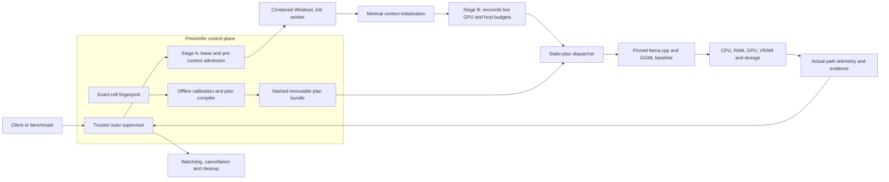
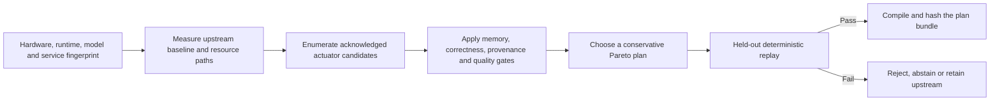
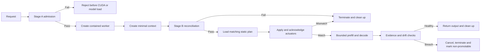

# PrismInfer

PrismInfer is a research-stage, safety-supervised control plane and plan
executor for running GGUF large language models on memory-constrained Windows
systems. It is being designed to calibrate an exact hardware/runtime/model
cell, choose only measured and acknowledged llama.cpp/GGML controls, and replay
a conservative static plan under hard GPU- and host-memory limits.

> [!IMPORTANT]
> PrismInfer is not currently a production model server. It has not yet proved
> constrained 8B/9B execution, 30B-90B feasibility, or a speedup over upstream
> llama.cpp. [`Plan.md`](Plan.md) is the canonical source for implementation
> order, clearances, and claim gates.

## Why PrismInfer

Fitting model weights in VRAM is only one part of constrained inference.
Runtime memory also includes KV and architecture-specific recurrent state,
operator workspaces, graph allocations, fragmentation, driver reservations,
and in-flight transfers. Moving tensors to CPU or compressing them can reduce
device pressure while making inference slower because PCIe transfers,
decompression, CPU contention, or page faults become the critical path.

PrismInfer therefore treats inference as a measured planning problem for one
exact deployment cell, not as a universal offload rule:

1. fingerprint the device, host, runtime, model artifact, and service target;
2. admit the run against live physical resources before and after GPU-context
   creation;
3. calibrate upstream behavior and only the actuators the runtime can prove it
   applied;
4. reject infeasible candidates before optimizing latency or throughput;
5. compile an immutable plan and replay it in a contained worker; and
6. record requested-versus-actual execution evidence, including abstention and
   fail-closed recovery.

Selecting the upstream llama.cpp plan can be the correct result. A safe
rejection is also a valid result when the requested model, context, or service
level cannot fit the admitted hardware budget.

## Target architecture

The following is the intended architecture. Components marked as planned in
the status table below are not current runtime capabilities.



PrismInfer owns admission, calibration, policy selection, plan integrity,
containment, and evidence. llama.cpp/GGML continues to own GGUF loading, model
graphs, tokenization, sampling, baseline operators, and supported hardware
backends. Optional custom kernels, KV/state compression, staged transfers,
speculative decoding, and structured sparsity remain independent providers
behind their own correctness, quality, profitability, and recovery gates.

## Workflows

### Offline calibration and plan compilation

Calibration is bounded evidence collection, not unrestricted autotuning. It
begins with the upstream baseline and can consider only controls that are
implemented, acknowledged, and observable on the exact cell.



The first selector does not require a neural optimizer. It can use measured
tables, conservative analytical bounds, and deterministic search. Hard
feasibility gates come first; among feasible plans it minimizes measured
critical-path and tail latency while maximizing throughput for the committed
service target. Transfer volume, host pressure, energy, stability, and plan
simplicity are tie-breakers. It is not primarily trying to minimize the time
spent computing placement.

Candidate controls may eventually include CPU/GPU placement, context and batch
sizes, KV/state policy, transfer staging, compression, or operator choice—but
only after each is implemented and its actual application can be verified.
Prompt-conditioned arbitrary neuron or layer skipping is outside the first
proof because it changes model semantics and requires separate model-aware
quality evidence.

### Admitted runtime replay



The normal token path is deterministic plan replay; it does not train a model,
run an open-ended search, or solve a large optimization problem per token.
Recovery may substitute a pre-certified local variant, switch at a compatible
boundary, or restart/reject. It must not silently continue after a cap,
identity, or evidence breach.

## Current status

| Area | Repository status |
| --- | --- |
| Memory governance | C++20 cap policies, allocation/host/KV ledgers, checked configuration, and fail-closed policy scaffolding exist. |
| Telemetry and evidence | JSONL lifecycle telemetry, manifests, model sidecars, schemas, claim validation, and deterministic fixtures exist. |
| Backends and planning | Fake/null backends, a process-backed llama.cpp baseline scaffold, and caller-fed hybrid/offload planning scaffolds exist. They are not actuator-bound optimized replay. |
| Compute research | Tiny CPU and opt-in CUDA Q4 decode/GEMV correctness scaffolds exist. They are not model-scale kernels or performance claims. |
| Supervisor and execution | The trusted outer supervisor, exclusive GPU lease, two-stage live admission, native contained worker, watchdog path, and plan executor remain gated work. |
| Calibration and optimizer | The exact-cell calibration store, cost model, constrained selector, immutable bundle, and held-out promotion flow remain planned. |
| Model evidence | No 8B/9B constrained-runtime result, 30B-90B deployment result, production-serving claim, or speedup claim has been established. |

The active proof is deliberately narrower than a general dynamic runtime: make
one exact pinned model/runtime/hardware/service cell safe and reproducible,
then expand only from retained evidence. Ornith is a separate
hybrid-architecture stress cell, not a basis for generalizing ordinary
Transformer KV-cache behavior.

## Scope boundaries

| In the core path | Optional after independent gates | Outside the first proof |
| --- | --- | --- |
| Exact-cell identity and provenance | Custom matrix or decode kernels | A clean-sheet replacement for llama.cpp |
| Live admission and resource accounting | KV or recurrent-state compression | Unverified dynamic tensor migration per token |
| Calibration of real runtime controls | Progressive layer or tensor staging | Arbitrary prompt-conditioned neuron/layer skipping |
| Static plan selection and replay | Speculative or draft-model decoding | Claims generalized across untested hardware/model buckets |
| Containment, watchdogs, recovery, evidence | Structured sparsity or routed providers | Treating pagefile capacity as physical RAM |

## Safety and clearance

Read [`AGENTS.md`](AGENTS.md) and
[`docs/codex-environment.md`](docs/codex-environment.md) before building or
running the project.

- `16 GiB` is a validation policy ceiling, never a target allocation. The
  effective GPU cap is lower after live reservations and safety headroom.
- Host admission is based on current physical-RAM availability, commit
  headroom, disk reserve, and workload estimates. There is no universal
  `24 GiB available RAM` prerequisite, and pagefile capacity is never credited
  as physical RAM.
- Sustained CUDA, calibration, model loading, and 8B/9B-or-larger execution
  remain prohibited until the supervisor, admission, containment, checked
  arithmetic, and watchdog gates in [`Plan.md`](Plan.md) are satisfied.
- CUDA support is never an implicit setup step. The checked-in synthetic kernel
  lane is tiny-fixture correctness only; it grants no model or sustained-work
  clearance.

## CPU-safe development

Run the dependency-only preflight first:

```powershell
.\scripts\dev-setup.ps1 -SkipBuild
```

The repository's bounded CPU verification entry point configures a Debug
build, runs tests, and exercises the fail-closed smoke matrix:

```powershell
.\scripts\verify.ps1
```

Equivalent manual commands are:

On Windows, use the guarded local verification path:

```powershell
.\scripts\verify.ps1
```

The default conservatively estimates build parallelism from a fresh physical
and commit snapshot, the T-101 development reserves, and 2 GiB per job. This is
a non-promotable preflight, not a live process-tree memory cap. `-BuildJobs
1..8` is an upper cap only; it cannot bypass the memory-derived bound.

On Linux or macOS, `verify.ps1` is not the local entry point. Use a bounded
CPU-only configure/build/test sequence; this does not create a promotable host
admission receipt:

```bash
cmake -S . -B build -DCMAKE_BUILD_TYPE=Debug
cmake --build build --parallel 1
ctest --test-dir build --timeout 60 --output-on-failure
```

CUDA remains opt-in. The probe and tiny synthetic kernel lanes are configured
separately; neither grants model-scale or sustained-workload clearance:

```powershell
cmake -S . -B build-cuda -DPRISMINFER_ENABLE_CUDA_PROBE=ON
cmake --build build-cuda --config Debug --parallel 1
ctest --test-dir build-cuda -C Debug --timeout 60 --output-on-failure
```

CUDA kernel prototype builds are gated separately from probe support. On
Windows, the checked-in CMake preset targets Visual Studio 2026 and an sm_120
GPU:

```powershell
cmake --preset vs2026-cuda-sm120
cmake --build --preset vs2026-cuda-sm120 --parallel 1
ctest --test-dir build/vs2026-cuda-sm120 -C Debug -L cuda_kernel --timeout 60 --output-on-failure
```

For a different CUDA GPU, copy the preset locally or configure manually with
the matching `PRISMINFER_CUDA_KERNEL_ARCHS` value.

## Probe

```powershell
.\build\Debug\prism-probe.exe --mode 1gb-safe-cpu --run-id cpu-smoke --telemetry probe.jsonl --manifest manifest.json
.\build\Debug\prism-validate-lifecycle.exe probe.jsonl
```

GPU-probed mode is expected to fail closed when CUDA probe support is absent:

```powershell
.\build\Debug\prism-probe.exe --mode 1gb-safe-gpu-probed
```

Model metadata can be validated without loading llama.cpp, and allocator cap
paths can be exercised without a large allocation:

```powershell
.\build\Debug\prism-probe.exe --mode 1gb-safe-cpu --model tiny.gguf --sidecar tiny.gguf.prism.json
.\build\Debug\prism-probe.exe --mode 1gb-safe-cpu --simulate-allocator-peak-bytes 1073741825
```

## Repository map

| Path | Purpose |
| --- | --- |
| [`include/prisminfer/`](include/prisminfer/) and [`src/`](src/) | C++20 policy, telemetry, validation, backend, planning, KV, quality, and kernel scaffolding |
| [`tools/`](tools/) | Bounded probe, validation, comparison, quality, and offline planning tools |
| [`tests/`](tests/) | Deterministic unit fixtures and gated hardware-specific tests |
| [`schemas/`](schemas/) | Evidence, telemetry, sidecar, and benchmark contracts |
| [`configs/`](configs/) | Safe modes and offline/simulated policy fixtures |
| [`scripts/`](scripts/) | Dependency preflight, bounded verification, cleanup, and plan/tracker checks |
| [`third_party/`](third_party/) | Provenance pins only; no llama.cpp source or model artifact is vendored |
| [`docs/adaptive-runtime-v2/`](docs/adaptive-runtime-v2/) | Active adaptive-runtime V2 thesis, architecture, mathematics, safety, evidence, research, and milestones |
| [`docs/archive/`](docs/archive/) | Curated source-controlled history; no active instruction depends on the ignored local archive |

## Canonical design documents

- [`Plan.md`](Plan.md) — binding program order, clearances, packets, and tracker contract
- [`Adaptive Runtime V2 index`](docs/adaptive-runtime-v2/README.md) — authority map and reading order
- [`program-charter.md`](docs/adaptive-runtime-v2/program-charter.md) — thesis, scope, cells, and claim taxonomy
- [`architecture.md`](docs/adaptive-runtime-v2/architecture.md) — provisional GGML seam, providers, and runtime reopen gates
- [`optimizer-mathematics.md`](docs/adaptive-runtime-v2/optimizer-mathematics.md) — corrected objectives, constraints, and statistical definitions
- [`safety-actuation-and-admission.md`](docs/adaptive-runtime-v2/safety-actuation-and-admission.md) — supervisor, admission, acknowledgements, and recovery
- [`evidence-thresholds-and-security.md`](docs/adaptive-runtime-v2/evidence-thresholds-and-security.md) — evidence schema, thresholds, sampling, and provider trust
- [`research-hypotheses-and-references.md`](docs/adaptive-runtime-v2/research-hypotheses-and-references.md) — current theory, novelty boundary, and primary literature
- [`major-milestones.md`](docs/adaptive-runtime-v2/major-milestones.md) — M0 and Plan packets A through G
- [`decisions-and-red-team.md`](docs/adaptive-runtime-v2/decisions-and-red-team.md) — non-normative council and red-team rationale

Detailed historical phase evidence remains under [`docs/`](docs/) and curated
superseded material under [`docs/archive/`](docs/archive/). The ignored
`.local-archive/` is preservation-only and is never authoritative.

## License

PrismInfer's first-party source code, documentation, scripts, tests, schemas,
and configuration are licensed under the Apache License, Version 2.0. See
[`LICENSE`](LICENSE) and [`NOTICE`](NOTICE).

Third-party software, optional system libraries, and external model artifacts
remain under their respective terms; see
[`THIRD_PARTY_NOTICES.md`](THIRD_PARTY_NOTICES.md). This repository does not
include model weights, tokenizers, production GGUF artifacts, llama.cpp source,
or the NVIDIA CUDA Toolkit.
