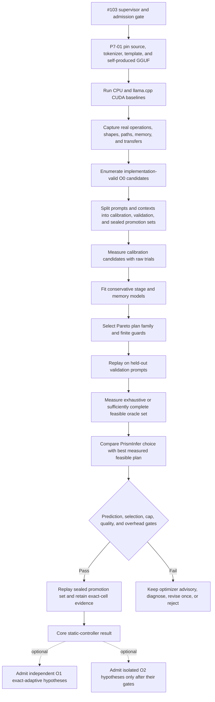

# 8B/9B PrismInfer Static-Controller Experiment

Status: final proposed decisive Phase 7 experiment. Model-backed execution is
blocked until [#103](https://github.com/Gravelaw/prisminfer/issues/103) closes.

This protocol tests the theorized PrismInfer approach first on a conventional
8B foundation and then, separately, on a 9B hybrid stress model. The core under
test is a safety-supervised, offline-calibrated static controller, not merely a
model-load or tokens-per-second benchmark.

## Research Questions

1. Can device/model calibration predict the cost and feasibility of valid
   llama.cpp/GGML execution plans?
2. Can PrismInfer select a plan that is close to the best measured feasible
   plan on held-out prompts and context bands?
3. Does plan selection add less overhead than the benefit it creates?
4. Does the selected plan remain within the 16 GiB ceiling and host limits?
5. Does the plan preserve exact behavior when it changes only execution and
   placement?
6. As independent, nonblocking hypotheses, do later kernel, KV, progressive,
   speculative, or structured mechanisms improve the best exact static plan
   after their quality and fallback costs are included?
7. When device/runtime/workload state drifts, does PrismInfer reject or fall
   back before a cap or quality failure?

## Hypothesis

For an exact foundation validation cell, a safety-supervised offline calibrated
planner can select among implementation-valid static execution plans such that,
on held-out workloads:

```text
selected plan is feasible and cap-safe
selected committed output tokens/s is within 5% of the best enumerated feasible plan
selected p95 inter-token latency is within 10% of the best feasible tail plan
prediction error stays inside the declared envelope
runtime orchestration overhead is <= 2%
```

A speedup over the best static llama.cpp plan is a separate hypothesis. The
optimizer can be useful as a reliable selector even if the upstream plan is
already optimal.

## Model Cells

### Foundation cell: Meta Llama 3.1 8B preferred

The first controller proof prefers a pinned llama.cpp-supported Meta Llama 3.1
8B artifact. This conventional dense global-attention decoder isolates the
controller, ordinary KV, placement, and runtime contracts from hybrid
linear-attention and multimodal state. P7-01 owns the final selection and must
record Meta license acceptance, access, exact source revision, converter
support, reproducible GGUF production, and hashes before the preference becomes
a pin.

Gemma 2 may be retained as an optional comparison, but its interleaved
sliding-window/global-attention pattern must be represented exactly. It is not
called a globally full-attention foundation.

The foundation artifact requires:

- exact source revision and license record;
- tokenizer, chat template, config, and architecture pin;
- reproducible conversion and self-produced q4 quantization;
- source and quant hashes;
- CPU and CUDA generation baseline;
- full-attention KV/state descriptor; and
- task/quality fixtures.

### Secondary capability/hybrid stress cell: Ornith-1.0-9B

`deepreinforce-ai/Ornith-1.0-9B` remains central because the user selected it as
a high-capability 9B candidate. It is not the generic foundation cell. Its
Qwen3.5-family text stack mixes Gated DeltaNet/linear-attention and
full-attention layers, and its source configuration includes multimodal
components. It becomes a certified stress cell only when all of these pass:

- exact source revision and license record;
- tokenizer, chat template, config, and architecture pin;
- pinned llama.cpp/GGUF support for the exact Qwen3.5-family graph;
- reproducible conversion and self-produced q4 quantization;
- source and quant hashes;
- CPU and CUDA generation baseline;
- task and coding quality fixtures; and
- explicit modality scope, main GGUF and optional `mmproj` hashes/placement,
  MTP inclusion/omission, full-attention layer set, Gated DeltaNet
  recurrent/convolution state layout/bytes, and unsupported-operator report.

### Additional controls

- Qwen3.5-9B as a lineage comparator, not an independent architecture control.
- A small deterministic model for fast correctness, schema, and fault tests.

Results are reported per model and architecture-state contract. A pass on the
foundation does not imply Ornith passes; a pass on Ornith does not imply an
ordinary full-attention KV result or all Qwen3.5-family artifacts pass.

### Quantization identity

The preferred derived artifact may use a mixed recipe such as `Q4_K_M`, but
`Q4_K_M` is not a single block type. Every retained cell records both the recipe
and each tensor's actual `ggml_type`, block layout, shape, and byte count.
Reference and candidate implementations must exactly support every tensor type
they consume; a toy `Q4Block` fixture is synthetic correctness evidence only.

## Experimental Levels

### O0: upstream-control optimizer, no new semantic mechanism

This is the decisive Phase 7 test. Candidate variables are limited to controls
with an implemented descriptor in `actuator-and-recovery-matrix.md` that the
pinned runtime can apply and acknowledge. O0 is a static plan; load/context
decisions do not change mid-request:

```text
CPU-only versus CUDA
GPU layer count / contiguous CPU-GPU split
supported tensor buffer overrides
generation and batch thread topology
context, batch, and ubatch
supported architecture-state/KV types and placement for the exact model
flash-attention setting where supported
mmap, direct-IO, mlock, fit margin, and related load controls
upstream speculative mode disabled for the primary exact baseline
prefill versus decode request parameters only where the actuator matrix proves
  a compatible boundary
```

O0 tests whether PrismInfer can calibrate and choose well without claiming a
new kernel or approximation.

### O1: optional exact adaptive execution

Add only after O0 and the in-process adapter pass:

```text
per-shape eligible kernel selection through an acknowledged hook
bounded pinned staging and measured prefetch
phase-aware placement transitions
upstream speculative decoding with exact target verification
```

Every candidate preserves the declared model behavior. Recovery is classified
as local substitution, compatible-boundary transition, or restart/reject; the
experiment does not claim generic seamless fallback. No O1 result is required
to complete the static controller. A separately advertised custom/adaptive-
kernel speed claim uses its frozen same-cell claim threshold (currently
`>=1.10x` where that claim is declared), but that threshold is not a Phase 6 or
Phase 7 completion gate.

### O2: optional approximate or derived mechanisms

Run as separate Phase 8 lanes:

```text
KV quantization/retention
progressive base-plus-residual weights
activation transfer compression
hidden-state-conditioned structured blocks
speculative target offload
```

O2 candidates do not enter the joint optimizer until their individual quality,
memory, overhead, and fallback gates pass.
They may all be rejected without invalidating an O0 controller result.

## Experiment Design



## Candidate Matrix for O0

The exact values are generated from the pinned runtime and memory admission,
not hard-coded across models. A representative initial matrix is:

| Axis | Candidate examples |
|---|---|
| Cap tier | 8 GiB primary; 12 and 16 GiB reference; 4/6 GiB discovery/rejection. |
| GPU layers | CPU-only, auto/fit, full feasible, and a coarse-to-fine contiguous sweep. |
| CPU threads | OS-managed; faster-core subsets; mixed-core subsets; all non-parked cores. |
| Batch threads | Calibrated separately from generation threads. |
| Context | 512, 2048 primary, 8192, then model-relevant long band. |
| Batch/ubatch | Batch 1 decode; pinned prefill candidates. |
| KV | Exact uncompressed baseline plus supported upstream types as separate quality cells. |
| Attention | Pinned upstream default and supported alternative. |
| File state | Declared cold and warm cells. |
| Power/thermal | Fixed AC/performance cell; drift cells separate. |

Use coarse-to-fine enumeration. Every candidate first passes artifact,
correctness, workspace, and capacity admission. The optimizer is not rewarded
for proposing an invalid plan.

## Prompt and Workload Splits

### Calibration set

Used to fit stage costs, choose candidate ranges, and determine plan bands.
Include:

- short and long prompts;
- coding/agent prompts relevant to the Ornith stress cell;
- general text/reasoning prompts;
- retrieval/needle prompts;
- shapes that exercise prefill and decode regimes.

### Validation set

Held out while fitting. Used to prune models, choose between planner variants,
and test selection accuracy.

### Sealed promotion set

Not used for candidate, threshold, model, or router selection. Used once a
versioned experiment policy is frozen. Failed prompt classes and all raw results
are retained.

### Drift/OOD set

- task distribution shift;
- longer context than calibrated;
- low/high speculative acceptance;
- concurrent CPU pressure;
- changed power/thermal mode;
- changed PCIe link/free memory state;
- runtime/driver pin mismatch;
- adversarial router prompts in O2.

## Calibration Observations

For every trial:

```text
validation cell and fingerprint
source/quant/tokenizer/template hashes
candidate and plan-entry identity
phase, operator, shape, representation, placement, actual path
CPU topology and threads
kernel/compute/conversion/queue/transfer/storage times
H2D/D2H/NVMe bytes and uncovered wait
VRAM/host/pinned/staging/KV/workspace current and peak
configured versus predicted versus measured provenance
temperature, clocks, power/throttling state
correctness and quality result
TTFT, prefill tokens/s, decode tokens/s, p95/p99 inter-token latency
failure/fallback reason
```

## Optimizer Compared with an Oracle

The experimental oracle is the best measured feasible plan among the candidate
set for a held-out cell. It is not a theoretical global optimum.

For workload \(w\):

\[
regret_{throughput}(w)=
\frac{TPS^*(w)-TPS_{selected}(w)}{TPS^*(w)},
\]

and:

\[
regret_{tail}(w)=
\frac{ITL_{p95,selected}(w)-ITL^*_{p95}(w)}{ITL^*_{p95}(w)}.
\]

Report:

- feasibility accuracy;
- top-1 plan accuracy and top-k coverage;
- throughput and tail-latency regret distributions;
- memory-bound coverage and any underprediction;
- selection/fallback overhead;
- calibration time and number of trials as amortization metadata;
- plan stability across repeated sessions.

## Baselines

1. Pinned llama.cpp default/auto-fit.
2. Best static upstream plan found by the same candidate budget.
3. Simple hand policy: maximum feasible GPU layers.
4. Simple analytical policy using only bytes/bandwidth.
5. PrismInfer cost model and constrained selector.
6. O1 exact adaptive mechanisms individually.
7. O2 mechanisms individually and then jointly.

Comparing only with llama.cpp defaults would overstate the optimizer's value.
The key baseline is the best fair static same-cell plan.

## O0 Pass Gates

### Identity and correctness

- Exact source, quant, tokenizer, template, prompt, runtime, hardware, and cap
  fields match.
- Requested controls are acknowledged; unavailable actual path is explicit.
- Deterministic outputs match the same-plan upstream reference.
- No hidden semantic change is attributed to execution optimization.

### Memory

- Peak VRAM stays within the declared tier and the live admitted cap, which is
  at most the 16 GiB claim ceiling minus required WDDM/device reserve.
- Unknown promoted GPU bytes are zero.
- Host, commit/pagefile, pinned, mapped, KV, and workspace evidence is complete.
- Memory upper bound never underpredicts the retained promoted runs.
- No budget value is serialized as an observed peak.

### Prediction

- Median held-out stage-time error <=10%.
- p95 held-out stage-time error <=20% under the approved sampling plan.
- Predicted p95 end-to-end latency error <=10% before automatic promotion under
  the request-level sample plan in `threshold-registry.md`.

### Selection

- Median committed-output-throughput regret <=5% versus the measured feasible
  oracle.
- Selected p95 inter-token latency is no more than 10% worse than the best
  feasible p95 plan.
- Out-of-range states choose fallback rather than unbounded extrapolation.

### Runtime

- PrismInfer plan selection/telemetry overhead <=2% versus the exact same
  selected upstream configuration.
- No hot-path calibration, global solve, or allocation.
- Stale plan, rejected control, OOM, and drift injections return to a known
  safe plan.

### Existing foundation-cell floor

- Fixture pass rate >=95%.
- Task-quality regression <=5%.
- Warm decode p50 >=3 tokens/s.
- p95 inter-token latency <=750 ms under a request-level tail sample plan.
- TTFT p95 <=30 s under independent request/cold-warm strata.
- Three-run sustained decode CV <=10% remains a repeatability diagnostic, not
  the sample size for p95/p99 inference.

These floors validate the cell; they do not prove the optimizer is faster.

## Optional Speedup Claim Gate

The optimizer may produce a correct choice without beating the best static
baseline. No speedup is required for core completion. If a speedup is claimed,
it requires:

```text
same exact cell and candidate budget
>=1.10x end-to-end improvement over best static upstream plan
quality/cap/prediction/repeatability gates pass
confidence interval does not overlap a no-improvement conclusion
```

If the result is within noise, report selection accuracy and no demonstrated
speedup.

## O1 and O2 Incremental Tests

### Kernel selection

- Use actual traced hot shapes.
- Include conversion/repack/workspace.
- Compare requested and actual variant.
- Require exact reference correctness and end-to-end gain.

### Placement/staging

- Static split first.
- Planned and observed transfer bytes agree.
- Timeline proves overlap.
- CPU execution is compared with GPU staging for each offloaded segment.

### KV/progressive/conditional

- Each passes its isolated gate from the execution/testing plan.
- Compare against O0's best plan, not against an untuned default.
- Dense/higher-precision recovery is classified using the actuator matrix. A
  post-commit audit is diagnostic unless pre-commit verification or bounded
  rollback is implemented.

### Speculation

- Report accepted draft length/rate, mandatory target correction/extra tokens,
  committed output tokens, and rollback separately.
- Optimize committed target-distributed output tokens/s and observed external
  bytes per committed output token. Acceptance remains a diagnostic.
- Low-acceptance drift disables the plan.

## Required Artifacts

- model-selection and artifact-production record;
- source and quant hashes;
- hardware/runtime fingerprint;
- calibration, validation, promotion, and OOD fixture hashes;
- complete candidate definition and search budget;
- raw calibration observations;
- fitted model and uncertainty metadata;
- oracle measurement results;
- plan bundle and hash;
- requested/actual execution trace;
- cap/lifecycle/quality/comparator results;
- profiler traces for hardware-path claims;
- all failures and fallback events;
- final classification and known limits.

## Falsification Outcomes

The experiment is valuable if it proves any of these:

- auto-fit or one static llama.cpp plan is already optimal for the foundation
  cell;
- the cost model cannot generalize enough for automatic selection;
- hardware/thermal noise makes fine-grained selection unstable;
- in-process observations are insufficient without an upstream hook;
- per-shape kernel selection does not change end-to-end behavior;
- dynamic placement loses to static residency;
- KV/progressive/conditional/speculative mechanisms fail their quality or
  overhead gates; or
- PrismInfer selects a repeatably better plan under the exact cap.

The optimizer approach passes as a research framework when it reaches the
correct conclusion with reproducible evidence, even if that conclusion is
"use upstream static plan" or "the adaptive hypothesis is rejected."

## Roadmap Mapping

| Experiment part | Roadmap item |
|---|---|
| Hardware supervisor and pre-context admission before model-backed work | #103 |
| Canonical full-attention and Ornith stress cells | P7-01 |
| Secure external baseline and Windows evidence | P7-02 and P7-03 |
| Pinned-runtime actuator and novelty inventory | P7-04 |
| Exact 9B/30B/70B/90B capacity admission | P7-05 |
| In-process adapter and actual-path hooks | P7-06 |
| Fingerprint, trace, calibration runners, and immutable observations | P7-07 |
| Resource-DAG cost model and oracle comparison | P7-08 |
| Static plan replay, acknowledgements, and recovery | P7-09 |
| O0 9B promotion audit | P7-10 |
| Frozen 30B static baseline before optional mechanisms | P8-00 |
| Optional exact kernel/staging mechanisms | P8-01 |
| Optional architecture-state, speculative, progressive, and structured lanes | P8-02 through P8-05 |
| Independent decisions and optional joint optimizer admission | P8-06 |
