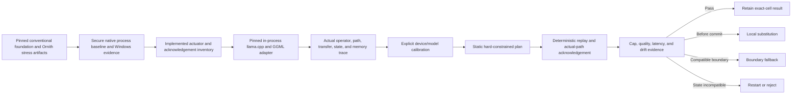

# PrismInfer Adaptive Runtime Research Program

Program authority: repository-root [`Plan.md`](../../Plan.md). This document is
the detailed research index; `Plan.md` controls thesis, dependency order,
clearance, current status, and GitHub Project synchronization.

Status: final council/design freeze complete with a conditional pass. Safety
prerequisites #81/#82 and the Phase 6 supervisor/admission gate #103 may advance
before model-backed Phase 6 evidence. No tracker phase label grants hardware
clearance.

## Outcome

The frozen council thesis is to build PrismInfer as a safety-supervised,
calibration-driven control plane and deterministic plan executor over a pinned
llama.cpp/GGML/GGUF substrate, not as a clean-sheet runtime.

Calibration measures the exact device, runtime, model, operator shapes,
placement, transfers, memory, quality, and workload phases. It produces a
versioned plan bundle. Phase 7 may emit only static load-time or request-time
fields that bind to an implemented actuator and an acknowledgement. Normal
inference replays that finite plan through llama.cpp/GGML and records the actual
path. Recovery is classified as local substitution, compatible-boundary
fallback, or restart/reject; no generic mid-request reversal is promised.

The preferred foundation cell is a self-produced, hash-pinned Llama 3.1 8B
Instruct text GGUF if its license and access are accepted. Ornith-1.0-9B is the
secondary capability and hybrid stress cell, and Qwen3.5-9B is its lineage
comparator, not an independent conventional control. Ornith/Qwen3.5 state must
separate eight full-attention layers from 24 linear-attention layers plus
convolutional/recurrent, MTP, and optional multimodal state. Gemma 2 may be an
architecture-aware control, but its alternating local/global attention is not
a globally full-attention baseline.

The research thesis passes conditionally. The earlier broad Phase 7-9 plan did
not pass as written. Optional adaptive mechanisms proceed only after the static
controller, early scale lower bounds, and 30B static placement produce evidence.

## Reading Order

1. [`session-thesis-and-evidence-map.md`](session-thesis-and-evidence-map.md) —
   structured reconstruction of the session ideas and papers, with evidence
   labels; it is not a verbatim transcript.
2. [`council-record.md`](council-record.md) — roles, disagreements, consensus,
   and the adversarial review outcome.
3. [`scope-and-requirements.md`](scope-and-requirements.md) — ownership,
   in/out/deferred scope, requirements, model/hardware envelope, and gates.
4. [`actuator-and-recovery-matrix.md`](actuator-and-recovery-matrix.md) —
   normative actuator, acknowledgement, lifecycle, safe-point, and recovery
   contract for every executable plan field.
5. [`architecture.md`](architecture.md) — components, integration ladder,
   workflows, hardware interaction, plan artifacts, and diagrams.
6. [`windows-evidence-protocol.md`](windows-evidence-protocol.md) — native
   child launch, Job accounting, WDDM/DXGI, host, file, pagefile, and observed
   transfer evidence.
7. [`security-privacy-reproducibility.md`](security-privacy-reproducibility.md)
   — threat, artifact authenticity, telemetry retention, and reproducibility
   contract.
8. [`scale-capacity-and-bandwidth-admission.md`](scale-capacity-and-bandwidth-admission.md)
   — early exact-artifact admission and bandwidth lower bounds for 9B through
   90B.
9. [`optimizer-and-calibration.md`](optimizer-and-calibration.md) — static
   actuator-bound objective, resource-constrained DAG makespan, calibration,
   uncertainty, and deterministic dispatch.
10. [`9b-optimizer-experiment.md`](9b-optimizer-experiment.md) — confirmatory
    conventional-foundation and Ornith-stress experiment protocol.
11. [`threshold-registry.md`](threshold-registry.md) — versioned metric
    definitions, provisional thresholds, sampling, and promotion authority.
12. [`execution-and-testing-plan.md`](execution-and-testing-plan.md) — vertical
   implementation slices, test matrix, fault injection, evidence, and exit
   audits.
13. [`novelty-and-gap-matrix.md`](novelty-and-gap-matrix.md) — upstream and
    closest-work overlap plus the allowed integration/evidence novelty claim.
14. [`roadmap.md`](roadmap.md) — recut foundation, static controller, early
    scale truth, and independent optional-research GitHub contracts.
15. [`references.md`](references.md) — annotated primary/official source index.

Independent specialist working papers were synthesis inputs, not normative
artifacts. Their binding findings and dissent are preserved in
[`council-record.md`](council-record.md) and the canonical documents above, so
a clean clone does not depend on local archived drafts.

## Core Architecture

PrismInfer owns calibration, planning, policy, evidence, and guarded control.
llama.cpp/GGML owns model loading, the graph, tokenizer/sampling, and baseline
operators. A narrow dispatch/telemetry hook is allowed only after real 9B
tracing proves a control gap.

## Phases

| Phase | Purpose | Required outcome |
|---|---|---|
| Phase 6, active | #103 fail-closed supervision and staged admission; exact per-tensor GGML quant semantics; strict runner; mandatory quality fixtures; supervised same-cell foundation evidence; claim audit. Offline KV and custom-kernel work are optional hypotheses. | The safety and evidence substrate passes and the inherited evidence gap is closed without requiring or promoting a kernel/KV speedup, broad 9B, Tensor Core, or deployability claim. |
| Phase 7 | Secure native baseline, Windows evidence, conventional/Ornith cell contracts, actuator inventory, early scale admission, in-process trace, calibration, and one static actuator-bound plan. | One conventional 8B/9B-class plan is requested, acknowledged, replayed, cap/quality checked, and assigned a precise recovery class; Ornith is then attempted only as a hybrid stress cell. |
| Early scale truth | Exact 30B/70B/90B capacity and multi-resource bandwidth lower bounds, followed by 30B static contiguous placement. | Admit, classify, or reject exact artifacts before optional adaptive work. |
| Optional research | Kernel hook/autotuning, bounded staging, living KV, speculative offload, progressive artifacts, and router oracle/adaptation. | Each independent hypothesis passes or stops; no failed branch blocks the static controller or early scale work. |
| Joint and large-model work | Combine at least two independently passing mechanisms; activate 70B/90B execution only after admission. | Exact measured result or evidence-backed rejection under host/storage/16 GiB GPU constraints. |

## Important Boundaries

- The GPU policy ceiling remains 16 GiB, but every executable run uses a lower
  effective cap: the minimum of policy, live WDDM/DXGI budget and CUDA
  availability, minus a documented nonzero reserve.
- Model-backed CUDA work requires an exclusive GPU lease, conservative
  pre-context admission, context-only reconciliation, an exact workload token,
  a contained worker, and an out-of-process watchdog owned by #103.
- The current target has approximately 32 GiB host RAM; the existing simulated
  90B plan's 128 GiB assumption is not executable on it.
- The current llama adapter is process/log based, offload counters are
  configuration-fed, and the CUDA q4 path is synthetic.
- The external baseline must use native `CreateProcessW`-class launch, explicit
  executable/argv/environment handling, and a Job Object before plan replay.
- Windows GPU evidence separates owned allocations from a stronger
  physical-residency/no-oversubscription claim; NVML alone cannot establish the
  latter under WDDM.
- Upstream llama.cpp already provides fit, placement, KV, and speculation
  controls; PrismInfer must calibrate and govern them before claiming novelty.
- The optimizer is an offline measured planner, not necessarily a learned
  neural model.
- Phase 7 is static and actuator-bound. Per-epoch placement, representation, KV
  policy, and structured-compute decisions are not fields in its executable
  schema.
- The source GGUF is immutable. Progressive/lossy representations are separate
  derived artifacts.
- Per-query weight recompression is not the default. KV and CPU/GPU boundary
  activations are the first online compression candidates.
- Prompt clusters may warm-start a plan. Hidden-state routing is research-only
  until an oracle, pre-commit verification/rollback semantics, adaptation
  decision, and compatible kernels pass; a later dense audit cannot undo
  committed output.
- Speculative objectives use committed target-distributed output tokens per
  cycle and per observed external byte. Accepted draft length remains a
  diagnostic.
- AlphaTensor-style algorithm discovery, Mojo, Triton, and new kernels are
  experiment lanes. Mojo may implement an isolated versioned C ABI provider;
  it is not the native Windows runtime.
- A 70B/90B result may correctly be classified as slow/offline,
  measured-offload, simulated, or rejected.

## First Concrete Goal

The first success criterion is not a new matmul or a 90B demo. It is a retained
static result on the exact admitted Llama 3.1 8B foundation cell
showing that PrismInfer can:

- identify an exact hardware/runtime/model cell;
- measure the real upstream path;
- reject every variable without an implemented actuator and acknowledgement;
- select a static implementation-valid plan;
- replay and acknowledge it;
- keep every memory tier truthful;
- preserve correctness and quality;
- detect drift and apply local, boundary, or restart/reject recovery; and
- classify the result without generalizing it.

Ornith follows as a separate hybrid multimodal stress cell. Its result cannot
be reported as a generic full-attention KV result.

## GitHub Tracking

The implementation backlog is designed for
[`Gravelaw/prisminfer`](https://github.com/Gravelaw/prisminfer) and
[`PrismInfer Roadmap` Project #2](https://github.com/users/Gravelaw/projects/2).
The binding item map and clearance order are in root [`Plan.md`](../../Plan.md);
the detailed acceptance criteria are in [`roadmap.md`](roadmap.md). Phase 6
remains active. Static-controller,
early-scale, and optional-research items are activated only through their
documented dependencies; listing an item does not promote it to executable
implementation work.
