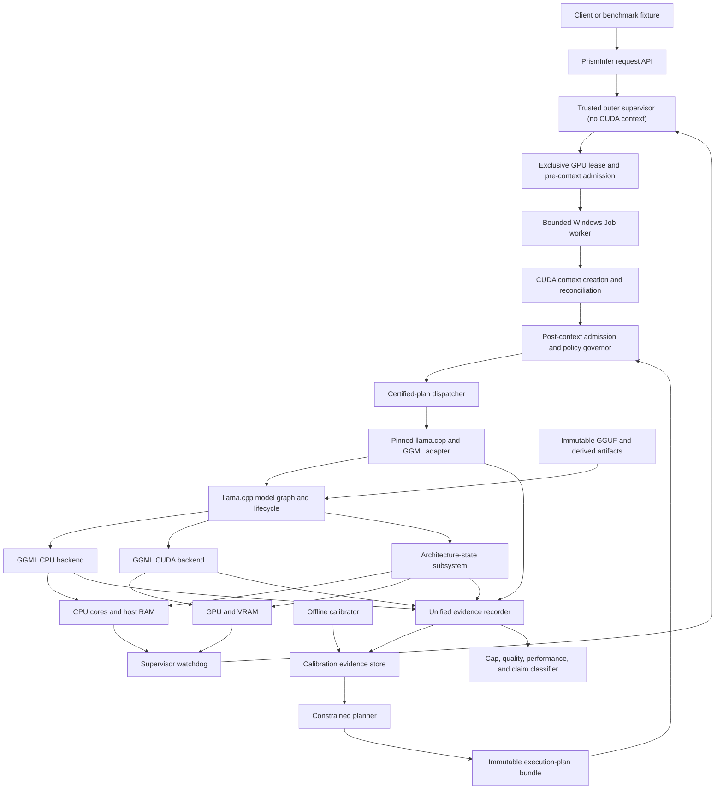
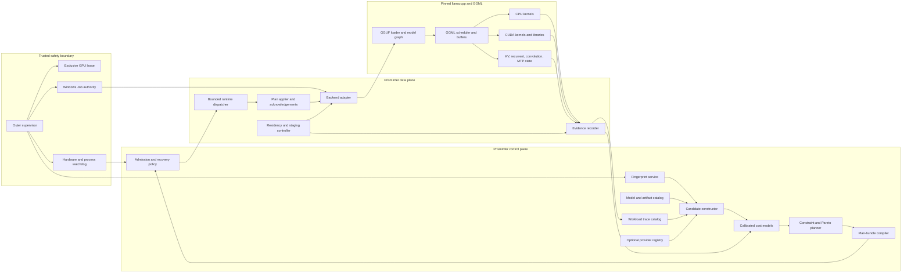
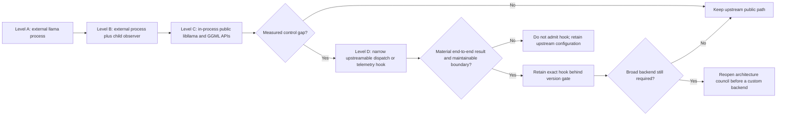
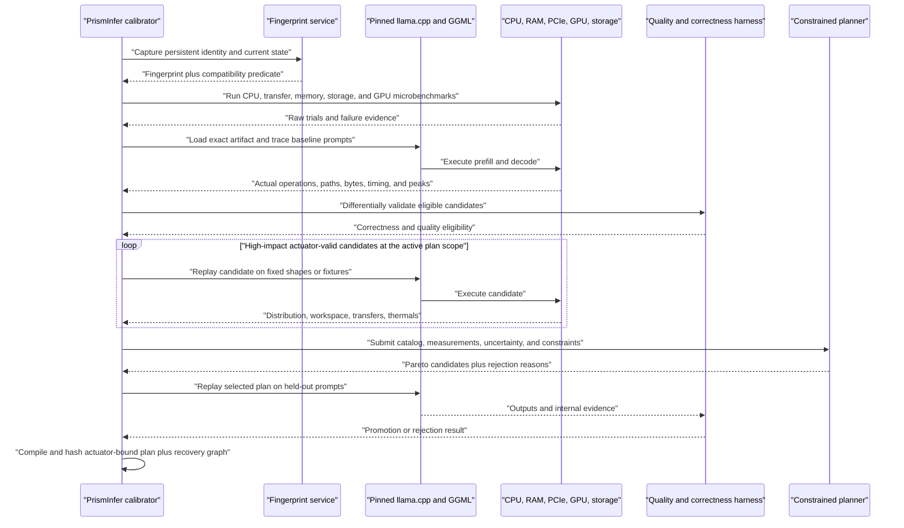
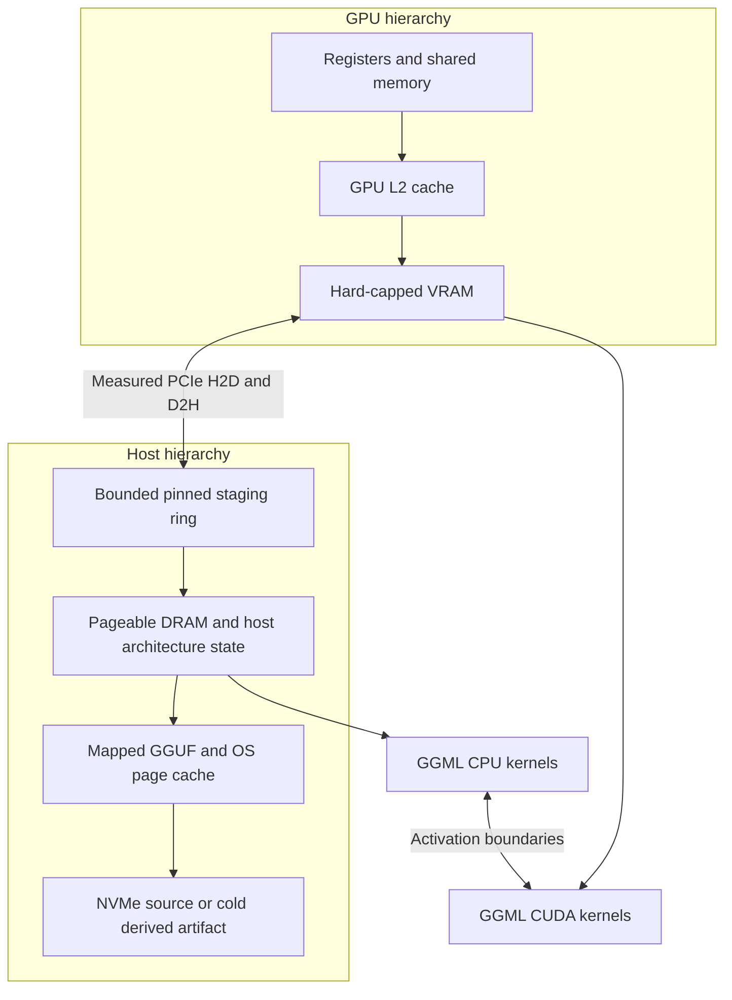
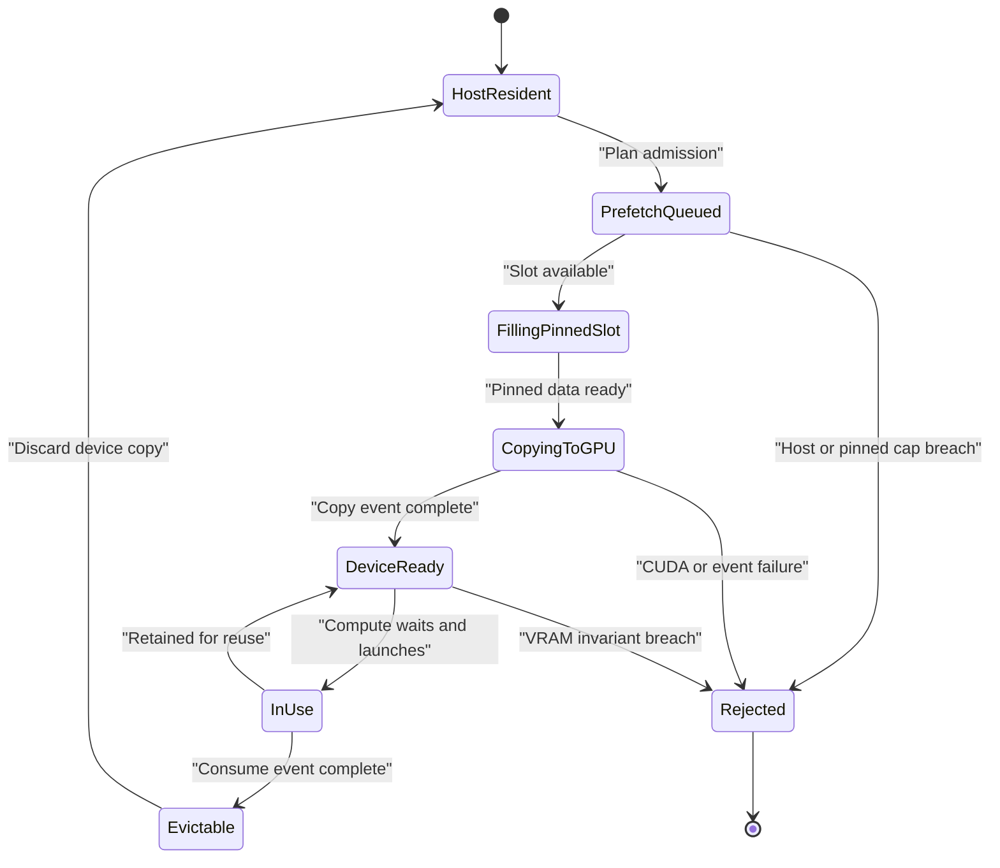
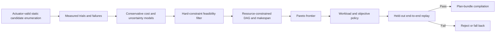
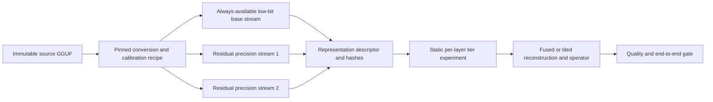
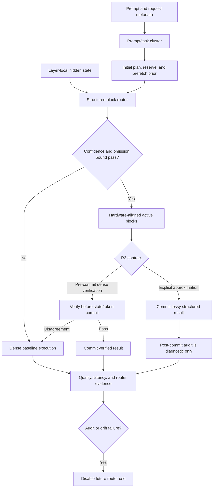

# PrismInfer Adaptive Runtime Architecture

Status: final council implementation baseline for Phase 6 safety closure,
Phase 7, and later research.

This architecture defines how PrismInfer can become a calibrated execution
controller while preserving llama.cpp/GGML/GGUF compatibility. It is a future
architecture, not evidence that the current repository already executes these
plans.

## Architectural Outcome

PrismInfer is split into a trusted outer supervisor, a control plane, and a
contained data-plane worker.

- The **trusted outer supervisor** remains outside the worker Job, owns the
  exclusive GPU lease, reads host and device guard telemetry, performs both
  admission stages, enforces deadlines, and can terminate the complete worker
  tree without depending on CUDA or llama.cpp remaining responsive.

- The **control plane** fingerprints the exact validation cell, runs
  calibration, builds a constrained candidate catalog, selects a feasible
  Pareto plan, validates it, and publishes a hashed plan bundle.
- The **contained data plane** loads the exact artifact through llama.cpp/GGML,
  applies
  implemented actuator-bound controls, records requested-versus-actual
  behavior, and performs local substitution, compatible-boundary recovery, or
  restart/reject when an assumption fails.

The normal token path does not train an optimizer, search kernels, or solve a
large mixed-integer problem. It performs bounded plan selection and dispatch.

## System Context



## Architectural Principles

1. **Immutable model provenance.** Never rewrite the source GGUF during
   calibration or execution.
2. **Executable decisions only.** A planner cannot select a control that the
   active integration tier cannot apply and acknowledge.
3. **Constraints before optimization.** Correctness, memory identity, cap,
   provenance, and critical quality are hard constraints.
4. **Measure the critical path.** Kernel, conversion, transfer, queue wait,
   reconstruction, routing, verification, and rollback all count.
5. **Measure phases without inventing switches.** Prefill, first-token,
   decode, long-context, and memory-pressure behavior are measured separately.
   Phase 7 uses one static load/context plan; a phase-specific decision enters
   execution only when the actuator matrix proves its lifecycle and recovery.
6. **Actuator-bound plan replay.** Calibration is offline; runtime selection is
   bounded and deterministic. Every decision has lifecycle, acknowledgement,
   state effect, and R0/R1/R2/R3 recovery semantics.
7. **Requested versus actual evidence.** The backend must report what it
   actually did, not only what PrismInfer requested.
8. **Exact-cell and architecture-state claims.** No plan or result generalizes
   by analogy; full-attention KV and hybrid recurrent/convolution state are
   accounted separately.
9. **Upstream-first integration.** Reuse public llama.cpp/GGML controls before
   adding a narrow hook, and use a broad fork only after a formal reopen gate.
10. **Reject infeasible scale targets early.** Run exact 9B/30B/70B/90B
    capacity and resource-DAG bandwidth lower bounds before optional mechanisms.
11. **Crash containment is outside the runtime.** CUDA, llama.cpp, GGML,
    providers, parsers, and model artifacts execute in a non-breakaway Job
    worker. The supervisor owns the kill authority and evidence finalization.
12. **Admission is two-stage and fail-closed.** A read-only pre-context gate
    rejects impossible work before worker CUDA initialization. Context creation
    is then metered and reconciled by a post-context gate before model load or
    workload allocation.
13. **Caps have three meanings.** The 16 GiB policy ceiling, the requested
    validation tier, and the effective live cap are distinct. Execution uses
    the smallest live value after a nonzero reserve; it never allocates toward
    the literal policy ceiling.

## Normative Cross-Cutting Contracts

The following documents are part of this architecture, not optional reading:

- the [actuator and recovery matrix](actuator-and-recovery-matrix.md) defines
  which decisions can enter a plan and how each can fail;
- the [Windows evidence protocol](windows-evidence-protocol.md) defines process,
  Job, host-memory, file, WDDM/DXGI, backend, and transfer evidence;
- the [scale admission contract](scale-capacity-and-bandwidth-admission.md)
  defines the early 9B/30B/70B/90B capacity and bandwidth rejections;
- the [threshold registry](threshold-registry.md) defines frozen metric,
  sampling, uncertainty, and promotion policies;
- the [security, privacy, and reproducibility contract](security-privacy-reproducibility.md)
  defines process/artifact trust, telemetry retention, and reproducibility; and
- the [novelty and gap matrix](novelty-and-gap-matrix.md) constrains claims to
  demonstrated upstream gaps and measured contributions.

A plan or promoted result is invalid when a contract applicable to its cell is
missing, stale, or failed. The novelty matrix governs claims; it is not an
excuse to relax execution, quality, or safety gates.

## Component Architecture



### Control-plane components

| Component | Responsibility | Must not do |
|---|---|---|
| Fingerprint service | Produce persistent hardware/software identity and request-time state. | Treat GPU name, advertised bandwidth, or thread count as a complete key. |
| Model/artifact catalog | Validate source and derived artifacts, tokenizer, template, recipe, license record, and hashes. | Substitute a third-party quant under a canonical hash. |
| Workload trace catalog | Retain real operator/shape/phase/placement/path histograms and critical-path traces. | Tune invented square matrices as a proxy for model execution. |
| Optional provider registry | Describe post-foundation kernel, staging, state, representation, speculation, or routing providers and their actuator/recovery contracts. | Make an optional provider a Phase 7 dependency or force an implementation the backend marks unsupported. |
| Candidate constructor | Build only executable combinations at the current integration tier. | Create arbitrary cross-products that cannot be measured or applied. |
| Cost model | Estimate time, bytes, peak memory, quality risk, and uncertainty from raw calibration. | Replace missing evidence with optimistic estimates. |
| Constrained planner | Reject infeasible candidates, retain Pareto plans, and select by policy. | Turn a hard cap or critical quality gate into a weighted penalty. |
| Plan compiler | Produce a strict immutable actuator-bound sidecar plus recovery graph. | Emit a decision without an implemented actuator/acknowledgement. |
| Admission policy | Validate current state against the plan envelope and apply the actuator's declared R0/R1/R2/R3 outcome. | Select a nearest plan silently after a key mismatch or call a post-commit audit reversal. |

### Data-plane components

| Component | Responsibility | Initial implementation |
|---|---|---|
| Outer supervisor | Own the GPU lease, immutable run contract, pre-context and post-context admission, Job lifetime, watchdog, cancellation, abort, cleanup reconciliation, and terminal evidence. | Separate trusted C++20 process with no CUDA context and a bounded IPC protocol. |
| Contained worker | Own CUDA, llama.cpp/GGML, model/context state, provider code, and workload execution. | Non-breakaway Windows Job child with kill-on-close, explicit memory/time/process limits, no authority to weaken supervisor policy. |
| Backend adapter | Create and own the pinned llama context, translate plan fields, expose structured telemetry. | C++20 in-process libllama/GGML adapter; external CLI retained for baseline. |
| Plan applier | Apply proven controls and collect requested/actual acknowledgements. | First plan uses static load/context/request actuators only. |
| Runtime dispatcher | Apply the admitted static plan and, where separately proven, perform O(1) R0 lookup. | No per-epoch global plan selection in Phase 7. |
| Residency/staging controller | Admit PrismInfer-owned pinned buffers/workspaces and coordinate bounded transfers. | Start after static placement and measured-transfer gates. |
| Evidence recorder | Correlate request, plan entry, backend path, timing, bytes, memory, and failure. | Extend existing JSONL/manifest system. |

The supervisor/worker boundary is mandatory for model-backed execution. An
in-process adapter means in-process *inside the contained worker*; it does not
place CUDA or llama.cpp inside the trusted supervisor. IPC messages are
versioned, length-bounded, sequence-numbered, and validated as untrusted input.

## Normative Actuator and Recovery Boundary

`actuator-and-recovery-matrix.md` is normative. Every executable plan field
binds to:

```text
actuator and pinned API/hook
lifecycle
eligibility
requested and actual acknowledgement
memory and semantic/state effect
application/commit point
recovery class
```

The first Phase 7 plan is static. Model representation, GPU-layer/tensor
placement, mmap/direct-IO, context/state type, multimodal projector, and draft
artifact choices are load/context-time decisions and cannot vary by epoch.

Recovery classes are:

- **R0 local substitution:** before operator/state/output commit, such as a
  candidate kernel to GGML default.
- **R1 compatible-boundary recovery:** only with proven state compatibility or
  exact conversion at a declared boundary.
- **R2 restart/reject:** reload/restart required; no continuity claim.
- **R3 approximation:** pre-commit verification, bounded checkpoint/rollback,
  or explicitly lossy output. A later audit cannot undo committed state/output.

Phase 7 admits only process-, model-load-, context-create-, and request-setup
actuators marked proven in the matrix. Kernel dispatch, staging/prefetch,
dynamic architecture-state changes, progressive representations, speculative
offload, and structured routing are optional providers. They neither block the
static foundation controller nor appear in a Phase 7 plan as inactive
placeholders.

## llama.cpp and GGML Integration Ladder



### Level A: current process adapter

Useful for baseline execution and pin checks. It cannot:

- observe GGML graph nodes or actual kernel dispatch;
- own or reconcile backend allocator pools;
- apply tensor buffer overrides through the API;
- coordinate streams/events with graph execution;
- certify child host-memory peaks with current process telemetry; or
- change per-operator execution inside a run.

It is baseline-only and may not replay a plan or support a promoted memory,
offload, or safety claim until the external-process safety gate below passes.

### Level B: truthful process baseline

Add child job/process observation for working set, private/commit, IO, faults or
residency proxies, exit lifecycle, and exact command/build identity. Forward all
relevant pinned CLI controls. This improves evidence but remains a controller,
not an execution runtime.

### External-process safety gate

Before any plan-controlled path, prompt, or artifact reaches an external
process, the adapter must satisfy the
[Windows evidence protocol](windows-evidence-protocol.md) and the
[security contract](security-privacy-reproducibility.md). At minimum it must:

- use `CreateProcessW` or an equivalent native API with an explicit executable,
  correctly encoded Windows arguments, controlled environment/current
  directory, restricted inherited handles, and a Job Object—not `std::system`,
  `call`, command concatenation, or shell redirection;
- use schema-safe run identifiers only as data and securely generated opaque
  log/artifact names or handles;
- resolve and approve artifact roots, reparse behavior, opened-handle identity,
  count/size limits, immutable hashes, and publisher/approval identity;
- reject plan-supplied arbitrary DLL, kernel, codec, or provider paths; and
- validate formats, residual graphs, per-tile bounds/checksums, decompression
  expansion, and all artifact-derived size arithmetic before GPU use.

Failure keeps the adapter in baseline-only status. It cannot be compensated by
an optimizer score, a trusted-looking hash, or cleanup after launch.

The first implementation of this boundary is the mandatory **P6-04A safety
gate, GitHub issue #103**. It must pass before any model-backed Phase 6 command,
including a short 9B warmup, model-backed kernel benchmark, quality fixture, or
calibration capture. P7-02 and P7-03 harden and extend the same supervisor and
evidence path; they do not replace it with a second launcher.

### Two-stage device admission

The outer supervisor owns both stages:

1. **Pre-context admission.** Before a worker calls a CUDA Runtime API that may
   initialize a primary context, acquire the exclusive GPU lease; validate
   policy, requested tier, artifact census, predicted context/runtime/backend/
   model/state/workspace peaks, host commit and storage headroom; and capture
   read-only DXGI/WDDM plus approved device telemetry. Missing or stale required
   evidence rejects the run before context creation.
2. **Post-context reconciliation.** After the contained worker creates only the
   context and minimal telemetry channel, it reports actual context/runtime
   bytes and CUDA free/total observations. The supervisor reconciles these with
   DXGI/WDDM and the owned ledger, recomputes the effective live cap, and either
   admits model load or cancels and terminates the worker. Model load, large
   workspaces, calibration, warmup, and prompt execution are prohibited before
   this acknowledgement.

Model/backend allocation is subsequently reconciled before warmup and watched
throughout execution. A budget decrease, stale sensor, unknown byte, reserve
breach, or disagreement never causes the worker to continue optimistically.

### Level C: in-process adapter

This is the Phase 7 architectural target. It should:

- own model/context lifetime through public APIs;
- register tensor buffer overrides before load;
- observe backend buffer sizes and scheduler reservations;
- expose prefill/decode safe points;
- apply CPU threads/topology and batch controls;
- correlate requests with backend allocations and operations;
- acknowledge actual placement and available execution path; and
- preserve a default llama.cpp-equivalent mode.

### Level D: narrow hook

Per-operation selection among GGML MMVQ/MMQ, vendor, or approved custom paths is
not a stable public llama.cpp control. If tracing proves a meaningful choice, a
narrow hook may receive a read-only `DispatchContext` and return an eligible
`KernelVariantId` or `default`.

The hook may not allocate, synchronize, read a database, or calibrate. GGML
remains the eligibility authority and must report requested and actual variants.

The hook and every non-upstream implementation use an optional provider
boundary. A provider must expose identity/version, eligibility, workspace and
retained-memory queries, exact input/output/state descriptors, stream/error
semantics, acknowledgement, and a declared R0/R1/R2/R3 recovery outcome.
C++/CUDA is the reference provider implementation. CUTLASS, Triton, Mojo, or
discovered algorithms remain isolated experiments and are never required to
complete the static controller.

## Early Model and Scale Admission

`scale-capacity-and-bandwidth-admission.md` is a program-entry contract, not a
Phase 9 afterthought. Before optional kernel, compression, speculation, or
routing work consumes implementation effort, PrismInfer must:

1. certify the exact Llama 3.1 8B Instruct text foundation artifact on the
   pinned runtime, subject to accepted license/access and a self-produced,
   hash-pinned GGUF;
2. certify Ornith separately as a hybrid multimodal capability/stress artifact,
   including main GGUF, optional `mmproj`, MTP choice, full-attention layers,
   recurrent/DeltaNet state, convolution state, and unsupported operations;
3. compute exact artifact/state/workspace capacity and resource-DAG lower bounds
   for the selected 9B, 30B, 70B, and 90B cells;
4. reject or quarantine any scale cell whose optimistic bound misses its frozen
   threshold; and
5. schedule 30B static contiguous placement immediately after the foundation
   controller, before optional adaptive mechanisms.

For GGUF, a marketing label such as `Q4_K_M` is not a scalar four-bit promise.
It can encode a mixed per-tensor quantization recipe. Artifact admission must
retain the exact GGUF hash, quantization recipe/tool identity, tensor-name/type/
shape/byte inventory, histogram hash, and measured total payload/metadata bytes.
Capacity uses those exact bytes. Kernel and quality comparisons use the same
artifact unless the derived representation is deliberately declared as a
separate variant with its parent hash and conversion recipe.

Qwen3.5 is a lineage comparator for Ornith, not an independent architecture
control. No uniform full-attention KV formula may be applied to its linear-
attention layers.

## Calibration Workflow



### Calibration suites

1. **Static fingerprint and capacity**
   - CPU Sets/core/cache/efficiency topology;
   - physical RAM, available RAM, commit and pagefile policy;
   - GPU identity, capability, physical/reportable VRAM, WDDM, driver/runtime;
   - actual PCIe link state;
   - artifact volume and physical storage mapping;
   - power, AC/battery, thermal and clock envelope.

2. **CPU execution**
   - exact GGUF quantized shapes;
   - generation and batch thread counts;
   - faster-core, mixed-core, and OS-managed placements;
   - prefill and decode separately;
   - CPU-only and contiguous layer-split baselines.

3. **GPU and kernel**
   - actual hot operator shapes and tensor layouts;
   - GGML default paths first;
   - vendor/template/custom candidates only when representation-compatible;
   - correctness, workspace, events, actual path, and retained profiler evidence.

4. **Transfer and memory**
   - pageable versus pinned H2D/D2H;
   - tensor-relevant sizes and alignments;
   - idle and concurrent-copy/compute cases;
   - one/two/three staging slots;
   - mmap warm/cold and bounded prefetch hints;
   - host working set/commit, IO, and fault/residency evidence.

5. **Architecture state and context**
   - exact architecture-state ledger first: full-attention KV separately from
     recurrent/DeltaNet, convolution, MTP, and multimodal state;
   - supported upstream KV types;
   - one isolated compression/retention candidate at a time;
   - context bands, metadata/workspace, attention error, retrieval, and
     long-context quality.

6. **Speculation**
   - draft location and cost;
   - proposed and accepted draft length distributions;
   - mandatory target correction/extra token and committed output count;
   - target transfer and verification time;
   - rollback and architecture-state side effects;
   - committed target-distributed output tokens/s and observed external bytes
     per committed output token.

7. **Conditional research**
   - dense activation traces;
   - hardware-aligned block oracle;
   - prompt-only warm-start versus hidden-state router;
   - router/gather/sparse-kernel overhead;
   - confidence, pre-commit or explicitly lossy contract, dense audits, and
     out-of-distribution behavior.

## Runtime Request Lifecycle

```mermaid
sequenceDiagram
  participant R as "Request"
  participant S as "Trusted outer supervisor"
  participant W as "Contained Job worker"
  participant A as "Admission governor"
  participant D as "Plan dispatcher"
  participant B as "llama.cpp and GGML adapter"
  participant X as "CPU and GPU executor"
  participant E as "Evidence recorder"

  R->>S: "Model, prompt, context, policy ceiling, and requested tier"
  S->>S: "Acquire lease; validate contract; pre-context admission"
  alt "Pre-context rejection"
    S-->>R: "Fail-closed reason; no CUDA context or model load"
  else "Pre-context admitted"
    S->>W: "Create suspended, assign bounded Job, then resume"
    W->>W: "Create minimal CUDA context only"
    W-->>S: "Context/runtime bytes and device observations"
    S->>A: "Reconcile and perform post-context admission"
  end
  alt "No compatible certified plan"
    A->>S: "Baseline-only or rejection decision"
  else "Plan admitted"
    A->>D: "Install one static actuator-bound plan, live cap, and recovery graph"
    D->>B: "Apply load/context/request controls before execution"
    B-->>D: "Acknowledge actual actuator values and restart requirements"
    B-->>S: "Model/backend allocation reconciliation"
    S->>S: "Admit workload; activate watchdog"
    D->>X: "Execute static prefill/decode configuration"
    X-->>E: "Timing, bytes, memory, actual variants"
    loop "Decode epochs"
      D->>X: "O(1) local dispatch for implemented operator actuators"
      X-->>E: "Token, latency, architecture state, transfers, committed output"
      E-->>D: "Drift and invariant status"
      alt "Drift or failure"
        D->>B: "R0 substitute, R1 compatible boundary, R2 restart/reject, or the declared R3 contract"
        S->>W: "Cancel, then terminate Job at the frozen deadline if needed"
      end
    end
    E->>A: "Final cap, quality, performance, and classification evidence"
    W-->>S: "Exit and cleanup acknowledgement"
    S-->>R: "Output plus terminal run identity"
  end
```

## Runtime Lifecycle and Recovery

```mermaid
stateDiagram-v2
  [*] --> ValidateContract
  ValidateContract --> AcquireLease: "GPU requested"
  ValidateContract --> CreateWorker: "CPU-only"
  AcquireLease --> PreContextAdmission
  PreContextAdmission --> RestartReject: "Reject or guard telemetry unavailable"
  PreContextAdmission --> CreateWorker: "Admitted"
  CreateWorker --> AssignJob
  AssignJob --> CreateContext: "GPU worker resumed"
  AssignJob --> LoadStaticPlan: "CPU-only worker resumed"
  CreateContext --> ReconcileContext
  ReconcileContext --> RestartReject: "Unknown bytes or live cap failure"
  ReconcileContext --> PostContextAdmission
  PostContextAdmission --> RestartReject: "Reserve, host, thermal, or policy failure"
  PostContextAdmission --> LoadStaticPlan
  LoadStaticPlan --> LoadModel
  LoadModel --> ReconcileBackend
  ReconcileBackend --> RestartReject: "Actual allocation/path mismatch"
  ReconcileBackend --> WatchdogActive: "Workload admitted"
  WatchdogActive --> Prefill
  Prefill --> FirstToken
  FirstToken --> Decode
  Decode --> LocalSubstitution: "Candidate fails before commit"
  LocalSubstitution --> Decode: "R0 equivalent path"
  Decode --> BoundaryRecovery: "R1 compatible state and guard"
  BoundaryRecovery --> Decode: "Exact conversion or compatible policy"
  Decode --> CancelRequested: "Watchdog, deadline, R2, or unsafe pressure"
  CancelRequested --> CleanupReconcile: "Cooperative exit"
  CancelRequested --> AbortJob: "Cancellation deadline exceeded"
  AbortJob --> CleanupReconcile
  Decode --> PrecommitVerify: "R3 candidate before commit"
  PrecommitVerify --> Decode: "Verified or dense result committed"
  Decode --> LossyCommit: "R3 explicit approximation policy"
  LossyCommit --> Decode: "Lossy state/output declared"
  LossyCommit --> ApproximateStop: "Post-commit audit fails"
  BoundaryRecovery --> CancelRequested: "Recovery fails"
  Decode --> CleanupReconcile: "Request complete"
  ApproximateStop --> CleanupReconcile: "No reversal claim; output classified"
  RestartReject --> CleanupReconcile: "Terminate worker if created"
  CleanupReconcile --> Complete: "Lease released; terminal evidence published"
  Complete --> [*]
```



R0 occurs before operator/state/output commit. R1 requires an implemented
state-compatibility or exact-conversion contract. R2 does not promise request
continuity. R3 may verify before commit or quarantine a checkpointed result for
rollback/recomputation. A post-commit R3 audit can disable future use but cannot
undo released tokens or changed hidden/KV/recurrent state.

The normative event ordering, cancellation deadlines, and CPU-only exceptions
are defined in [`../runtime-state-machine.md`](../runtime-state-machine.md).

## Hardware and Memory Architecture



### Resource rules

- **VRAM:** resident quantized weights, active architecture state (including
  full-attention KV where present), workspaces, graph state, and backend pools
  are all part of the cap.
- **Pinned RAM:** bounded transfer staging only. Allocate once, measure current
  and peak, and record pageable fallback separately.
- **Pageable RAM:** CPU-resident quantized weights, host KV/recurrent/
  convolution state, metadata, and mapped resident pages. Maintain an OS
  reserve.
- **mmap:** addressability and an OS-managed cache, not proof of residency.
- **NVMe:** cold-load and research tier until model-order bytes per committed
  output token pass the early resource-DAG lower-bound gate.
- **Pagefile/unified memory:** evidence of pressure or failure, not certified
  capacity.

### GPU admission equation

Three values must never be collapsed into one field:

```text
policy_ceiling_bytes = 17179869184
requested_tier_bytes = exact validation tier requested by the run
pre_context_live_capacity_bytes = min(
  physical_or_reportable_local_bytes,
  dxgi_local_budget_bytes)

pre_context_gpu_reserve_bytes = max(
  1 GiB, ceil(0.10 * pre_context_live_capacity_bytes))

pre_context_effective_cap_bytes = min(
  requested_tier_bytes,
  max(0, min(policy_ceiling_bytes, pre_context_live_capacity_bytes)
    - pre_context_gpu_reserve_bytes))

post_context_live_capacity_bytes = min(
  physical_or_reportable_local_bytes,
  fresh_dxgi_local_budget_bytes,
  reconciled_owned_gpu_bytes + cuda_free_bytes)

gpu_reserve_bytes = max(
  pre_context_gpu_reserve_bytes,
  1 GiB,
  ceil(0.10 * post_context_live_capacity_bytes))

effective_live_cap_bytes = min(
  pre_context_effective_cap_bytes,
  requested_tier_bytes,
  max(0, min(policy_ceiling_bytes, post_context_live_capacity_bytes)
    - gpu_reserve_bytes))
```

The reserve and stage formulas are provisional threshold T-100. A validated
device-specific policy may become more conservative. It may not become zero or
exceed the policy/request/live minima merely to make a run pass.

```text
peak_vram =
  cuda_context_runtime_bytes
+ backend_buffer_and_pool_bytes
+ resident_quant_weight_bytes
+ weight_metadata_bytes
+ resident_architecture_state_payload_bytes
+ state_metadata_residual_or_index_bytes
+ activation_and_kernel_workspace_bytes
+ graph_and_instrumentation_bytes
+ allocator_fragmentation_bytes
+ safety_margin_bytes
+ unknown_gpu_bytes
```

Promotion requires:

```text
peak_vram <= effective_live_cap_bytes
effective_live_cap_bytes <= requested_tier_bytes <= policy_ceiling_bytes
unknown_gpu_bytes == 0
full_high_precision_model_materialized == false
```

Equality between the effective cap and requested tier means the smaller
requested tier still leaves the full live reserve; it does not mean the reserve
was waived. Raw physical VRAM, a configured tier, or a nominal 16 GiB label is
never treated as reserve-adjusted capacity.

This first equation supports an owned-allocation claim only after allocator and
backend reconciliation. A physical-residency/no-oversubscription claim also
requires the DXGI/WDDM local budget/current-usage and eviction/non-local evidence
defined in `windows-evidence-protocol.md`. Host, pinned, commit/pagefile, mapped
residency, and storage each have a separate ledger and admission rule.

Pre-context admission uses conservative artifact census and worst-case reserved
context/backend/workspace values without creating a CUDA context. Post-context
admission replaces context estimates with reconciled observations before model
load. Model/backend reconciliation then gates warmup, and the supervisor
watchdog recomputes the live envelope throughout the run.
The admitted cap never grows during a run: each watchdog cap is the minimum of
the post-context admitted cap and the current reserve-adjusted live cap.

## Optional Residency and Prefetch Provider

Phase 7 uses static upstream placement. The provider below starts only after
the static Llama 3.1 8B foundation controller and 30B contiguous-placement
baseline. Its first
placement unit is a whole model, contiguous layer segment, or large tensor
group. Individual neurons are never CPU/GPU transfer units.



Use one compute stream and one prefetch/copy stream initially. Add streams only
when a retained critical-path trace proves value. A generation counter and
copy/consume events protect each staging slot from early reuse.

Prefetch distance is time-based:

```text
prefetch is useful only when
  predicted_copy_completion <= predicted_compute_start
and
  staged_bytes + every reserve <= its hard budget
```

When a copy cannot be hidden, compare it with CPU execution using host-resident
weights and transferring only the activation boundary.

## Optional Kernel and Matrix-Multiplication Provider

The phrase "three matrix-multiplication algorithms" is implemented as an
eligible candidate portfolio, not a fixed global choice. Phase 7 traces the
pinned GGML default and may compare whole-build/upstream settings, but per-op
selection and custom providers do not block the static controller.

### Kernel key

```text
model and quant artifact hashes
llama.cpp and GGML commit/build flags
device UUID, compute capability, SM count
driver, CUDA runtime, toolkit, library versions
OS/driver mode and power/thermal bucket
operator and sequence phase
source/destination tensor types and quant block
layouts, transpose, alignment, padding
M, N, K, batch, ubatch, context bucket, expert count
residency and transfer regime
workspace cap and determinism policy
```

### Candidate order

1. Pinned GGML default path.
2. Supported alternate GGML configuration/path.
3. cuBLAS/cuBLASLt where the exact representation and conversion cost are fair.
4. A selectively generated CUTLASS or equivalent candidate.
5. One exact custom fused candidate for a measured gap.
6. Triton, Mojo, AlphaTensor-derived, or other research candidate in an
   isolated lane.

For decode, quantized GEMV/MMVQ-style paths may matter more than dense square
GEMM. For prefill, GEMM and fused epilogues may matter more. Compare the entire
operator path, including dequantization/repack, workspace, launch, and transfer.

An isolated candidate remains optional research until full-model replay
improves the same cell under the frozen threshold and fresh confirmatory run.
Its provider must query workspace/retained bytes before admission and use R0
only before operator/state commit. AlphaTensor demonstrates that new algorithms
exist; it does not establish a useful Ornith q4 decode path.

## Optimizer and Plan Selection

The mathematical details are in `optimizer-and-calibration.md`. Architecturally,
the optimizer is a pipeline:



Phase 7 uses exhaustive measurement or simple search over the small static
upstream actuator catalog. Dynamic programming, CP-SAT/MILP, or a compiled
resource DAG is used only when an implemented placement/scheduling provider
creates a real schedule. A learned ranker or contextual bandit is optional
later. It cannot invent actuators or bypass correctness, quality, memory,
provenance, recovery, abstention, or confirmatory-replay gates.

## Plan Bundle

The bundle declares its scope. `phase7_static` is the foundation schema;
`optional_provider_extension` is admitted only after the provider's independent
gate. The static bundle contains no dormant research decisions.

Normative logical structure:

```text
execution_plan
  schema_version
  plan_scope = phase7_static | optional_provider_extension
  plan_id and plan_sha256
  source_model and derived_artifact hashes
  quantization label, recipe id, mixed-quant flag, and tensor inventory hash
  tokenizer, template, fixture, and calibration hashes
  model architecture and modality/state descriptor hashes
  hardware/software compatibility predicate
  policy ceiling, requested tier, reserve policy, effective-live-cap rule,
    and unknown-byte policy
  actuator descriptor ids and versions
  static process/model-load/context/request decisions
  requested-value hashes and acknowledgement requirements
  architecture-state allocation and placement
  commit points and R0/R1/R2/R3 recovery graph
  optional provider descriptors, only for extension scope
  compiled task/resource DAG, only when scheduling is actuated
  expected metric intervals
  abstention and drift envelope
  validation and profiler evidence references
  expiry and invalidation rules
```

The bundle is installed before execution. Unknown fields fail according to the
strict schema/version policy. A plan miss records the exact reason; no
nearest-shape or nearest-device substitution is allowed for promoted evidence.
An unacknowledged actuator rejects the candidate claim. An R2 decision never
appears as a seamless runtime fallback, and an R3 decision declares whether it
uses pre-commit verification, quarantined checkpoint/rollback, or explicitly
lossy post-commit output.

The bundle may describe one static per-tensor or per-layer mixed-quant profile
already encoded by the immutable GGUF. That is artifact identity, not a runtime
precision actuator. Changing a tensor's representation requires an approved
derived artifact or a separately proven representation actuator; the optimizer
may not reinterpret `Q4_K_M`, `q4`, or an average bit rate as permission to
switch precision dynamically.

## Optional Progressive Representation Provider

Per-query recompression of immutable q4 weights is normally rejected. The
only admitted starting point is an offline-created, immutable derived artifact
with one static per-layer tier plan. This provider is not part of Phase 7:



Independent Q2/Q3/Q4 GGUF files are not automatically nested. Progressive
precision requires bit planes, nested codebooks, or explicit base/residual
blocks plus compatible kernels and effective-bit accounting.

The research is split into independent hypotheses rather than one combined
roadmap item:

1. ordinary q4 residency and exact fused/tiled decode;
2. an entropy/random-access diagnostic, with no hot-path claim;
3. an exact lossless cold-cache experiment;
4. a static base-plus-residual weight format and provider;
5. activation compression at a measured CPU/GPU boundary; and
6. only after static representation wins, a separately adapted request/epoch
   estimator with its own R3 semantics.

The static provider must publish a format/version, canonical CPU decoder,
random-access index, residual dependency graph, per-tile bounds/checksums,
effective-bit ledger, workspace query, exact kernel set, and crash/invalidation
policy. It is compared with the best same-size fixed quant. A load-time tier is
R2; a lossy dynamic tier is R3 unless exact state conversion and pre-commit
verification prove otherwise.

## Optional Conditional-Compute Provider



Prompt clusters may warm-start; they do not permanently disable layers or
neurons. Generated tokens change the hidden state. The actual decision must be
layer-local and structured for hardware efficiency.

This is an optional provider and never a Phase 7 actuator. The research
sequence is:

1. dense trace;
2. hardware-aligned oracle;
3. reject if the oracle cannot save enough work at the quality limit;
4. auxiliary router only if the oracle passes;
5. compatible structured kernels;
6. choose pre-commit verification, bounded quarantined rollback, or explicitly
   lossy post-commit output;
7. measure full-continuation quality, router/gather/kernel overhead, and OOD;
8. optional model adaptation for whole-layer/depth behavior.

A post-commit dense audit cannot preserve or restore semantics. It may disable
future use and classify the current output as approximate. A rollback claim
must name checkpointed hidden, KV/recurrent/convolution, sampling, and client-
output state plus the recomputation and memory bound.

Mixture-of-Depths, LayerSkip, DMC, DP-LLM, and similar work show that aggressive
depth, merge, or precision decisions often require training. That work is a
separate derived model artifact, not an invisible runtime flag.

## Architecture-State Plane and Optional Living KV Provider

The ledger is model-architecture aware. It does not multiply one K/V formula
across every layer. At model certification it records, separately:

```text
full-attention KV by layer/head/token/type/layout/residency
linear-attention or DeltaNet recurrent matrices/state
convolution state
MTP head/state and artifact choice
multimodal projector/tower buffers and cached features
prefix/shared state and ownership
metadata, indices, residuals, workspace, fragmentation, unknown bytes
```

The conventional full-attention foundation cell establishes exact KV
accounting. Ornith's hybrid cell must identify its eight full-attention layers
and its linear/recurrent state rather than inheriting that formula.

Living KV is an optional state provider layered on this exact baseline. Each
full-attention KV block may carry:

```text
block and sequence identity
layer, head group, token range, and layout
payload, metadata, residual, and index bytes
precision and codec
residency and state-transition history
age and last access
importance/retrieval-risk evidence
reuse or prefix-sharing metadata
encode/decode and transfer cost
quality-policy identity
recovery or retained-source representation
```

Potential state flow:

```text
new high precision
  -> quantized GPU
  -> compressed host
  -> optional cold storage, summary, or eviction
```

Start with exact accounting and one isolated KIVI/KVQuant-style policy. Test
retention, rotated/sketched, cross-layer, and progressive lanes separately.
Lynx-style Anchor/Residual transfer is an emerging replication target, not an
assumed local PCIe result.

KV type selected at context creation is R2 unless an exact, bounded conversion
is implemented. Lossy quantization, retention, merging, summary, or eviction is
R3. A later higher-precision or dense path cannot reconstruct discarded state
without a retained source/checkpoint and explicit recomputation.

## Optional Speculative-Offload Provider

Speculative execution is valuable only when committed target-distributed output
amortizes target and transfer cost. For verification cycle (i), define:

```text
A_i = accepted draft tokens
I_i = target correction/extra token committed by the exact verifier
G_i = A_i + I_i = committed output tokens in the cycle
```

`I_i` is normally one and may be zero only for a declared termination/cancel
case. Rejected/proposed/rolled-back tokens are not reward.

```text
committed_output_tokens_per_second =
  expected(G_i) /
  expected(draft + target + transfer + verification + correction + rollback time)

observed_external_bytes_per_committed_output_token =
  expected(observed target + draft + architecture-state + residual transfer bytes) /
  expected(G_i)
```

Draft artifact/device and MTP inclusion are load/context-time R2 decisions.
Draft length/threshold may change only after a completed verification cycle
when the pinned actuator acknowledges an R1-compatible boundary. The provider
must compare against upstream llama.cpp speculation and ordinary offload. A low
acceptance rate is a drift signal, but recovery follows the actuator matrix; it
does not imply an unsafe mid-cycle switch. Proposed or accepted draft count is
diagnostic, not the primary success metric.

## Telemetry and Evidence Schema Additions

At minimum:

```text
hardware_fingerprint_id
runtime_fingerprint_id
model_cell_id
supervisor_build_hash, worker_build_hash, Job id, and exclusive-lease id
clearance_stage and clearance_evidence_ids
calibration_dataset_id
execution_plan_id and sha256
plan_entry_id and hash
plan_scope, actuator descriptor id/version, lifecycle, and commit point
requested and actual actuator values
requested and actual placement or kernel variant where actuated
eligibility, R0/R1/R2/R3 recovery, abstention, and drift reason
operator, shape, representation, phase, and context bucket
predicted interval and observed duration
task/resource DAG id, task start/finish, dependency, resource, and exposed wait
CPU topology class and thread policy
host working set, private/commit, available memory, IO/fault proxy
pinned/staging current and peak
H2D/D2H bytes, duration, overlap, and uncovered wait
mapped/NVMe read bytes and wait
VRAM ledger by ownership category
policy_ceiling_bytes, requested_tier_bytes, pre/post-context live capacity,
  gpu_reserve_bytes, and effective_live_cap_bytes
pre_context_admission and post_context_admission observations/decisions
full-attention KV plus recurrent/DeltaNet/convolution/MTP/mmproj state bytes
state payload/metadata/residual/index/workspace and residency
router confidence, block coverage, precommit verification, postcommit audit,
  checkpoint/rollback, approximation class, and violations
speculative proposed/accepted/rejected/correction/committed/rollback counts
observed target/draft/state/residual bytes per verification cycle
power, clocks, temperature, and throttling state
watchdog sample age, heartbeat, breach reason, cancel/abort deadlines, and
  cleanup reconciliation
instrumentation mode and profiler artifact hashes
```

Configured, predicted, measured, and inferred values use distinct fields and
provenance tags.

## Failure and Recovery Architecture

| Failure | Required action |
|---|---|
| Exclusive GPU lease unavailable | Reject or wait only within the frozen bounded acquisition deadline; never run concurrently by accident. |
| Pre-context evidence missing/stale or conservative peak exceeds the effective live cap | Reject before worker CUDA initialization; record no-context-created evidence. |
| Post-context bytes or CUDA/DXGI observations disagree | Cancel and terminate the contained worker before model load; quarantine the run. |
| Watchdog heartbeat/telemetry stale, thermal stop reached, reserve crossed, or cancellation deadline missed | Stop submissions immediately, request cancellation, terminate the Job at T-105, reconcile cleanup, and require review before retry. |
| Fingerprint, artifact, graph, or load/context actuator mismatch | R2 reject/reload; a separately certified request may start, with no continuity claim. |
| Backend does not acknowledge a load/context actuator | R2 reject the plan; no candidate claim. |
| Backend rejects an operator candidate before commit | R0 use the equivalent upstream operator, record requested/actual path. |
| Unknown or unreconciled memory | Fail cap certification; at most measured-non-certified. |
| Optional pinned allocation fails before copy/state commit | R0 use a measured synchronous source path if equivalent; otherwise R2 reject and remove overlap claim. |
| Transfer or event failure before consumption | R0 wait/use the equivalent source path when proven; otherwise R2 stop/restart. |
| Kernel launch fails after partial state may have committed | Do not assume R0; reject/restart unless commit evidence proves substitution is safe. |
| R1 state conversion fails | Quarantine output/state and R2 restart/reject; include transition memory and time. |
| R3 pre-commit verification fails | Commit the verified dense/higher-precision result only. |
| R3 post-commit audit fails | Mark current output approximate, disable future provider use, and do not claim reversal. |
| Latency, thermal, acceptance, or memory drift | Abstain or apply only the recovery class proven for that actuator; otherwise R2 and schedule recalibration. |
| Missing residual or derived artifact | R2 reject before model load/execution. |
| 70B/90B lower bound misses target | Reject implementation candidate before a long run. |

Recovery is part of the plan and is tested at declared commit points. It is not
an ad hoc exception path, and `fallback` alone is not a valid recovery
description.

## Scale Progression

### 9B: validate the controller

- Conventional full-attention foundation artifact first; Ornith hybrid stress
  artifact only after its separate state/modality certification.
- Full CPU and full GPU baselines where each exact artifact fits.
- Trace actual operations, kernel paths, buffers, and workspaces.
- Calibrate only proven process/load/context/request actuators.
- Replay one static acknowledged plan under 8 GiB constrained and 12/16 GiB
  reference tiers.
- Do not invent offload when full-GPU is the correct baseline.

### 30B: validate heterogeneous placement

- Prove host and GPU capacity with safety reserves.
- Enumerate contiguous layer splits first.
- Run this static cell immediately after the 9B static controller.
- Compare CPU layer time with resident GPU execution and activation-boundary
  transfer before adding weight staging.
- Add bounded streaming only after static split and speculation baselines.
- Require measured transfer and host-memory evidence.

### 70B and 90B: validate or reject the thesis for this host

On approximately 32 GiB host RAM, many dense q4 artifacts are NVMe-dependent.
Admission occurs at program entry, before optional providers. For each resource
path and verification cycle, use actual non-resident active bytes and committed
target-distributed output tokens:

```text
optimistic_resource_time_per_cycle =
  required_nonresident_active_bytes_per_cycle /
  measured_effective_resource_bandwidth

optimistic_time_per_committed_output_token =
  resource_DAG_makespan_lower_bound /
  committed_target_distributed_output_tokens
```

If an optimistic lower bound misses the frozen research threshold, reject the
candidate. Speculation, native MoE locality, stable structured blocks, and
adapted conditional compute are independent byte-reduction hypotheses with
their own quality, provider, and recovery gates.

## Architecture Decisions

| ID | Decision | Rationale |
|---|---|---|
| ADR-001 | C++20/CUDA is the production implementation path. | Direct ecosystem and Windows/toolchain compatibility. |
| ADR-002 | Source GGUF is immutable; plans and derived artifacts are separate. | Provenance and reproducibility; a derived artifact does not imply rollback. |
| ADR-003 | In-process pinned llama.cpp/GGML adapter is the next runtime dependency. | Current process/log adapter cannot acknowledge a static executable plan or observe the real path. |
| ADR-004 | Planner is offline and constraint-first; online path is finite and deterministic. | Prevent hot-path search, cap risk, and unstable behavior. |
| ADR-005 | Existing upstream controls are baselines and initial actuators. | Avoid duplicate novelty and unnecessary forks. |
| ADR-006 | Per-op tuning requires a narrow backend hook and actual-path evidence. | CLI/global settings cannot provide per-shape dispatch. |
| ADR-007 | Pinned RAM is staging, not capacity. | Page-locked memory is scarce and still across PCIe. |
| ADR-008 | Progressive weights are an optional provider and require a nested derived format. | Independent GGUF bit widths are not refinement streams; static proof precedes dynamic policy. |
| ADR-009 | Prompt clusters may warm-start; structured routing is an optional R3 provider. | Prompt alone cannot predict evolving contributions, and post-commit audits cannot reverse output. |
| ADR-010 | Approximation requires pre-commit verification, quarantined rollback, or an explicitly lossy contract. | A later dense/higher-precision path does not repair committed state or tokens. |
| ADR-011 | Committed target-distributed output tokens/s and observed external bytes per committed output token govern speculative offload. | Accepted drafts alone omit the verifier's correction/extra token and bias comparison. |
| ADR-012 | 30B/70B/90B capacity and DAG lower bounds run at program entry and may reject execution. | Avoid mistaking addressability for usefulness or delaying decisive feasibility evidence. |
| ADR-013 | Phase 7 compiles one static acknowledged plan from proven load/context/request actuators. | Unimplemented per-epoch decisions are not plan fields. |
| ADR-014 | Llama 3.1 8B is the preferred exact foundation, subject to accepted license/access and artifact pin; Ornith is a separate hybrid stress cell. | Architecture-state and operator differences must not be hidden inside a generic 8B/9B result. |
| ADR-015 | Kernel, staging, state, progressive, speculative, and router providers are optional. | The static controller and 30B placement truth do not depend on experimental mechanisms. |
| ADR-016 | Resource overlap is represented by a compiled dependency DAG and makespan. | Summing component times cannot express overlap, contention, or buffer reuse. |
| ADR-017 | A trusted CPU-only outer supervisor owns a non-breakaway Job worker containing CUDA, llama.cpp/GGML, providers, parsers, and model state. | A crash, hang, or corrupted runtime cannot own its only termination and evidence path. |
| ADR-018 | GPU admission is pre-context and post-context, with model/backend reconciliation before warmup. | Context creation consumes memory; estimates alone and post-hoc cap checks are insufficient. |
| ADR-019 | Policy ceiling, requested validation tier, and effective live cap are distinct fields. | The literal 16 GiB ceiling can exceed physical or WDDM-available memory and is never an allocation target. |
| ADR-020 | GGUF mixed-quant identity is the exact per-tensor inventory and artifact recipe, not a nominal `q4` scalar. | Capacity, kernel eligibility, and same-cell comparisons otherwise silently mix different bytes and semantics. |

## What Success Looks Like

The first architecture success is not a 90B demo or a new matmul headline. It
is a reproducible 9B proof that PrismInfer can:

1. fingerprint an exact machine/runtime/model cell;
2. observe real upstream execution;
3. enumerate only proven process/load/context/request actuators;
4. calibrate a bounded static choice set and early scale lower bounds;
5. compile an executable static plan with a truthful architecture-state and
   memory ledger;
6. replay and acknowledge the plan through llama.cpp/GGML;
7. detect drift and apply the declared R0/R1/R2/R3 outcome without claiming
   impossible reversal; and
8. classify the result without overclaiming.

That foundation leads directly to 30B static placement. Kernel research,
staging, progressive representation, living KV, structured compute, and
speculative offload remain independent optional providers; only passing
providers may later enter a joint plan. 70B/90B remain lower-bound-gated.
