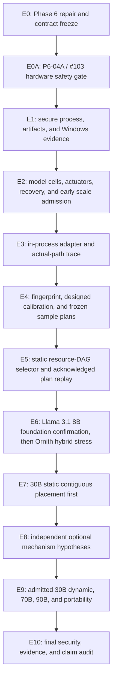
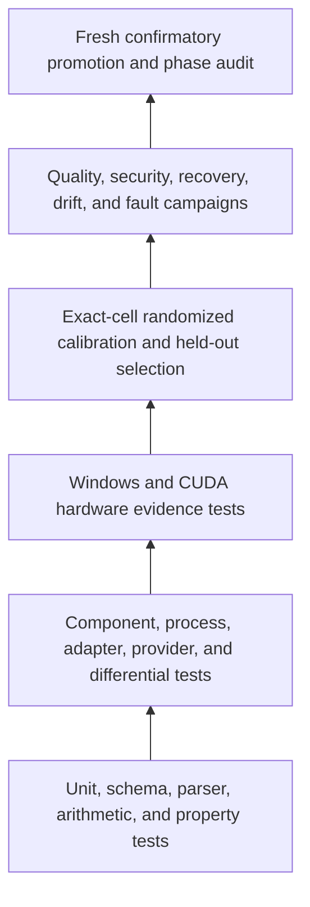

# Adaptive Runtime Execution and Testing Plan

Status: final council execution baseline
Roadmap: [`roadmap.md`](roadmap.md)
Normative companion documents:

- [`actuator-and-recovery-matrix.md`](actuator-and-recovery-matrix.md)
- [`windows-evidence-protocol.md`](windows-evidence-protocol.md)
- [`security-privacy-reproducibility.md`](security-privacy-reproducibility.md)
- [`threshold-registry.md`](threshold-registry.md)
- [`scale-capacity-and-bandwidth-admission.md`](scale-capacity-and-bandwidth-admission.md)
- [`../runtime-state-machine.md`](../runtime-state-machine.md)

This plan tests the smallest useful PrismInfer thesis first: can a secure,
evidence-complete controller select and replay a static pinned-runtime plan?
Custom kernels, staging, KV adaptation, speculation, progressive
representation, and structured routing are optional later hypotheses. They do
not compensate for a failed foundation.

## Execution Principles

1. Repair Phase 6 q4/evidence tracking before claiming Phase 7 readiness.
2. Close P6-04A, GitHub issue #103, before any model-backed Phase 6 execution.
   The gate is a trusted CPU-only supervisor, bounded Job worker, two-stage
   admission, watchdog, cancellation, abort, and cleanup path.
3. Secure the Windows process and artifact boundary before a plan can supply
   paths, options, or providers.
4. Separate owned allocation, physical residency, host residency/commit,
   mapped-file IO, pagefile IO, and transfer claims.
5. Use the exact admitted Llama 3.1 8B Instruct text GGUF as the preferred
   controller foundation, subject to accepted license/access and artifact pin.
   Use Ornith only as a hybrid architecture stress cell.
6. Inventory and test actuators before allowing them into candidate generation.
7. Run exact 8B/9B/30B/70B/90B capacity and resource-DAG bounds early.
8. Calibrate offline, with nested holdouts and fresh confirmation. The online
   path performs bounded lookup and deterministic replay only.
9. Build a static Phase 7 plan with R0/R1/R2 recovery. Dynamic or lossy R3
   mechanisms are optional Phase 8 research.
10. Measure 30B static contiguous placement before optional mechanisms.
11. Normalize speculative and large-model traffic by committed
    target-distributed output tokens, not accepted draft tokens.
12. Treat a stopped, rejected, slow/offline, or measured-non-certified result
    as valid evidence.

## Hardware Clearance Ladder

Clearance is cumulative, exact-cell scoped, and evidence-backed. A higher stage
is not granted by documentation, an issue state, or a successful lower stage.

| Clearance | Permitted work | Mandatory evidence | Current disposition |
|---|---|---|---|
| C0, CPU/simulation | Documentation, static analysis, CPU/reference tests, schemas, planners, and simulated fault paths. | Ordinary CPU verification and retained test results. | Cleared. |
| C1, tiny attended CUDA | Tiny deterministic correctness fixtures and Compute Sanitizer with explicit bytes, shapes, iterations, dispatch bound, timeout, and one operator present. | Hardware preflight, no competing GPU job, T-104 dispatch result, cleanup, and attended observation. | Conditionally cleared; no model, calibration, sustained benchmark, or unattended work. |
| C2, supervised synthetic CUDA | Short kernel/memory/transfer benchmarks and calibration microfixtures without model weights. | P6-04A/#103 exit, T-100 through T-105 enforced by the supervisor, lease/Job/fault-injection evidence, and C1 pass. | Blocked until #103 closes with accepted evidence. |
| C3, model-backed Phase 6 | Short exact-artifact load, q4/KV/quality fixture, warmup, and candidate evidence for the pinned Phase 6 cell. | C2 plus artifact/quant/tensor-inventory hashes, P6-07/P6-08/P6-10 gates as applicable, pre/post-context and model/backend reconciliation, and short-run approval. | Blocked until C2 and exact model-cell prerequisites pass. |
| C4, sustained foundation calibration/replay | Sustained Llama 3.1 8B foundation calibration, held-out confirmation, static selector replay, then separately admitted Ornith stress. | Entry: Phase 6 exit audit, P7-01 through P7-06 evidence, frozen sample plan, active watchdog, and exact admission. Promotion from C4 additionally requires T-001 through T-025 as applicable. | Blocked until preceding gates pass. |
| C5, scale/long evidence | Longer foundation/Ornith evidence, 30B static placement, and independently admitted 70B/90B work. | C4, exact scale capacity/DAG admission, model-specific clearance, run budget, cooldown, and the corresponding Phase 7/8/9 gate. | Blocked; no clearance by analogy. |

Any guard breach, context-fatal CUDA error, stale telemetry, missed cancellation
deadline, or unreconciled cleanup revokes the active clearance for that run. It
does not automatically revoke prior evidence, but another hardware attempt
requires review and a fresh preflight.

## End-to-End Execution Sequence



## Baseline Freeze Record

Before any confirmatory comparison, freeze:

```text
PrismInfer revision and dirty-tree patch hash
llama.cpp/GGML revision, submodule/dependency identity, and build flags
compiler, CMake, CUDA, driver, library, OS, and security-policy state
CPU topology/CPU Sets, RAM/commit/pagefile, GPU/VRAM/WDDM budget, PCIe, storage
power, thermal, clock, background-load, and instrumentation policy
model/checkpoint, tokenizer, template, parser, GGUF, imatrix, mmproj, MTP hashes
converter, quantizer, provider, and derived-artifact recipe hashes
GGUF quant label, mixed-quant flag, per-tensor type/shape/byte inventory hash
context, batch, ubatch, threads, affinity, sampling, seed, and stop controls
prompt/quality fixture revision, task stratum, split assignment, and split seed
cold/warm cache definition and file identity
policy ceiling, requested cap tier, live capacity observations, reserve policy,
  effective live cap, and both admission decisions
threshold-registry version and metric-specific sample plan
actuator inventory, plan schema, acknowledgement schema, and recovery graph
privacy/retention policy and approved artifact roots
clearance stage, supervisor/worker hashes, lease/Job policy, watchdog thresholds,
  cancellation deadlines, and approving evidence IDs
```

Model weights and large traces remain in an approved external artifact store.
The repository retains portable identities, recipes, schemas, small fixtures,
and hashes.

## Stage Plan

### E0: Phase 6 repair and contract freeze

Roadmap coverage: Phase 6 repair plus P7-00.

Execution:

1. Link the Phase 6 manifest foundation to its existing branch/PR.
2. Retain issue `#73` for the synthetic CUDA lane and preserve its limited
   claim.
3. Track exact q4 semantics, manifest benchmark runner, KV/quality fixtures,
   same-cell evidence, and the Phase 6 audit.
4. Validate all adaptive-runtime Markdown, Mermaid, links, UTF-8, and source
   references.
5. Freeze the provisional threshold registry, security contract, Windows
   evidence protocol, actuator/recovery matrix, and novelty gap matrix.

Exit:

- exact selected GGUF q4 reference work has a tracked owner and gate;
- no toy CUDA or configured-budget evidence is presented as model/runtime
  proof;
- all normative documents agree on static-first sequencing and committed
  output terminology.

### E0A: P6-04A fail-closed hardware supervisor and admission boundary

Roadmap coverage: cross-cutting host-admission primitive #109 plus P6-04A,
GitHub issue #103. Issue #109 supplies the pure T-101 decision and authoritative
system counters; #103 remains the blocking integration/watchdog/token gate
before model-backed Phase 6 and is not deferred to Phase 7.

Execution:

1. Build a trusted CPU-only outer supervisor and a separate worker containing
   CUDA, llama.cpp/GGML, providers, parsers, model/context state, and workload.
2. Create the worker suspended, assign a non-breakaway kill-on-close Job with
   explicit process/memory/time limits, establish bounded IPC, then resume.
3. Acquire one exclusive PrismInfer GPU lease and reject accidental concurrent
   work.
4. Implement pre-context admission using policy/request identity, conservative
   artifact/context/backend/state/workspace census, DXGI/WDDM evidence, host
   physical/commit reserve, thermal state, and required telemetry freshness.
5. Permit only minimal context creation, reconcile actual context/runtime and
   CUDA/DXGI observations, then perform post-context admission before model
   load or workload allocation.
6. Reconcile model/backend pools before warmup and continuously enforce T-100
   through T-105 with the outer watchdog.
7. On breach, stop submissions, request bounded cooperative cancellation,
   terminate the Job at the frozen deadline, reconcile cleanup, release the
   lease, and publish a terminal fail-closed artifact outside the worker.
8. Fault-inject worker crash/hang, stale sensor, budget shrink, thermal stop,
   context-allocation surprise, IPC corruption, cancellation miss, child-tree
   escape attempt, and cleanup disagreement without using a real resource
   breach as the test mechanism.

Exit:

- the supervisor never creates or owns a CUDA context;
- no CUDA context exists on a pre-context rejection and no model is loaded on a
  post-context rejection;
- Job termination and kill-on-close contain the complete worker tree;
- T-100 through T-105 are release-active, typed, recorded, and pass their
  deterministic fault tests;
- terminal evidence survives worker crash and distinguishes cancellation,
  forced abort, cleanup result, and context-fatal quarantine;
- clearance C2 may be granted for an exact synthetic cell; C3 remains blocked
  until its model/artifact gates also pass.

### E1: secure process, artifact, and Windows evidence foundation

Roadmap coverage: P7-02 and P7-03, extending the accepted P6-04A/#103
supervisor rather than introducing a second launcher.

Execution:

1. Replace shell-string launch with a native Windows process API.
2. Assign the child tree to a Job Object before ordinary execution proceeds.
3. Restrict environment, working directory, inherited handles, executable and
   artifact roots, and output handles.
4. Bind paths to canonical/open-handle identity and enforce approval records.
5. Capture child/process-tree working set, private commit, IO, exit, timeout,
   and cleanup.
6. Implement allocator/backend/context/workspace/KV/pool, DXGI/WDDM,
   host/commit/pagefile, mapped-file, and transfer schemas.
7. Keep configured, predicted, measured, and inferred values distinct.

Exit:

- all process, path, artifact, parser, Job-tree, WDDM disagreement, pagefile,
  cache-state, file-identity, and dropped-record fault tests pass;
- claim classification downgrades correctly when evidence is absent or
  ambiguous;
- plan inputs cannot load an arbitrary executable, DLL, provider, or artifact.

### E2: model cells, actuators, recovery, and early scale admission

Roadmap coverage: P7-01, P7-04, and P7-05.

Execution:

1. Pin a conventional full-attention foundation, an Ornith hybrid stress cell,
   and a tiny smoke artifact.
2. Record the exact GGUF tensor name/type/shape/byte inventory and its hash.
   Treat labels such as `Q4_K_M` as mixed per-tensor recipes, not a scalar
   four-bit payload, and use actual artifact bytes for capacity.
3. Record exact architecture-state scope; do not apply a uniform KV formula to
   Ornith.
4. Audit the pinned runtime and current upstream for every possible actuator.
5. Implement descriptors and acknowledgements for only proven static controls.
6. Assign R0/R1/R2/R3 by actual commit and compatibility behavior.
7. Census exact 8B/9B/30B/70B/90B artifact/state/workspace bytes.
8. Measure safe host/GPU capacity and effective CPU, DRAM, PCIe, and model-order
   storage service.
9. Build optimistic capacity-constrained DAG bounds and freeze T-060 through
   T-065 sample plans.

Exit:

- Phase 7 candidate generation rejects unacknowledged or R3 actuators;
- 30B has an explicit static admission decision;
- each 70B/90B artifact is admitted or rejected before an ordinary execution
  backlog is activated;
- lower bounds report committed output tokens/s and external bytes per
  committed output token.

### E3: in-process adapter and actual-path trace

Roadmap coverage: P7-06.

Execution:

1. Embed the pinned libllama/GGML lifecycle inside the contained worker behind
   an opt-in build/runtime flag; the outer supervisor remains CPU-only.
2. Reproduce the secure external baseline in default-equivalent mode.
3. Apply only audited P7-04 process/load/context/request controls.
4. Emit actuator acknowledgements and correlate request, operator, placement,
   transfer, state, workspace, and implementation events.
5. Reconcile adapter-owned, backend-owned, runtime, context, state/KV,
   workspace, retained pool, and unknown bytes.
6. Disable or downgrade on API/commit mismatch, unavailable actual-path
   observation, or weaker cap evidence.

Exit:

- deterministic prompts match the external baseline under identical sampling;
- requested values and actual runtime state are independently visible;
- default/off mode preserves upstream behavior;
- the secure external path remains a reproducible fallback and comparator.
- all GPU paths use the same accepted supervisor, Job, two-stage admission, and
  cancellation boundary established by #103.

### E4: fingerprint, designed calibration, and frozen sample plans

Roadmap coverage: P7-07.

Execution:

1. Generate a stable device/runtime/model/artifact/power fingerprint.
2. Design public-control and static-placement experiments with randomized order
   and session/machine-state blocks.
3. Capture raw CPU, GPU, transfer, storage, context, and end-to-end trials.
4. Partition calibration/search, model selection/pruning, confirmatory replay,
   and sealed promotion data.
5. Pilot variance/tail behavior, then freeze metric-specific power or precision
   plans, independent units, missing-data rules, multiplicity policy, and stop
   rules.
6. Re-run finalists on fresh confirmation data after adaptive search.

Exit:

- repeated unchanged cells retain identity; relevant drift invalidates them;
- raw trials reproduce summaries and retain failures and overhead;
- p95/p99 claims use independent request/sequence samples with a quantile
  precision plan, not tokens treated as iid or three aggregate runs;
- calibration claims are predictive, not unsupported causal attributions.

### E5: static selector and acknowledged plan replay

Roadmap coverage: P7-08 and P7-09.

Execution:

1. Apply analytical capacity and eligibility rejection.
2. Fit resource-DAG stage and end-to-end prediction intervals for supported
   static candidates.
3. Compare the selector with a measured feasible oracle on held-out cells.
4. Compile a deterministic immutable plan bound to exact compatibility and
   actuator descriptors.
5. Replay process/load/context/request settings and record actual
   acknowledgements.
6. Exercise R0 local substitution, proven R1 boundary change, and R2
   restart/reject paths.
7. Measure orchestration overhead against the same selected upstream
   configuration.

Exit:

- T-020 through T-025 and T-008 pass under frozen confirmation plans;
- promoted memory is never underpredicted;
- no nearest-plan substitution occurs;
- no dynamic kernel, staging, KV, representation, routing, or speculation
  decision appears in the Phase 7 plan;
- uncertainty causes abstention or upstream default rather than unsafe choice.

### E6: Llama 3.1 8B foundation confirmation, then Ornith hybrid stress

Roadmap coverage: P7-10.

Entry requires clearance C4. Closing #103 alone grants neither model-backed
clearance nor sustained calibration: C3, the Phase 6 audit, P7-01 through
P7-06, and the frozen run-specific admission evidence must also pass.

Execution order:

1. tiny deterministic smoke;
2. conventional full-attention CPU reference;
3. conventional full-GPU where feasible;
4. conventional static contiguous split sweep;
5. strongest public upstream control sweep;
6. selector/oracle comparison and acknowledged replay;
7. fresh T-001 through T-008 and T-020 through T-025 confirmation;
8. security, evidence, drift, recovery, and claim audit;
9. only then, certified Ornith hybrid stress replay.

Exit:

- foundation behavior is proven or rejected without Ornith confounders;
- Ornith main/mmproj/MTP, multimodal scope, hybrid operator and architecture
  state coverage are explicit;
- Ornith results never generalize to conventional full-attention KV behavior;
- selector failure yields an evidence/calibration-tool outcome rather than
  automatic scope expansion.

### E7: 30B static placement first

Roadmap coverage: P8-00.

Execution:

1. Reconfirm the exact 30B P7-05 admission and hardware fingerprint.
2. Run CPU-only, every admitted contiguous split, and full feasible candidates.
3. Measure actual GPU/host/state/workspace/transfer/file behavior.
4. Compare best upstream static with PrismInfer selection.
5. Freeze the 30B static result before opening optional mechanism experiments.

Exit:

- one exact static cell is measured or rejected;
- load success is not substituted for throughput, latency, quality, cap,
  physical host, transfer, or storage evidence;
- later dynamic candidates must beat this frozen baseline.

### E8: independent optional mechanism hypotheses

Roadmap coverage: P8-01 through P8-06.

Run each lane against its own static same-cell baseline:

- approved kernel provider/autotuning;
- bounded pinned staging and prefetch;
- one architecture-correct KV/state policy;
- committed-output-aware speculative offload;
- entropy/lossless/static-progressive/activation-transfer representation
  hypotheses as separate children;
- structured oracle, with router/adaptation opened only after oracle success.

Rules:

- T-040 through T-048 are independent continuation gates;
- a child that fails stops without blocking Phase 8;
- an R3 path is pre-commit verified, checkpoint/rollback-bounded, or explicitly
  approximate;
- joint evaluation occurs only if at least two mechanisms pass separately;
- T-049 requires fresh confirmation over best static and best single-lane
  baselines.

### E9: gated scale, dynamic 30B, and portability

Roadmap coverage: P9-00 through P9-04.

Execution:

1. Re-hash artifacts and refresh exact admission after all relevant drift.
2. Freeze final T-060 through T-065 sample plans and allowed mechanism credit.
3. Run optional 30B dynamic work only against the frozen static baseline.
4. Activate 70B and 90B independently only when their exact lower bounds pass.
5. Record complete host/pagefile/file/NVMe/PCIe/GPU/state/workspace evidence.
6. Repeat invalidation/recalibration on another hardware/software cell or
   publish the blocker.

Exit:

- each scale cell is validated, quality-gated, measured-offload slow/offline,
  measured-non-certified, simulated lower-bound, or rejected;
- no artifact receives aspirational compression/router/speculation credit;
- no plan crosses a fingerprint or compatibility predicate silently.

### E10: final security, evidence, and claim audit

Roadmap coverage: P9-05.

Audit:

- native process and Job boundary;
- artifact/provider authenticity and revocation;
- parser/decoder overflow and expansion safety;
- privacy/retention and fixture-only defaults;
- self-hosted runner trust boundary;
- source/build/artifact/fixture/threshold/sample/plan/raw-observation
  reproducibility;
- exact-cell requested-versus-actual, recovery, cap/residency, quality,
  latency, committed-output, and portability traceability;
- novelty/gap claims versus pinned and current upstream.

The broader runtime thesis may be rejected even when the evidence/calibration
tool is successful.

## Test Pyramid



Every higher layer consumes retained artifacts from the layer below. Passing a
unit test does not imply a measured mechanism or model-cell claim.

## Unit and Property Tests

### Native launch and path handling

- Windows argument builder round-trips spaces, quotes, backslashes, Unicode,
  percent/variable syntax, shell metacharacters, empty arguments, and long
  paths without shell interpretation.
- Device paths, alternate data streams, unexpected reparse points, traversal,
  outside-root paths, and open-after-swap identities are rejected.
- Job assignment, inherited handles, timeout, early exit, nested child, forced
  termination, output-handle, and cleanup states are deterministic.
- Run IDs cannot become path components; opaque names are collision-safe.

### Supervisor, lease, admission, and cancellation

- Only the outer supervisor can acquire/release the GPU lease, admit a stage,
  change clearance state, terminate the Job, or publish terminal evidence.
- A worker proves it is inside the expected non-breakaway Job before context
  creation; malformed, replayed, oversized, out-of-order, or stale IPC fails
  closed.
- Pre-context reject produces zero worker CUDA-context events. Post-context
  reject produces zero model-load/workload events.
- Policy ceiling, requested tier, live observations, reserve, and effective cap
  remain separately typed and serialized; fuzz/property tests preserve
  `peak <= effective <= requested <= policy`.
- Budget shrink, context surprise, stale watchdog data, thermal stop, worker
  heartbeat loss, cancellation timeout, Job abort, crash, and cleanup mismatch
  reach deterministic terminal states under T-100 through T-105.
- No context-fatal or forced-abort case is retried automatically in the same
  worker or clearance record.

### Artifact, plan, and provider safety

- Schema version, magic, endian, dimensions, counts, offsets, ranges,
  alignment, padding, and dependency graphs validate before use.
- Addition, multiplication, alignment, KV ledger, workspace, and expansion
  arithmetic is overflow-safe.
- Truncated, oversized, cyclic, duplicate, decompression-bomb, wrong-parent,
  revoked, and hash-mismatched artifacts fail before GPU launch.
- Provider capability/workspace/stream/hidden-allocation violations fail closed
  and cannot abort the host.
- Plan substitution, arbitrary provider path, unknown actuator, and unsupported
  schema version are rejected.

### Identity and evidence schemas

- Canonical fingerprint serialization is order-stable and hash-stable.
- Every required compatibility-field mutation changes or rejects the cell ID.
- Configured/predicted/measured/inferred fields are non-interchangeable.
- Missing, unknown, duplicate, contradictory, and non-finite fields fail the
  appropriate claim class.
- Ordinary and profiler cells cannot be compared as the same cell when
  instrumentation changes memory/timing.

### Actuator and recovery

- Candidate construction accepts only complete, eligible descriptors.
- Requested-value hash and actual acknowledgement bind to the same plan entry.
- R0 proves no output/state commit and cleans workspace.
- R1 requires exact state compatibility or a versioned conversion with bounded
  transition memory/time.
- R2 records restart/reload/reject without continuity language.
- R3 cannot claim reversal after committed state/output; audit-only behavior is
  explicitly lossy.
- Recovery itself is capacity-admitted and fails closed if it exceeds the cap.

### Resource DAG and planner

- Dependency, resource-capacity, stream, copy-engine, staging-slot, and commit
  constraints are enforced.
- Critical-path makespan is bounded by known synthetic DAGs; additive sums are
  rejected where overlap exists.
- Infeasible capacity and transfer candidates are pruned before scoring.
- Prediction intervals and one-sided memory bounds are monotone under added
  uncertainty.
- Pareto/selector tie-breaking is deterministic.
- Abstention selects the declared upstream default.

### Committed-output accounting

For each target verification cycle, test:

```text
committed output = accepted draft tokens actually committed
                 + target correction/extra token committed
                 - rolled-back or quarantined tokens
```

- zero-commit cycles cannot divide bytes by zero or report throughput;
- acceptance rate and accepted draft length remain diagnostics;
- target, draft, verification, correction, rollback, KV/state, PCIe, and
  storage cost all remain in the same cycle record;
- external bytes per committed output token reconcile with transfer/file
  events.

### Sampling and split integrity

- tokens in a sequence cannot inflate request/session sample counts.
- calibration, selection, confirmation, and sealed promotion IDs cannot
  overlap.
- adaptive candidate search triggers multiplicity control or fresh finalist
  replay.
- changing a candidate after sealed promotion consumes a new sealed set.
- frozen sequential stop rules cannot be changed after observing results.

## Differential Correctness Tests

### Operator and representation level

- Exact selected GGUF q4 CPU reference versus pinned GGML dequant/matmul.
- Candidate kernel versus CPU reference over exact quant blocks, edge shapes,
  misalignment, tails, and adversarial values.
- Lossless tile decode byte-for-byte versus source.
- Static progressive reconstruction versus declared tier reference and parent.
- KV/state conversion versus architecture-correct reference where R1 is
  claimed.
- Structured mask/oracle output versus full dense continuation before any
  router claim.

### Runtime level

- Secure external baseline versus in-process default-equivalent output.
- External/in-process actual CLI/API settings and applied defaults.
- CPU-only, full-GPU, and each static split under deterministic sampling.
- Selected static plan versus direct invocation of the same upstream
  configuration.
- Speculation versus exact non-speculative target output under its declared
  verification policy.
- Ornith main-only, optional modality/mmproj, MTP, hybrid state, and unsupported
  paths remain distinct validation cells.

## Windows Evidence Tests

### GPU and WDDM

- owned allocator versus backend buffers/pools versus CUDA context/runtime;
- device memory delta, DXGI local/nonlocal budget and usage, NVML availability,
  eviction/residency/fault evidence;
- short peak, changing WDDM budget, competing desktop/GPU load, and nonlocal
  use;
- unknown/unreconciled bytes force the correct downgrade.
- pre-context DXGI/WDDM observations and post-context CUDA/DXGI reconciliation
  are separate timestamped samples; neither is copied into the other field;
- reserve-adjusted live capacity is recomputed on budget/usage change and an
  admitted run cancels before the reserve can be consumed.

### Host, mapping, file, and pagefile

- parent versus child/process-tree working set/private commit/IO;
- system physical total/available and authoritative system-wide commit
  total/limit/headroom; on Windows, system commit comes from
  `GetPerformanceInfo`, not `MEMORYSTATUSEX` pagefile fields;
- `development_nonpromotable` and `evidence_promotable` T-101 lanes retain
  their distinct physical and commit reserves, with explicit reserves allowed
  to raise but never lower the lane floor;
- exact planned incremental resident and commit peaks, uncertainty, and pinned
  bytes are charged separately against live payload; pagefile capacity never
  increases physical payload;
- deterministic admission fixtures cover 8 GiB, 12 GiB, and 15 GiB available,
  independent commit pressure, missing/contradictory counters, overflow,
  pinned-host cap breach, and rejection of development-receipt promotion;
- mapping size versus actual resident proxy;
- source GGUF versus derived artifact versus log versus unrelated/pagefile IO;
- cold versus warm cache identity and rejection of mislabeled state;
- host reserve breach and pagefile pressure classification. No fixed free-RAM
  prerequisite, including 24 GiB, is a valid admission rule.

### Transfers

- actual source/destination allocation identity and submitted/completed bytes;
- pageable/pinned, stream/engine, queue wait, duration, exposed wait, overlap,
  retry and partial transfer;
- logical tensor size cannot substitute for a transfer event;
- dropped CUPTI/ETW/backend records downgrade the claim;
- configured transfer budgets cannot populate observed fields.

## Calibration and Statistical Tests

### Pilot and sample-plan freeze

For every threshold used in promotion, record:

```text
threshold ID/version and exact metric
population and validation cell
independent experimental unit
pilot baseline and variance/tail estimate
minimum detectable practical effect or desired interval width
confidence method and level
number of sessions, requests, prompts, cold starts, and restarts
randomization and blocking
multiplicity/finalist policy
failure/missing handling
sequential stop rule
split IDs and owners
```

### Repeatability and drift

- randomize candidate/baseline order within session blocks;
- separate cold, warm, and restarted-machine populations;
- retain thermal/power/clock/background-load state;
- use at least three sessions for diagnostic CV, with more independent units
  when a confidence or tail claim requires them;
- inject driver, power, context, artifact, runtime, and storage drift and verify
  fingerprint invalidation.

### Prediction and selection

- report median and p95 stage prediction error with intervals;
- report end-to-end p95 prediction error on independent requests;
- compare selector throughput and tail regret with the measured feasible oracle;
- verify memory upper bounds on every promoted run;
- replay finalists fresh after search to control winner's curse;
- report task/context strata and worst-stratum behavior.

## Performance Metrics

### Required request metrics

- TTFT distribution, with cold and warm cells separate;
- inter-token latency distribution and request p50/p95/p99 where supported by
  the frozen precision plan;
- prefill tokens/s and warm decode tokens/s;
- end-to-end wall time and orchestration overhead;
- committed target-distributed output tokens/s;
- accepted draft length/rate as diagnostics only;
- CPU time/utilization/topology, DRAM traffic where available;
- GPU kernel, copy, exposed-wait, utilization and profiler path;
- actual H2D/D2H, mapped-file, storage and pagefile bytes;
- external bytes per committed output token;
- peak owned GPU, physical residency evidence, host working set/private commit,
  state/KV, staging, workspace, pool and unknown bytes.

### Required baselines

For the exact same cell, as applicable:

1. secure external llama.cpp CPU;
2. in-process default-equivalent CPU;
3. secure external and in-process full-GPU;
4. contiguous static split sweep;
5. strongest public upstream control sweep;
6. selector oracle and selected plan;
7. no-custom/no-optional PrismInfer replay;
8. strongest upstream kernel/provider baseline for kernel research;
9. serialized versus staged/prefetched data movement;
10. ordinary upstream speculation/offload;
11. best static and best single-mechanism baseline before joint evaluation.

Isolated operator timing is diagnostic. A speedup claim requires end-to-end
same-cell confirmation under the registry threshold.

## Quality and Privacy Tests

### Foundation fixtures

- deterministic generation/token identity;
- general instruction/reasoning strata;
- retrieval and needle/long-context strata;
- coding only where the model supports it;
- worst-stratum and paired per-prompt deltas;
- tokenizer/template/parser correctness.

### Ornith stress fixtures

- coding/capability tasks appropriate to the artifact;
- main-only versus modality/mmproj scope;
- MTP enabled/disabled only when separately pinned;
- full-attention and DeltaNet architecture-state coverage;
- no conventional-KV generalization.

### Approximate mechanisms

- paired dense/source baseline and quality delta;
- long-context and state-drift checks;
- OOD/confidence and worst-stratum behavior;
- pre-commit verification, bounded rollback/quarantine, or explicit approximate
  classification;
- a later dense audit can disable future use but cannot erase released output.

### Privacy

- fixture-only semantic capture is the default;
- production prompts, tokens, logits, activations, hidden states and KV are not
  retained without explicit opt-in, purpose, access control, encryption,
  retention and deletion policy;
- telemetry uses IDs and aggregates by default;
- tests fail if default mode writes raw semantic data;
- activation/router datasets have source, license, split and retention records.

## Fault and Adversarial Matrix

| Fault | Required outcome |
|---|---|
| GPU lease already held or lease identity changes | Reject boundedly; no worker/context is created. |
| Pre-context telemetry stale/missing or conservative peak infeasible | Reject with no CUDA context and preserve admission inputs. |
| Physical RAM is adequate but system commit headroom is below reserve or plan | Reject on the commit-specific reason before allocation; pagefile capacity cannot increase physical payload. |
| System commit source is process-bounded, unknown, contradictory, or overflowing | Reject as non-authoritative; do not substitute `MEMORYSTATUSEX` pagefile fields. |
| A fixed 24 GiB-free prerequisite rejects an otherwise fitting exact plan | Policy/conformance test fails; recalculate from T-101 lane reserve and exact workload peaks. |
| Development-lane receipt is presented as promotable evidence | Reject and require fresh `evidence_promotable` admission. |
| Context allocation exceeds estimate or CUDA/DXGI disagree | Post-context reject; cancel/terminate before model load. |
| GPU temperature reaches T-102 stop or sensor age exceeds T-103 | Stop submissions immediately; bounded cancel/Job abort and cooldown evidence. |
| Worker heartbeat stops or IPC is corrupt/replayed | Treat worker as untrusted/unresponsive; abort Job and reconcile cleanup. |
| Cooperative cancel exceeds T-105 | Force Job termination; no automatic same-context retry or promoted result. |
| Worker crashes before final manifest | Supervisor publishes crash/Job/cleanup terminal artifact outside the worker. |
| Shell characters or malformed Windows quoting | No shell interpretation; literal argument or reject. |
| Reparse/TOCTOU/path traversal/device/ADS path | Reject before execution and record reason. |
| Unapproved or revoked artifact/provider/plan | Reject before load/launch. |
| Truncated/overflowing/cyclic/compression-bomb artifact | Reject before GPU use; no partial state. |
| Child exits, hangs, spawns grandchildren, or cleanup fails | Job-accounted exit/timeout/termination and retained evidence. |
| Short GPU/host peak | Capture by peak/event evidence or downgrade classification. |
| WDDM budget changes or eviction/nonlocal use appears | Reconcile and downgrade/reject physical-residency claim. |
| Mapped bytes mislabeled resident or pagefile hidden | Reject promoted host-residency/offload claim. |
| Transfer event missing or logical bytes substituted | No measured-transfer/profitability claim. |
| ETW/CUPTI/backend records dropped | Record drops and downgrade the cell. |
| Pinned runtime lacks requested actuator | Candidate rejected before plan compilation. |
| Backend applies a different value | Acknowledge default/reject/restart; never claim requested value. |
| R0 kernel/prefetch failure before commit | Local upstream/wait path; exact state preserved. |
| R1 conversion or boundary guard fails | Abort transition and use proven reverse conversion or R2 restart/reject. |
| R2 load/context mismatch during request | Restart/reload/reject; no seamless-continuity claim. |
| R3 router/KV/progressive audit after output release | Disable future use; released output remains approximate. |
| Recovery workspace exceeds cap | Reject recovery and take bounded R2 outcome. |
| Calibration candidate overfits search split | Fresh confirmation fails; do not promote. |
| Fingerprint/runtime/driver/model drift | Reject stale plan and recalibrate or use safe default. |
| Speculation produces zero committed output | No divide-by-zero or throughput credit; fall back/reject cycle. |
| Low acceptance with high draft/transfer cost | Committed-output metric rejects candidate. |
| Raw production semantics written by default | Privacy test fails and artifact is quarantined/deleted. |
| Untrusted PR reaches self-hosted GPU runner | Workflow policy rejects execution. |

## Validation Matrix

### Hardware and software axes

| Axis | Required cells |
|---|---|
| OS | Windows 11/WDDM primary; Linux later for portability, not as a substitute. |
| GPU | RTX 5080 Laptop primary; additional cell for P9 portability if available. |
| GPU cap | policy ceiling, requested tier, live capacity, reserve, and effective live cap are separate; 12/16 GiB are request/reference labels where meaningful, never literal allocation targets. |
| Host | exact physical total/available, authoritative commit total/limit/headroom, T-101 lane, lane reserves, exact incremental resident/commit peaks, uncertainty, pinned bytes, storage volume/device; required availability cells include 8/12/15 GiB and independent commit pressure. |
| Runtime | trusted outer supervisor plus contained Job worker for every model/CUDA path; secure external pinned llama and in-worker pinned adapter; current upstream only as a separate comparison. |
| CUDA | default non-CUDA CI; optional probe; guarded kernel/provider lane. |
| Instrumentation | ordinary, telemetry, ETW/CUPTI/Nsight profiler as separate cells when overhead differs. |
| Power/thermal | frozen policy/bucket and recorded drift. |

### Model and workload axes

| Axis | Required cells |
|---|---|
| Smoke | tiny deterministic fixture. |
| Foundation | exact admitted, self-produced Llama 3.1 8B Instruct text GGUF, subject to accepted license/access. |
| Hybrid stress | Ornith-1.0-9B only after main/mmproj/MTP/operator/state admission. |
| Scale | exact admitted 30B; exact 70B/90B gated by lower bound. |
| Representation | source q4 first; each derived artifact is a separate cell. |
| Phase | load, context creation, cold/warm prefill, batch-1 decode, larger batch where declared. |
| Context | 2K smoke plus exact short/medium/long strata appropriate to model and host. |
| Prompt | deterministic, general, coding where supported, retrieval/needle, OOD/adversarial. |
| Cache | cold file, warm OS cache, declared retained model/context state. |
| Policy | upstream default, every public static candidate, selected plan, optional mechanism only after gate. |

## Threshold and Mechanism Gates

Use the versioned registry rather than copying a naked number into an issue.
The current provisional continuation policies are:

| Gate | Registry entries | Required interpretation |
|---|---|---|
| 9B cap/quality/usability/overhead | T-001 through T-008 | Exact-cell foundation policy with metric-specific independent units. |
| Selector prediction/regret/memory | T-020 through T-025 | Predictive held-out gate; no unsupported causal claim. |
| Kernel | T-040 | End-to-end same-cell, not isolated kernel time. |
| Staging/prefetch | T-041/T-042 | Timeline-backed exposed benefit and verified cold state. |
| Lossless/progressive/activation representation | T-043/T-044/T-046 | Separate child hypotheses, effective bytes and decoder/workspace included. |
| KV/state | T-045 | Net bytes, codec margin, quality and architecture-state correctness. |
| Structured oracle/router | T-047/T-048 | Oracle first; router only after pass; realized end-to-end savings. |
| Joint optional plan | T-049 | At least two independent passes and fresh confirmation. |
| 30B/70B/90B viability | T-060 through T-065 | Committed output, tail, quality and complete evidence; research threshold, not SLA. |

Threshold changes require a versioned decision before new measurement. They do
not rewrite a failed completed experiment.

## Exact-Cell Promotion Gates

### Phase 7 conventional foundation

Required:

- exact source/quant/tokenizer/template/fixture/runtime/hardware/cap identity;
- accepted P6-04A/#103 supervisor evidence and clearance C4 for the exact run;
- secure process and artifact boundary;
- owned memory reconciliation and any claimed physical-residency evidence;
- external/in-process equivalence and actual-path trace;
- approved metric sample plans and fresh confirmation;
- T-001 through T-008 and T-020 through T-025 as applicable;
- R0/R1/R2 fault evidence and complete reproducibility bundle.

Ornith is a second stress decision and cannot repair a failed foundation.

### Phase 8 30B static

Required before optional research:

- P7-05 exact admission still valid;
- CPU-only and all admitted contiguous static split baselines;
- complete host/GPU/state/workspace/transfer/file evidence;
- frozen quality and profitability policy with an approved sample plan;
- selected static outcome or explicit rejection.

### Phase 9 70B/90B

Before each long run:

- exact artifact/state bytes and safe host/GPU budgets;
- resource-DAG optimistic bound meets T-060 through T-065;
- no hidden pagefile/unified-memory or aspirational mechanism credit;
- complete evidence path for the intended classification;
- ordinary upstream baseline and an explicit stop budget;
- artifact-specific activation decision.

These are research-viability gates, not deployment SLAs. A pre-run rejection is
a valid result.

## Evidence Bundle Per Promoted Run

Retain:

- source/build/toolchain/runtime/hardware fingerprint and dirty patch hash;
- clearance stage; supervisor/worker hashes; lease and Job identity; both
  admission records; policy/request/live/reserve/effective cap values;
- artifact registry records, hashes, approval, parents, recipes and revocation;
- fixture/split/sample-plan/threshold identities;
- raw trials, failures, order, warmup, thermal/power, overhead and dropped
  records;
- secure process/Job, Windows host/WDDM/file/pagefile/transfer evidence;
- plan, compatibility, actuator descriptors, acknowledgement events, recovery
  graph and fault results;
- predicted and observed capacity, stage/DAG timing, memory/state/workspace and
  selector/oracle comparison;
- TTFT, ITL, prefill/decode, committed output, external bytes, quality and
  worst-stratum results with intervals;
- profiler identity/hash when a hardware-path claim is made;
- privacy/retention and self-hosted-runner classification;
- watchdog samples, threshold breaches, cancellation/abort timing, cleanup and
  cooldown evidence;
- exact claim class, limitations, and stop/go decision.

## CI and Hardware Lanes

### Hosted non-CUDA CI

- build and unit tests on Windows and Linux;
- schema, parser, overflow, plan, fingerprint, recovery and committed-output
  accounting tests;
- pure host-admission boundary tests for canonical lane floors, 8/12/15 GiB
  availability cells, independent commit pressure, counter provenance,
  freshness, overflow, pinned cap, and non-promotable development receipts;
- fake/null backend lifecycle and forced-failure matrices;
- Markdown/link/Mermaid/UTF-8 checks where tooling is available;
- no hardware performance threshold.

### Self-hosted Windows CUDA correctness

- manual or trusted-branch dispatch only;
- no untrusted pull-request code;
- pinned actions/toolchain/provider and least-privilege credentials;
- isolated approved workspace/artifact roots and runner cleanup;
- CUDA probe and guarded exact correctness/provider tests;
- approved evidence upload only, with secret/semantic-data scan.
- lane output is at most C1 unless the #103 supervisor/fault suite and the
  exact higher-clearance entry contract are explicitly selected and retained.

### Manual evidence and performance

- secure external/in-process baseline cells;
- Windows/WDDM/host/file/pagefile/transfer evidence;
- randomized calibration and fresh confirmation;
- Nsight/CUPTI/ETW only in declared instrumentation cells;
- only C3/C4/C5-cleared 9B, 30B, and admitted large-model runs;
- performance thresholds never enforced on noisy hosted CI.

## Roadmap Traceability

| Execution stage | Roadmap issues |
|---|---|
| E0 Phase 6 repair/contracts | Phase 6 repair, P7-00 |
| E0A hardware safety interlock | Cross-cutting #109 primitive, then P6-04A / #103 integration |
| E1 security and Windows evidence | P7-02, P7-03 |
| E2 artifacts/actuators/scale admission | P7-01, P7-04, P7-05 |
| E3 in-process trace | P7-06 |
| E4 calibration and sampling | P7-07 |
| E5 selector and replay | P7-08, P7-09 |
| E6 9B phase audit | P7-10 |
| E7 30B static | P8-00 |
| E8 optional hypotheses | P8-01 through P8-06 |
| E9 scale and portability | P9-00 through P9-04 |
| E10 final audit | P9-05 |

## Exit Audit Template

```text
phase and exact validation-cell identity
source, derived artifact, runtime, build, hardware and plan hashes
security/artifact approval and privacy classification
threshold registry and metric sample-plan versions
entry gates and their retained evidence
requested versus actual actuator acknowledgements
R0/R1/R2/R3 events and commit-point correctness
owned allocation, physical residency, host, pagefile, file and transfer class
raw and summarized performance/quality/committed-output evidence
prediction, selector oracle, regret and uncertainty
fault, drift, recovery and portability results
optional mechanism pass/reject decisions
claim classification and prohibited generalizations
open blockers, negative findings and next decision
GitHub issue/project status after evidence is accepted
```

A phase closes when it can state the truth about the exact cells, including a
rejection. It does not remain open merely because an optional mechanism failed.
