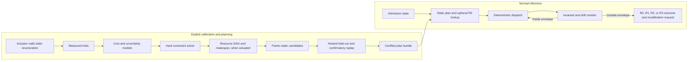

# Optimizer and Calibration Design

Status: proposed design; the current repository does not yet contain this
optimizer or calibration database.

## Direct Answer: What the Optimizer Tries to Do

The optimizer does **not** primarily minimize the time needed to calculate a
placement. Calibration may take minutes or hours because it is amortized.

Its primary task is:

> Find an executable inference plan that satisfies hard correctness, memory,
> provenance, and quality constraints, then minimizes the measured end-to-end
> resource-constrained critical path and tail latency per committed
> target-distributed output token.

The first Phase 7 plan may choose only actuators proven in the pinned runtime
and adapter:

- exact source artifact and model/modality/state cell;
- process and CPU topology policy;
- model-load file policy;
- static GPU-layer and proven tensor-buffer placement;
- context, batch, ubatch, thread, full-attention KV, and attention controls
  supported and acknowledged by the pinned build; and
- one declared R0/R1/R2 recovery outcome for each exact Phase 7 actuator; R3
  appears only in a separately scoped optional provider with an explicit
  verification, quarantine/rollback, or lossy contract.

It does not choose per-epoch representation, placement, KV format, transfer
schedule, speculative model, or structured block mask. Kernel dispatch,
staging, living KV, progressive representation, speculative offload, and
structured compute are independent optional providers admitted only after the
static controller and their own correctness/quality/recovery gates.

Planner runtime and plan-switch cost are included, but they are secondary to
the resulting inference behavior.

## Two-Level Optimizer



No unconstrained learned model is required. The initial implementation uses a
measured static table, analytical capacity/resource lower bounds, and simple
prediction intervals. Dynamic programming, CP-SAT/MILP, or schedule search is
introduced only when an implemented provider exposes real schedulable tasks and
resources.

A learned ranker or safe contextual bandit is allowed only when:

1. simple models fail a predeclared selection-accuracy gate;
2. the learned component cannot create an ineligible candidate;
3. all hard constraints remain outside the learned score;
4. an actuator-specific R0/R1/R2/R3 outcome exists; and
5. the learned artifact, features, calibration, and drift policy are pinned.

## Normative Executability Rule

`actuator-and-recovery-matrix.md` is part of the optimizer specification. A
decision variable is eligible only when its descriptor identifies an
implemented pinned API/hook, lifecycle, exact eligibility predicate,
requested/actual acknowledgement, memory and state effect, commit point, and
recovery class.

The candidate constructor rejects a missing or unacknowledged actuator. It may
not emit an aspirational value and rely on replay to ignore it. R0 substitutes
before commit, R1 converts or preserves compatible state at a declared
boundary, R2 restarts/rejects without continuity, and R3 is pre-commit verified,
checkpoint/rollback quarantined, or explicitly lossy.

The optimizer also inherits the normative
[Windows evidence protocol](windows-evidence-protocol.md),
[scale admission contract](scale-capacity-and-bandwidth-admission.md),
[threshold registry](threshold-registry.md),
[security, privacy, and reproducibility contract](security-privacy-reproducibility.md),
and [novelty and gap matrix](novelty-and-gap-matrix.md). Missing evidence or a
failed applicable contract makes a candidate ineligible; no learned score,
Pareto ranking, or nearest-cell substitution can override that result.

## Mathematical System Model

### Sets

For the Phase 7 static plan, let:

- \(u \in \mathcal U\) be an execution unit: model, tensor, or contiguous layer
  group exposed by a proven static actuator;
- \(e \in \mathcal E\) be an observed execution epoch, not automatically a
  decision boundary;
- \(d \in \mathcal D\) be a storage tier: VRAM, pinned RAM, ordinary RAM, or
  optional NVMe;
- \(c \in \mathcal C\) be a compute device: GPU or CPU;
- \(r \in \mathcal R_u\) be a valid representation for unit \(u\);
- \(k \in \mathcal K(u,r,c,s)\) be a correct eligible kernel for shape/state
  \(s\), available only through an optional proven R0 provider;
- \(a \in \mathcal A\) be a task in an implemented execution/schedule DAG;
- \(l \in \mathcal L\) be a capacity-constrained resource such as a CPU pool,
  GPU stream, copy engine, PCIe link, DRAM channel, storage queue, staging slot,
  or workspace pool; and
- \(m \in \mathcal M\) be architecture state: full-attention KV, recurrent or
  DeltaNet state, convolution state, MTP state, or multimodal state.

### Decision variables

A Phase 7 plan \(\pi_7\) is static across observed epochs:

\[
\pi_7=
\left(
r_u,
p_{u,d},
c_u,
\ell_{load},
\ell_{context},
\ell_{request}
\right),
\]

where:

- \(p\) is static placement/residency acknowledged after load;
- \(\ell_{load}\), \(\ell_{context}\), and \(\ell_{request}\) are vectors of
  proven actuators at those lifecycles; and
- representation, placement, and state type have no epoch subscript.

An optional provider extension may add \(k_{u,e}\), a compiled schedule
\(\tau\), a state policy, speculative configuration, or structured mask only
after the actuator matrix marks that variable proven. Each extension has a
separate plan scope and cannot be serialized into `phase7_static`.

Online state is used for admission, drift, and abstention. It does not create a
new plan. Hidden-state router features exist only inside an approved R3 provider
and are absent from Phase 7.

## Hard Feasibility Constraints

### Memory

For every tier and epoch:

\[
\sum_{u,r} S_{u,r}p_{u,d}
+M^{state}_{d,e}
+M^{workspace}_{d,e}
+M^{runtime}_{d,e}
+M^{fragmentation}_{d,e}
+M^{instrumentation}_{d,e}
+M^{unknown}_{d,e}
\le M^{cap}_{d}.
\]

For a promoted GPU result:

\[
M^{unknown}_{GPU,e}=0,
\qquad
M^{cap}_{GPU}\le 16\ \mathrm{GiB}.
\]

Host RAM, commit/pagefile, pinned memory, mapped residency, and storage pressure
are separate constraints. They cannot be collapsed into "not VRAM."

Here \(M^{state}\) separately accounts for full-attention KV, recurrent/
DeltaNet, convolution, MTP, and multimodal state. A uniform KV formula is not
valid for Ornith/Qwen3.5 hybrid layers.

### DAG precedence and resources

For a provider with executable tasks, every dependency \((a,b)\) requires:

\[
s_b \ge s_a+t_a.
\]

An object-transfer task precedes its consumer, staging slots cannot be reused
before consume completion, and active use of each resource remains within its
measured effective capacity:

\[
\sum_{j\in active(l,t)} b_j(t)
\le \widehat{BW}_{l}(x_t).
\]

Advertised PCIe, DRAM, GDDR, or NVMe bandwidth is not admissible as
\(\widehat{BW}\).

### Actuator and recovery feasibility

For every decision \(j\):

\[
implemented(j)\land acknowledged(j)\land
recovery(j)\in\{R0,R1,R2,R3\}.
\]

R0 requires substitution before the affected commit point. R1 requires exact
state compatibility/conversion and bounded transition memory/time. R2 is not a
runtime continuation. R3 records pre-commit verification, quarantined rollback,
or explicit approximation; a post-commit audit is not reversal.

### Correctness and provenance

The candidate kernel/representation must match exact tensor semantics:

\[
\lVert y_k-y_{reference}\rVert
\le \epsilon_{numeric}(u,r).
\]

The source, tokenizer, quant, derived artifact, runtime, plan, and fixture
identities must match. A lossy derived artifact cannot claim the source GGUF's
identity.

### Quality and risk

Let \(D_j(Y_\pi,Y_0)\) be a declared distortion metric against the same-model
baseline. Feasibility requires an empirical risk bound:

\[
\Pr_{x\sim\mathcal D_{target}}
\left[D_j(Y_\pi,Y_0)>\epsilon_j\right]
\le \delta_j,
\quad \forall j.
\]

The distribution is unknown, so this is an empirical project policy rather than
a distribution-free guarantee. PrismInfer uses nested held-out fixtures, paired
comparisons, confidence intervals, exact-cell labels, worst-stratum reports,
and the declared R3 contract.

## Objective

Use lexicographic, constraint-first optimization:

1. Reject plans that fail provenance, correctness, memory, or critical quality.
2. Among feasible plans, minimize makespan/tail latency and maximize committed
   target-distributed output throughput.
3. Break near-ties with transfer volume, host pressure, energy, stability, and
   implementation simplicity.

A risk-aware score over already-feasible plans can be:

\[
J(\pi)=
w_1\mathbb E[T_{makespan}]
+w_2\mathbb E[TPOT]
+w_3CVaR_{0.95}(TPOT)
+w_4\mathbb E[B_{H2D}+B_{D2H}]
+w_5\mathbb E[B_{NVMe}]
+w_6\mathbb E[E_{joules}]
+w_7C_{switch}
+w_8V_{prediction}.
\]

Hard constraints must not be moved into this score merely to make the solver
return a candidate.

### Speculative objective

For verification cycle \(i\), let \(A_i\) be accepted draft tokens,
\(I_i\) be the verifier's committed correction/extra target token, and
\(G_i=A_i+I_i\) be committed target-distributed output tokens. `I_i` is
normally one and is zero only for a declared termination/cancel case.

\[
committed\ output\ tokens/s=
\frac{\mathbb E[G]}
{\mathbb E[
T_{draft}+T_{target}+T_{transfer}+T_{verify}+T_{correction}+T_{rollback}
]},
\]

and:

\[
observed\ external\ bytes/committed\ output\ token=
\frac{\mathbb E[B_{target}+B_{draft}+B_{state}+B_{residual}]}
{\mathbb E[G]}.
\]

Bytes are observed transfer events, not logical tensor sizes. Proposed,
rejected, and rolled-back tokens are not reward. Acceptance rate and accepted
draft length remain diagnostics, not the primary objective.

## Candidate Construction

The full cross-product is intractable and mostly invalid. Construct candidates
in layers.

### Layer 1: Phase 7 static upstream actuators

- CPU-only and full-GPU where feasible;
- `n_gpu_layers` contiguous splits;
- public tensor buffer overrides;
- context, batch, ubatch, full-attention KV type, flash-attention, and fit
  controls available in the pinned runtime;
- generation/batch thread and CPU topology choices;
- only controls proven and acknowledged at process, model load, context create,
  or request setup.

This layer excludes per-op kernel selection, staging, state conversion,
speculative offload, progressive representation, and routing.

### Layer 2: optional exact providers

- per-shape implementation variants through an approved hook;
- bounded pinned staging/prefetch;
- upstream speculative parameters and target offload only after exact-cycle
  accounting; and
- exact state conversion or lossless activation transfer only after an
  independent provider gate.

### Layer 3: optional R3 research providers

- hidden-state structured blocks;
- per-epoch dynamic precision;
- Anchor/Residual KV speculation;
- speculative target streaming;
- algorithm-discovery candidates.

Layer 3 candidates never enter the joint catalog until they independently pass
their own correctness, quality, memory, recovery, and end-to-end gates. Static
progressive format, living KV, activation compression, and structured routing
are separate hypotheses; none is a Phase 7 or 30B-static dependency.

## Cost Model Decomposition

Predict and observe task components separately, but do not add them to obtain
latency when work overlaps. A schedulable provider compiles a DAG
\(G=(\mathcal A,E)\). Each task \(a\) has predicted duration \(t_a\), start
\(s_a\), resource demand, memory interval, and uncertainty. Dependencies and
resource capacities constrain starts. The phase objective is:

\[
T_{makespan}=\max_{a\in\mathcal A}(s_a+t_a)-\min_{a\in\mathcal A}s_a.
\]

The compiled DAG includes compute, conversion, transfer, queue/event, storage,
router, speculation, transition, and orchestration tasks:

```text
task_id and implementation/actuator
dependencies and state/commit effect
resource and capacity demand
predicted duration interval
predicted bytes and memory-live interval
actual start, finish, queue wait, exposed wait, and overlap
```

CPU pools, GPU streams, copy engines, PCIe, DRAM, storage queues, staging slots,
and workspaces are explicit resources. A static Phase 7 plan may have a trivial
observed DAG; it does not fabricate transfer tasks it cannot schedule.

Also predict:

```text
peak bytes by ownership and tier
payload and effective bits
quality-risk vector
actual implementation acknowledgement/recovery probability
thermal/power and run-to-run variance
```

Coarse end-to-end time alone is non-identifiable: many combinations of kernel,
conversion, queue wait, transfer, CPU contention, allocator growth, throttling,
and speculative rejection can produce the same total. Component telemetry
improves prediction but does not make observational coefficients causal.

## Calibration Key

At minimum:

```text
source model, quant, tokenizer, chat template, main GGUF, mmproj, MTP, and derived artifact hashes
model architecture, modality scope, full-attention layer set, recurrent/DeltaNet,
  convolution, MTP, and multimodal state descriptor hashes
PrismInfer, llama.cpp, GGML, compiler, build flags, and schema versions
CPU topology/ISA/cache class and selected CPU-set predicate
RAM/commit/pagefile policy
GPU UUID, compute capability, SM count, VRAM
driver mode, driver, CUDA runtime/toolkit, math library versions
PCIe link state
storage volume and physical device mapping
power/thermal bucket
operator, representation, layout, alignment, M/N/K, batch/ubatch
prefill/decode/speculative phase and context band
actuator descriptor/version/lifecycle and requested/actual acknowledgement
placement, transfer regime, architecture-state policy, and workspace cap
task/resource DAG and optional provider identity/version
correctness/determinism policy
```

Persistent plan identity excludes volatile free bytes, but admission reevaluates
free RAM/VRAM, commit, link state, clocks/temperature, and concurrent pressure.

## Calibration Protocol

### Trial control

- Freeze model, prompts, seed, sampling, runtime pin, cap, power mode, and test
  environment.
- Separate cold load, warm prefill, and steady decode.
- Warm up explicitly and record the boundary.
- Randomize candidate order where practical.
- Retain raw samples and failed trials.
- Declare the experimental unit for every metric: kernel trial, request,
  prompt, decode sequence, token within sequence, session, cold start, and
  machine restart are not interchangeable.
- Use `threshold-registry.md` to freeze a metric-specific power/precision or
  sequential stop rule before confirmatory measurement. Three runs are only a
  coarse CV diagnostic, never a p95/p99 request-tail sample plan.
- Record temperature/clocks/throttling and invalidate uncontrolled drift.
- Compare paired prompts in the same order.
- Use session blocks and interleaved baseline anchors.
- Separate calibration/search, model selection/pruning, confirmatory replay,
  and sealed promotion fixtures. A post-seal candidate change needs a new seal.

### Sample complexity guidance

For \(K\) noisy kernel candidates with variance proxy \(\sigma^2\), separating a
competitor by \(\Delta\) at error probability \(\delta\) requires approximately:

\[
n=O\left(\frac{\sigma^2}{\Delta^2}\log\frac{K}{\delta}\right).
\]

This is guidance, not proof, because thermal drift, repeated-token correlation,
adaptive pruning, and autocorrelation violate independence. Use blocked trials,
multiple-comparison control or fresh finalist replay, and confidence intervals.

For binary quality outcomes, Hoeffding's conservative bound is:

\[
n\ge\frac{\log(2/\delta)}{2\varepsilon^2}.
\]

Small quality deltas require more fixtures than a smoke test. Use paired
intervals for continuous metrics only at the correct independent unit. A
bootstrap does not turn correlated tokens from three sequences into independent
requests. Report task strata and the worst stratum.

The threshold registry records the metric definition, population, practical
rationale, minimum detectable effect or interval-width target, confidence,
multiplicity policy, sample/stop rule, split, and approving gate. Existing
percentages are provisional continuation policies, not scientific constants.

### Designed experiments and identifiability

Telemetry decomposition does not identify a causal cost by itself. Calibration
therefore uses actuator interventions rather than fitting one model to whatever
runtime combinations happened to occur:

1. enumerate implementation-valid actuator combinations and record structural
   exclusions;
2. randomize/interleave candidate and strongest-static-baseline order inside
   session, thermal, power, cache, and cold/warm blocks;
3. change one actuator or use a declared factorial subset where interactions
   are the question;
4. retain nuisance variables, missingness, requested/actual paths, declared
   recovery outcomes, and failed runs;
5. fit predictive stage and makespan models without calling coefficients causal;
6. hold out complete sessions, prompt/task strata, context bands, thermal/cache
   states, and actuator combinations where interpolation is claimed;
7. abstain outside calibrated support rather than extrapolate; and
8. confirm adaptively selected finalists on untouched requests/sessions.

The calibration report includes selection frequency, prediction residuals by
stratum, abstention coverage, and sensitivity to trial order. A complex model
must beat lookup tables and a static exhaustive sweep on fresh-selection regret
before it can auto-select a promoted plan.

## Search Strategy

### Stage 0: analytical rejection

- exact 9B/30B/70B/90B artifact and architecture-state capacity bounds at
  program entry;
- resource-DAG and bytes/committed-output-token lower bounds;
- representation/kernel incompatibility;
- missing actuator, acknowledgement, provider, commit, or recovery contract;
- workspace and cap violations;
- transfer compression inequality;
- conditional-compute oracle upper bound.

Reject an impossible candidate before benchmarking.

### Stage 1: exhaustive Phase 7 static catalog

Exhaustively measure the small set of proven public process/load/context/request
controls. Apply correctness, memory, acknowledgement, and R2 restart-cost checks
before timing. Exact hot-shape tracing informs later providers; it does not make
per-op selection a Phase 7 decision.

### Stage 2: successive halving

Spend additional search trials on close candidates. Never prune before
correctness and memory eligibility. Preserve losing raw results. Adaptive
search finalists receive a fresh confirmatory replay so noisy selection is not
reported as performance evidence.

### Stage 3: static placement and optional structured scheduling

- dynamic programming for contiguous layer partitions;
- compile a task/resource DAG for transfer/prefetch only after its provider
  exposes executable tasks, events, buffers, and capacities;
- offline MILP/CP-SAT for a reduced actuator-valid catalog if necessary;
- Pareto frontier over latency, throughput, bytes, memory, quality risk, and
  stability.

### Stage 4: nested held-out and confirmatory replay

Replay candidates on unseen prompts, complete session blocks, context bands,
thermal/cache states, and then a fresh confirmatory set. A microbenchmark or
adaptively selected winner that loses full replay is rejected.

### Stage 5: executable runtime scope

Phase 7 compiles one static acknowledged plan and its recovery graph:

```text
phase7_static
  process/load/context/request actuator values
  architecture-state allocation
  acknowledgement requirements
  exact R0/R1/R2 recovery outcomes
```

Optional providers may later add a small finite family only when each state
guard maps to an implemented actuator and compatible commit/recovery boundary.
An R3 outcome exists only in that separately gated extension scope and must
declare pre-commit verification, quarantined rollback, or lossy commit.
Context, thermal, memory, or acceptance bands do not by themselves authorize a
plan switch.

## Online Dispatcher

The Phase 7 runtime dispatcher may use:

- one admitted static plan;
- resource checks and abstention;
- requested-versus-actual actuator acknowledgement; and
- an optional exact operator lookup only after an R0 hook/provider passes.

Prompt clustering, speculative acceptance bands, and hidden-state routing are
not Phase 7 dispatch inputs. They remain optional provider-local research.

It may not:

- benchmark an unknown kernel;
- solve the global planner;
- create a new representation;
- exceed pre-reserved workspace;
- explore an uncertified semantic path on a promoted request; or
- ignore a fingerprint/compatibility miss.

Suggested decision order:

```text
validate plan and artifacts
  -> admit current resources
  -> apply static actuators at their declared lifecycle
  -> verify every backend acknowledgement
  -> execute and observe
  -> remain, abstain, or apply the actuator's R0/R1/R2/R3 outcome
```

## Uncertainty, Robustness, and Drift

Every estimate carries:

- sample count and time window;
- central estimate;
- variance/quantiles or confidence interval;
- calibration range;
- instrumentation mode;
- abstention and R0/R1/R2/R3 outcome frequency.

Memory predictions are one-sided conservative bounds. A plan is rejected when
the upper bound does not fit. Runtime monitoring evaluates residuals:

```text
observed - predicted latency
observed - reserved memory
actual - requested implementation
actual - expected transfer bytes
actual - expected committed output and acceptance length
precommit verification - approximate output
postcommit audit - already committed approximate output
```

Use hysteresis for monitoring, not as authority to switch an unimplemented
actuator. A hard invariant breach applies the actuator's declared recovery:
R0 before commit, proven R1 at a compatible boundary, or R2 restart/reject.
R3 post-commit drift disables future use and classifies current output; it does
not restore it. Performance drift uses a frozen violation window and otherwise
abstains or requests recalibration.

## Compression Decision Model

For raw bytes \(B\), compressed ratio \(\rho\), link bandwidth \(W\), and
encode/decode cost \(T_e,T_d\), compression helps the exposed transfer path
only when:

\[
T_e+\frac{\rho B}{W}+T_d<\frac{B}{W}.
\]

Use exposed rather than total transfer time when overlap exists.

### Decision by object

| Object | Default optimizer treatment |
|---|---|
| Immutable quantized weights | Precompute offline; never recompress per query. Select representation/tier and fuse decode where possible. |
| Full-attention KV cache | Optional online provider because data grows each token; does not represent recurrent/DeltaNet or convolution state. |
| CPU/GPU boundary activations | Candidate if fused conversion materially reduces exposed PCIe time. |
| Temporary workspace | Allocate compact form directly; do not compress after creation. |
| Cold prefix/architecture state | Chunked random-access compression candidate with state-specific correctness. |
| Hot GPU tensors | Compact only if kernels consume the representation profitably. |

### Effective bits

\[
b_{effective}=\frac{
B_{payload}+B_{metadata}+B_{index}+B_{padding}+B_{residual}+B_{codebook}
}{N_{values}}.
\]

Nominal bits are insufficient.

## Optional Progressive-Representation Provider

For a nested derived representation:

\[
\widehat W^{(m)}=B_0+\sum_{j=1}^{m}R_j.
\]

The provider selects only dependency-valid prefixes of residual streams. It
must include incremental bytes, duplicated base data, metadata, index,
checksums, storage, reconstruction/fused-kernel cost, workspace, and quality
risk. The first candidate is a static per-layer tier loaded as a distinct
derived artifact; it is not a Phase 7 plan field.

Independent research progression:

1. entropy/random-access diagnostic;
2. exact lossless cold-cache experiment;
3. versioned static nested format plus canonical CPU decoder;
4. static layer-wise tier compared with the best same-size fixed quant;
5. only after a confirmed win, a separately adapted request/epoch estimator
   with pre-commit, checkpointed rollback, or explicit R3-lossy semantics.

Ordinary independent GGUF quantizations are not nested candidates.

## Optional Conditional-Compute Provider

For structured blocks:

\[
y=\sum_{b=1}^{B}f_b(h),
\qquad
\widehat y=\sum_{b=1}^{B}z_b(h)f_b(h).
\]

The research harness first uses a full-continuation oracle trace to estimate the
maximum possible savings under quality constraints. It does not train a router
if the oracle cannot eliminate the frozen fraction of hardware-aligned work
after index/gather/sparse-kernel overhead. This provider is absent from Phase 7.

Prompt clustering may warm a non-semantic prefetch prior inside an optional
provider. It may not select a semantic Phase 7 plan or permanently disable
compute. The hidden-state router, when approved, uses confidence and an
omission-risk surrogate:

\[
z_{b,e}=1\quad\text{when}\quad c_e<\tau_c\ \text{or}\ U_e>\tau_U.
\]

Out-of-distribution state, low confidence, or router disagreement selects dense
execution **before commit** when that path is available. After approximate
state/token/output commits, a dense audit is diagnostic only. The provider must
use one binding R3 contract:

1. dense/higher-precision verification completes before state/token commit;
2. state and client output remain quarantined behind a bounded checkpoint and
   rollback/recompute window; or
3. output is explicitly lossy and audits only disable future use.

No gate may describe option 3 as semantics-preserving fallback.

## Calibration Data Contracts

### `CalibrationObservation`

```text
observation_id
fingerprint_id and validation_cell_id
model/source/main-GGUF/mmproj/MTP/derived artifact hashes
architecture/modality/state descriptor hashes
phase, operator, shape, context, batch, ubatch
representation, placement, compute device, kernel
plan_scope, actuator id/version/lifecycle, commit point, recovery class
thread topology and runtime controls
warm/cold state and trial-order metadata
experimental unit, session/block/split, threshold and sample-plan ids
predicted interval
task/resource DAG id and task/dependency/resource/start/finish/exposed-wait times
submitted/completed bytes by tier
current/peak/workspace/reserve/unknown bytes by ownership and architecture state
power/thermal/clock state
correctness and quality policy/result
speculative proposed/accepted/rejected/correction/committed/rollback counts
observed target/draft/state/residual external bytes
requested/actual actuator acknowledgement and recovery/abstention reason
precommit verification, checkpoint/rollback, postcommit audit, approximation class
raw trace and profiler artifact hashes
```

### `CandidatePlan`

```text
candidate_id
plan_scope = phase7_static | optional_provider_extension
compatibility predicate
actuator descriptor ids/versions and static decision vector
requested acknowledgement predicates
memory upper bounds
architecture-state bounds
expected metric intervals
quality-risk vector
task/resource DAG and compiled makespan, when actuated
commit-point and R0/R1/R2/R3 recovery graph
support/eligibility evidence
calibration observation set hash
threshold/sample-plan/split ids
solver/version/committed-output objective policy
rejection or Pareto status
```

### `CertifiedPlanBundle`

```text
schema and plan ids
all artifact and runtime hashes
plan scope and architecture/modality/state descriptors
hard constraints and reserves
static process/model-load/context/request actuators and acknowledgements
architecture-state allocation and placement
commit points and R0/R1/R2/R3 recovery graph
optional provider descriptors only for extension scope
compiled task/resource DAG only for schedulable providers
expected envelopes and drift rules
verification and quality evidence hashes
expiry/invalidation policy
```

## Falsifiable Gates

`threshold-registry.md` is normative. The numbers below are provisional policy
values and promote a claim only with the registry's frozen metric definition,
independent unit, power/precision or sequential stop rule, confidence method,
multiplicity/finalist-replay rule, nested splits, and fresh confirmatory run.
Three runs may support a CV diagnostic; they do not establish request p95/p99.

### Calibration accuracy

- Median stage-time prediction error at most 10% on held-out shapes/prompts.
- p95 stage-time prediction error at most 20%.
- Predicted p95 end-to-end latency error at most 10% for a certified envelope
  before joint adaptive promotion.
- Memory upper bound never underpredicts observed peak for a promoted run.
- Selected plan is within 5% of the best enumerated feasible candidate in median
  committed target-distributed output tokens/s.
- Selected p95 inter-token latency is no more than 10% worse than the
  lowest-p95 feasible candidate.

If these fail, the optimizer is advisory only.

### Runtime overhead

- Static admission/acknowledgement and telemetry overhead at most 2% versus the exact same
  upstream parameter set on the 9B cell.
- Optional per-operation R0 dispatch is O(1) and performs no allocation or
  synchronization.

### Kernel selection

Optional provider; not a Phase 7 exit dependency.

- Exact representation and reference correctness.
- Actual path acknowledgement.
- End-to-end same-cell improvement at least 10% for a speedup claim.
- A confidence interval overlapping baseline is not promoted as faster.

### Transfer/prefetch

Optional provider after the static controller and 30B static baseline.

- Planned and observed bytes agree within 1% or one transfer granule.
- Claimed overlap has retained timeline evidence.
- End-to-end phase improvement at least 5% over the identical serialized path.
- Prefetch improves cold TTFT at least 10% without host reserve/commit breach.

### Progressive weights

Optional static-derived-format research; not a phase exit dependency.

- Immutable derived artifact and no full high-precision materialization.
- At least 15% effective resident/transferred-byte reduction.
- Existing quality gate passes.
- At least 10% end-to-end improvement before profitability claim.

### Full-attention KV

Optional provider. Hybrid recurrent/DeltaNet and convolution state require
separate policies and cannot inherit this gate.

- Net KV bytes fall at least 40%, including metadata/residual/workspace.
- Existing task and long-context quality gates pass.
- Encode/decode overhead consumes at most 80% of measured time saving.

### Structured compute

Optional R3 research provider.

- Oracle eliminates at least 30% of eligible aligned block work on held-out
  data before router development.
- Router retains at least 95% of oracle-realized savings.
- Quality and dense-audit risk bounds pass.
- Router plus sparse-kernel overhead leaves at least 10% end-to-end gain.
- The provider declares pre-commit verification, quarantined rollback, or
  explicitly lossy output; post-commit audit is not called fallback.

### Speculative offload

- Upstream speculation is the same-cell baseline.
- Primary metrics are committed target-distributed output tokens/s and observed
  external bytes per committed output token; accepted drafts are diagnostic.
- Draft/MTP artifact, correction token, target verification, architecture-state
  writes, rollback, and every observed transfer are included.
- Load/context choices use R2; a cycle parameter may use R1 only after a fully
  completed verification cycle and backend acknowledgement.
- A fresh confirmatory result must beat the best ordinary upstream
  speculation/offload candidate before a speedup claim.

### Joint optimizer

Optional and attempted only after at least two mechanisms pass independently.

- Zero hard-cap breaches and zero unknown promoted memory bytes.
- All component gates pass independently.
- Held-out quality passes.
- At least 10% end-to-end improvement over the best static same-cell baseline
  before a joint speedup claim.
- Repeatability and tail intervals pass their approved registry sample plans.

These are initial versioned engineering gates. A failing result is not loosened
after inspection without a retained policy decision and rerun.

## Optimizer Implementation Sequence

1. Freeze conventional foundation and Ornith hybrid stress cells, architecture-
   state descriptors, actuator/recovery matrix, threshold/sample registry, and
   plan/reason schemas.
2. Make the secure external baseline and Windows/WDDM/host/file/transfer
   telemetry truthful; distinguish configured, predicted, observed, and
   inferred values.
3. Run exact artifact/state/workspace and resource-DAG lower-bound admission for
   9B, 30B, 70B, and 90B before optional mechanisms.
4. Add the in-process adapter, real operator/shape/path/state trace, and actual
   actuator acknowledgements.
5. Build static CPU/GPU/memory/end-to-end calibration runners and exhaustive
   Phase 7 actuator enumeration.
6. Fit simple conservative predictive tables/models with nested holdouts,
   abstention, and fresh confirmatory replay.
7. Compile/replay one static acknowledged 9B plan with exact R0/R1/R2
   outcomes; retain R3 only in separately gated optional-provider scope.
8. Run 30B static contiguous-placement dynamic programming and measurement.
9. Validate selection, cap, architecture state, quality, recovery, and overhead
   using frozen registry sample plans.
10. Add each optional provider independently; compile a resource DAG only for
    real scheduling actuators; joint optimization is last and optional.

## What the Optimizer May Conclude

Valid outcomes include:

- full-GPU llama.cpp is already the best 9B plan;
- a static layer split is better than dynamic streaming;
- GPU offload loses to CPU execution after transfer;
- a custom kernel does not beat GGML;
- compression reduces bytes but loses latency or quality;
- Ornith does not expose profitable contextual block sparsity;
- speculation fails to improve committed output tokens/s or observed external
  bytes per committed output token after draft acceptance and correction costs;
- the current 32 GiB host makes a dense 70B/90B target unusable; or
- one exact calibrated plan produces a repeatable improvement.

The framework succeeds when it reaches one of those conclusions with truthful,
reproducible evidence.
