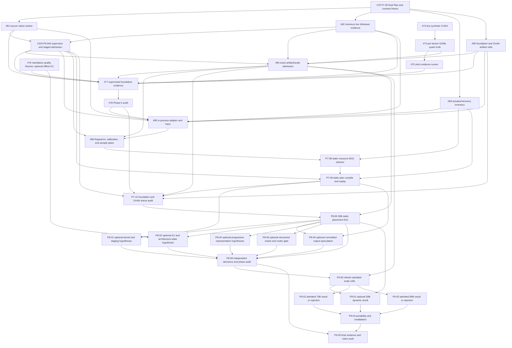

# Adaptive Runtime Roadmap

Program authority: repository-root [`Plan.md`](../../Plan.md). This document is
the detailed research roadmap; when sequencing or status differs, `Plan.md` and
the reconciled GitHub Project #2 dependency matrix control.

Status: final council/design freeze; synchronized with
`Gravelaw/prisminfer` and
[`Gravelaw` Project #2](https://github.com/users/Gravelaw/projects/2).

This roadmap details Phase 6 issue #103 and Phase 7-9 issues #79-#102. The
issue count is descriptive, never a scope cap: a new safety or evidence issue
must be created when no existing owner can close a required gate. Development
cost is not a planning constraint; correctness, security, capacity, dependency
order, statistical validity, and retained evidence are constraints.

## Program Outcome

Determine whether PrismInfer can be a useful calibrated controller over a
pinned llama.cpp/GGML/GGUF runtime on a 16 GiB GPU, without assuming that an
exotic mechanism must succeed. The program must:

1. secure and truthfully observe the existing Windows process/runtime path;
2. certify the preferred Llama 3.1 8B foundation cell, subject to license and
   artifact pinning;
3. use Ornith-1.0-9B only as a secondary hybrid architecture stress cell;
4. inventory only actuators the pinned runtime can apply and acknowledge;
5. reject implausible 9B/30B/70B/90B artifact cells through early capacity and
   resource-DAG bounds;
6. calibrate, select, and replay one static acknowledged plan;
7. measure 30B static heterogeneous placement before optional mechanisms;
8. test kernels, staging, KV policies, speculation, progressive
   representations, and structured routing only as independent hypotheses;
9. activate 70B/90B runs only after exact-artifact admission; and
10. publish negative, slow/offline, measured-non-certified, and rejected
    outcomes as first-class results.

## Binding Program Rules

- Upstream llama.cpp/GGML remains the graph, loader, sampler, and default
  operator executor. PrismInfer owns policy, evidence, plan compilation,
  acknowledgements, and only separately proven execution hooks.
- The source GGUF is immutable. Any quantized, progressive, indexed, router,
  projector, MTP, or provider artifact is separate, hashed, approved, and
  linked to its source.
- A requested setting is not evidence that the runtime applied it. Every
  executable plan entry has an actuator descriptor and actual acknowledgement.
- Phase 7 plans contain static process/load/context/request controls only. They
  do not contain dynamic representation, KV, kernel, routing, or speculative
  decisions.
- Recovery uses the normative classes in
  [`actuator-and-recovery-matrix.md`](actuator-and-recovery-matrix.md): R0 local
  pre-commit substitution, R1 proven compatible-boundary transition, R2
  restart/reject, or R3 explicitly approximate behavior. Generic seamless
  fallback is forbidden.
- Metric thresholds come from
  [`threshold-registry.md`](threshold-registry.md) with a frozen experimental
  unit, sample plan, interval method, multiplicity rule, and stop rule. Three
  runs do not establish request-tail behavior.
- Speculative work is normalized by committed target-distributed output tokens
  and observed external bytes. Accepted draft length remains diagnostic only.
- Physical-residency, owned-allocation, host-residency, transfer, and storage
  claims remain separate under
  [`windows-evidence-protocol.md`](windows-evidence-protocol.md).
- Optional mechanisms do not block Phase 7, 30B static measurement, or a valid
  program conclusion.

## Revised Dependency Graph



## Phase 6 Tracker Repair

Phase 7 architecture documentation may proceed, but executable Phase 7 work
cannot bypass Phase 6 truth and evidence gates. Conversely, model-backed Phase
6 work cannot precede the safety foundation. Issues #81 and #82 may therefore
advance before Phase 6 exits, and #103 is tracked in Phase 6 to remove the
otherwise circular dependency.

The Phase 6 milestone and Project items are repaired as follows:

| Tracker action or exact issue title | Purpose | Initial state |
|---|---|---|
| Link `P6-01/P6-04 Phase 6 manifest foundation` to the existing Phase 6 branch/PR | Retain the implemented manifest ingestion, cell/variant split, config schema, and compression fields without recreating them. | Review |
| `#103 P6-04A Implement fail-closed hardware supervisor and staged admission boundary` | Own the exclusive GPU lease, two-stage admission, watchdog, cancellation, abort evidence, checked safety arithmetic, and fault suite required before model-backed work. | Ready |
| Retain `#73 P6-05/P6-06 Add synthetic CUDA q4 correctness lane` | Completed guarded tiny-fixture launch and sanitizer evidence while preserving the claim that toy `Q4Block` evidence is not GGUF correctness or speed evidence. | Done |
| `P6-07 Implement exact selected GGUF quant tensor-slice semantics` | Inventory every per-tensor `ggml_type` used by the pinned recipe and replace toy semantics with exact model-relevant reference fixtures. | Ready |
| `#75 P6-08 Add a strict manifest-emitting benchmark/evidence runner` | Produce retained exact-cell timing, workspace, correctness, and actual-path evidence. | Blocked by #74 |
| `P6-09/P6-10 Add retained foundation quality fixtures and optional offline KV evaluation` | Build mandatory deterministic quality/long-context fixtures; keep offline KV results optional and separately classified. | Ready for harness work; model execution gated |
| `P6-11/P6-12/P6-13 Collect supervised same-cell foundation evidence` | Retain exact artifact hashes, CPU/upstream baselines, candidate/rejection results, cap classification, and quality without requiring a custom-kernel or KV win. | Blocked by #103 and #84 |
| `#78 P6-14 Run the Phase 6 evidence and claim audit` | Classify the exact cell without a bucket-wide 9B, Tensor Core, deployable, or custom-speedup overclaim. | Blocked by #77 |

Phase 6 completion supplies safety clearance, per-tensor quant truth, quality
fixtures and exact-cell evidence inputs. It does not force a custom kernel, KV
compression, or speedup into the Phase 7 controller. The `>=1.10x` threshold is
only a custom-kernel speedup-claim gate.

## Phase 7: Secure Static Calibrated Foundation

Milestone outcome: a secure, evidence-complete Windows path calibrates and
replays one static acknowledged plan on the exact admitted Llama 3.1 8B
foundation cell. Ornith is then attempted only as a hybrid architecture stress
cell.
Exact 9B/30B/70B/90B artifacts receive early admission or rejection. Custom
kernels and dynamic mechanisms are not dependencies.

### P7-00 Freeze council contracts, threshold registry, and novelty boundary

Deliverables:

- canonical architecture, scope, roadmap, execution/testing, references, and
  council decision record;
- actuator/recovery, Windows evidence, threshold/sampling, security/privacy,
  scale-admission, and novelty/gap contracts;
- portable session-input evidence map and artifact hashes;
- exact claim vocabulary and current-versus-proposed implementation table.

Exit gate:

- independent adversarial P0 deltas are reflected in every normative plan;
- thresholds are explicitly provisional until metric-specific sample plans
  are approved;
- no claim relies on current upstream behavior without checking the pinned
  commit;
- Markdown, Mermaid, UTF-8, links, and whitespace validate.

Dependencies: current repository state and Phase 6 claim boundary.
Priority/Risk/Workstream: P0 / High / Governance.
Initial status: In Progress.

### P7-01 Pin the Llama 3.1 8B foundation cell and an Ornith hybrid stress cell

Deliverables:

- one self-produced, hash-pinned Llama 3.1 8B Instruct text GGUF foundation
  cell, subject to accepted license/access;
- Ornith-1.0-9B as a secondary hybrid capability/stress cell only;
- Qwen3.5 lineage comparison where useful, not as the generic control;
- small deterministic smoke artifact;
- source revisions, license, tokenizer/template, conversion, quantization,
  imatrix, main/mmproj/MTP, modality, architecture-state, and quality records.

Exit gate:

- canonical quants are reproducible and bound to immutable source hashes;
- third-party GGUFs are smoke-only unless independently reproduced;
- the foundation cell's exact GQA/KV/state semantics are recorded;
- Ornith records full-attention layers, DeltaNet recurrent/convolution state,
  MTP and optional vision/mmproj coverage; unsupported scope is rejected;
- model-card benchmark scores are not local evidence.

Dependencies: Phase 6 q4 semantics, fixtures, and artifact rules.
Priority/Risk/Workstream: P0 / Critical / Model Cell.
Initial status: Backlog.

### P7-02 Replace the shell launcher with a secure native Windows baseline

Deliverables:

- native `CreateProcessW`-equivalent launch with correct Windows quoting;
- canonical executable and artifact roots, restricted handle inheritance,
  controlled environment/current directory, pre-created output handles, and
  opaque filenames;
- suspended-create/Job assignment or equivalent race-free process-tree
  governance, timeout, termination, cleanup, and child exit evidence;
- artifact approval/trust registry, open-handle identity, reparse/TOCTOU
  defenses, and no plan-selected arbitrary executable/provider path;
- exact external llama command/build identity and relevant CLI translation.

Exit gate:

- metacharacters, Unicode, long paths, reparse swaps, child/grandchild, early
  exit, hang, and cleanup tests pass;
- child working set/private commit/IO/exit evidence belongs to the child tree,
  not only the PrismInfer parent;
- missing evidence downgrades the run instead of serializing a budget as a
  measurement.

Dependencies: P7-00 and a pinned external llama executable.
Priority/Risk/Workstream: P0 / Critical / Security and Runtime Integration.
Initial status: Backlog.

### P7-03 Implement the Windows/WDDM/host/file/transfer evidence protocol

Deliverables:

- separate owned-allocation and physical-residency claim paths;
- allocator/backend/context/workspace/KV/pool and unknown GPU categories;
- DXGI/WDDM local/nonlocal budget/usage and eviction/residency evidence where
  required;
- parent plus Job/process-tree host working set, private commit, system
  physical/commit/pagefile state, mapped-versus-resident distinction, and
  file-identity-aware IO;
- actual H2D/D2H submission/completion, pageable/pinned, queue/wait/overlap,
  and dropped-instrumentation fields;
- ordinary and profiler cells kept separate.

Exit gate:

- configured, predicted, measured, and inferred values cannot alias;
- unknown promoted owned GPU bytes are zero;
- physical-residency claims retain WDDM evidence and no hidden
  oversubscription;
- file/pagefile/transfer ambiguity forces the documented lower
  classification;
- all fault cases in `windows-evidence-protocol.md` pass.

Dependencies: P7-00; integrates with P7-02 and P7-06.
Priority/Risk/Workstream: P0 / Critical / Windows Evidence.
Initial status: Backlog.

### P7-04 Inventory pinned actuators, acknowledgements, and recovery classes

Deliverables:

- pinned-commit audit of model/load/context/request/operator controls;
- current-upstream comparison and closest-work/novelty gap update;
- versioned actuator descriptors with lifecycle, eligibility, requested and
  actual schemas, memory/state effects, safe point, and R0/R1/R2/R3 recovery;
- explicit commit points for operator output, KV/recurrent state, sampled token,
  client output, and checkpoints;
- Phase 7 executable schema restricted to proven static actuators.

Exit gate:

- no candidate can be constructed without an implemented acknowledgement;
- R0 occurs before state/output commit, R1 proves compatibility/conversion,
  R2 reports restart/reject, and R3 is excluded from the Phase 7 plan;
- pinned/current mismatch, wrong actual value, missing fallback, and
  cap-exceeding recovery tests pass.

Dependencies: P7-00 and pinned runtime source/build.
Priority/Risk/Workstream: P0 / Critical / Runtime Contract.
Initial status: Backlog.

### P7-05 Run early exact-artifact 9B/30B/70B/90B admission

Deliverables:

- exact tensor/metadata/tokenizer/main/mmproj/MTP/state/workspace byte census;
- safe GPU and host payload after OS, context, pools, state, instrumentation,
  fragmentation, and safety reserves;
- measured effective CPU, DRAM, PCIe, and model-order storage service;
- capacity-constrained resource DAG and optimistic makespan interval;
- minimum unavoidable external bytes per committed output token;
- sensitivity, dominant-resource, and admit/reject report for every artifact.

Exit gate:

- pagefile/commit is not credited as physical resident RAM;
- Ornith uses hybrid architecture-state accounting, not a uniform KV formula;
- provisional T-060 through T-065 metrics have frozen sample plans;
- 70B/90B ordinary execution remains inactive if the optimistic bound misses
  the threshold;
- no optional mechanism receives credit without isolated measured evidence.

Dependencies: P7-01, P7-03 measurement definitions, and Phase 6 artifact truth.
Priority/Risk/Workstream: P0 / Critical / Scale Admission.
Initial status: Backlog.

### P7-06 Add the in-process pinned llama.cpp/GGML adapter and actual-path trace

Deliverables:

- opt-in libllama/GGML model/context/request lifecycle;
- default-equivalent mode against the secure external baseline;
- only P7-04-approved static controls;
- actual operator, tensor type/layout, shape, phase, buffer placement,
  workspace, transfer, state, and invoked implementation where observable;
- backend buffer/scheduler observation, request/operator correlation, and
  compatibility fallback to the secure external baseline.

Exit gate:

- deterministic output and applied defaults agree with the external baseline;
- requested-versus-actual acknowledgements exist for every controlled field;
- API/commit mismatch disables the adapter safely;
- missing memory/path evidence downgrades certification;
- adapter integration cannot silently make cap evidence weaker.

Dependencies: P7-01 through P7-04.
Priority/Risk/Workstream: P0 / Critical / Runtime Integration.
Initial status: Backlog.

### P7-07 Build the fingerprint, calibration store, and metric sample plans

Deliverables:

- fingerprint covering CPU topology, RAM/commit, GPU/VRAM, PCIe, storage, OS,
  driver/toolkit/runtime pin, model/artifacts, power and thermal bucket;
- raw immutable observations for public upstream controls and supported static
  placements;
- randomized/block-designed CPU, GPU, transfer, storage, context, and
  end-to-end trials;
- nested calibration/search, model-selection, confirmatory, and sealed
  promotion partitions;
- metric-specific power/precision, tail-quantile, multiplicity, missing-data,
  and stop plans tied to threshold IDs.

Exit gate:

- unchanged cells produce stable identity; relevant drift invalidates the plan;
- raw observations reproduce summaries and retain order, warmup, thermal,
  failures, overhead, and dropped records;
- tokens within one sequence are not treated as independent requests;
- adaptive search uses correction or fresh finalist replay;
- no causal claim is made from non-identifiable telemetry decomposition.

Dependencies: P7-03, P7-05, and P7-06.
Priority/Risk/Workstream: P0 / Critical / Calibration and Statistics.
Initial status: Backlog.

### P7-08 Fit a static resource-DAG cost model and conservative selector

Deliverables:

- analytical capacity and eligibility rejection before scoring;
- measured resource-DAG stage models with prediction intervals;
- catalog of upstream/public static candidates only;
- conservative memory upper bound, Pareto frontier, abstention rules, and
  deterministic decision/rejection rationale;
- measured feasible oracle comparison on held-out cells.

Exit gate:

- T-020 through T-025 pass under frozen confirmatory plans;
- promoted memory is never underpredicted;
- selection is within the regret thresholds for throughput and tail behavior;
- a weak or uncertain selector remains advisory or chooses the upstream
  default;
- the objective uses critical-path makespan, not an additive stage sum.

Dependencies: P7-04 and P7-07.
Priority/Risk/Workstream: P0 / Critical / Planning.
Initial status: Backlog.

### P7-09 Compile and replay an immutable acknowledged static plan

Deliverables:

- versioned plan hash and exact compatibility predicate;
- static process/load/context/request entries bound to actuator descriptors;
- requested-versus-actual acknowledgement events;
- R0/R1/R2 recovery graph, restart/reload cost, drift/hysteresis/cooldown, and
  safe upstream fallback;
- stale, corrupt, substituted, unsupported, and actual-value-mismatch tests;
- online lookup with no calibration, search, arbitrary provider load, or
  unbounded allocation on the token path.

Exit gate:

- identical inputs produce the same plan;
- nearest-plan substitution is forbidden for promoted evidence;
- every mismatch chooses a declared local, boundary, or restart/reject result;
- no representation/KV/router/speculative R3 control appears in Phase 7;
- orchestration overhead meets T-008.

Dependencies: P7-04 and P7-08.
Priority/Risk/Workstream: P0 / Critical / Plan Execution.
Initial status: Backlog.

### P7-10 Validate foundation replay, then Ornith stress, and audit Phase 7

Deliverables:

- exact admitted Llama 3.1 8B smoke, CPU, full-GPU where feasible, static
  split, strongest upstream sweep, selector oracle, and plan-replay results;
- exact primary constrained tier plus 12/16 GiB reference cells as applicable;
- fresh confirmatory T-001 through T-008 and T-020 through T-025 evidence;
- security, recovery, drift, invalidation, quality, and claim-classification
  results;
- Ornith hybrid stress replay only after converter/operator/main/mmproj/MTP and
  architecture-state contracts pass;
- Phase 8 entry decision and static-controller stop/go verdict.

Exit gate:

- the foundation passes or is explicitly rejected before Ornith
  can be used to generalize controller behavior;
- Ornith results remain hybrid-stress-specific;
- no speedup, Tensor Core, deployable, physical-residency, or bucket-wide claim
  exceeds retained evidence;
- if the selector cannot reliably match the upstream sweep, PrismInfer is
  classified as an evidence/calibration tool rather than expanded by default.

Dependencies: P6-14, P7-01, P7-05, P7-09, and P6-04A/#103.
Priority/Risk/Workstream: P0 / Critical / Validation.
Initial status: Backlog.

## Phase 8: 30B Static Truth and Optional Mechanism Research

Milestone outcome: 30B static contiguous placement is measured or rejected
first. Each optional mechanism is then independently passed or rejected behind
the Phase 7 static fallback. Progressive representation and structured routing
are optional research, not phase-exit requirements.

### P8-00 Measure or reject 30B static heterogeneous placement first

Deliverables:

- exact admitted 30B artifact and quality cell;
- CPU-only, full feasible, and contiguous CPU/GPU layer split sweep;
- actual host/VRAM/state/workspace/transfer/file evidence;
- best upstream static and PrismInfer-selected static comparison;
- selected plan or dominant-resource rejection report.

Exit gate:

- P7-05 admission remains valid for the exact run cell;
- result includes transfer and host pressure rather than load success alone;
- profitability requires the frozen same-cell threshold; otherwise the static
  result is retained as measured-non-certified, slow/offline, or rejected;
- optional mechanisms cannot retroactively define the static baseline.

Dependencies: P7-10 and P7-05 admission of the exact 30B artifact.
Priority/Risk/Workstream: P0 / Critical / 30B Static Validation.
Initial status: Backlog.

### P8-01 Run independent optional kernel-dispatch and bounded-staging hypotheses

This is a parent tracker with two independent child experiments; neither can
pass by averaging with the other.

Kernel child:

- approved provider ABI or narrow GGML hook, exact eligibility, queried and
  preallocated workspace, actual-path acknowledgement, CPU differential,
  profiler, and end-to-end T-040 evidence;
- R0 fallback before operator/state commit.

Staging/prefetch child:

- bounded pinned pool/ring, generation-safe copy/consume state machine, actual
  bytes/timeline/exposed wait, cold/warm file identity, and T-041/T-042 evidence;
- R0 wait/default or proven R1 boundary transition.

Dependencies: P8-00 and Phase 7 plan/acknowledgement infrastructure.
Priority/Risk/Workstream: P1 / Critical / Kernel and Data Movement.
Initial status: Backlog.

### P8-02 Evaluate one optional KV and architecture-state policy

Order:

1. exact per-architecture state ledger;
2. one isolated KIVI/KVQuant-style candidate where architecture permits;
3. state placement or retention as a separate candidate;
4. conversion, workspace, metadata, and quality evidence;
5. R1 only with exact compatible conversion; otherwise R2 or R3.

Exit gate:

- T-045 plus long-context/task-quality gates pass;
- Ornith hybrid state is not mislabeled as ordinary full-attention KV;
- a later audit is not described as undoing already committed lossy state;
- Phase 2/6 ledgers and offline results are reused, not recreated or promoted
  as live-runtime proof.

Dependencies: P8-00 and a Phase 6-approved offline candidate.
Priority/Risk/Workstream: P1 / Critical / KV and Architecture State.
Initial status: Backlog.

### P8-03 Evaluate committed-output-aware speculative offload

Deliverables:

- strongest upstream speculation baseline;
- exact draft model/device/length/threshold and target placement/verification
  cycle;
- mandatory target correction/extra token, accepted/rejected drafts, rollback,
  quarantined output, KV/state and transfer evidence;
- committed target-distributed output tokens/s and observed external bytes per
  committed output token;
- low-acceptance/drift behavior with R1 only after a completed verification
  cycle or R2 restart.

Exit gate:

- accepted draft length is diagnostic and never the primary reward;
- exact output policy and quality gates pass;
- benefit is over the best ordinary upstream speculation/offload cell and
  includes draft, verification, correction, rollback, state, and transfer cost;
- no committed token is later erased from the metric without quarantine and
  bounded rollback evidence.

Dependencies: P8-00 and P7-09 plan/recovery support.
Priority/Risk/Workstream: P1 / Critical / Speculation.
Initial status: Backlog.

### P8-04 Run optional progressive-representation hypotheses

This parent produces independent pass/reject decisions for:

- entropy/random-access diagnostics;
- an exact lossless cold-cache tile format under T-043;
- a static nested base-plus-residual weight artifact under T-044; and
- activation-transfer compression under T-046.

Exit gate:

- every derived artifact has source-parent, recipe, effective-bit, metadata,
  index/residual, workspace, trust, and decoder-safety evidence;
- ordinary independent quants are not called progressive;
- per-query weight recompression is out of scope;
- dynamic/lossy tier changes are R2/R3 unless pre-commit verification or
  bounded rollback exists;
- failure does not block Phase 8 exit.

Dependencies: P8-00 and security/provider/quality contracts.
Priority/Risk/Workstream: P1 / Critical / Progressive Representation.
Initial status: Backlog.

### P8-05 Run the optional structured-compute oracle before any router

Deliverables:

- approved fixture-only dense hidden-state/block-contribution capture;
- hardware-aligned block definitions and full-continuation counterfactual;
- prompt/task clustering warm-start baseline;
- held-out oracle including selection/gather/fallback cost;
- router/adaptation child issue only if T-047 passes;
- if admitted, nested router splits, OOD/confidence, structured kernel,
  pre-commit verification/quarantine or explicit R3 classification, and T-048.

Exit gate:

- oracle failure stops router training;
- router savings are realized end to end, not inferred from scalar sparsity;
- a dense audit cannot be described as reversing emitted output or committed
  state;
- whole-layer skipping remains separate model-adaptation scope;
- failure does not block Phase 8 exit.

Dependencies: P8-00 and privacy/retention approval for activation fixtures.
Priority/Risk/Workstream: P1 / Critical / Conditional Compute.
Initial status: Backlog.

### P8-06 Record independent decisions, optional joint result, and Phase 8 audit

Deliverables:

- retained pass/reject decision for P8-01 through P8-05 child hypotheses;
- joint catalog only if at least two mechanisms independently pass;
- factorial/interaction result against best static and best single-mechanism
  cells;
- fresh T-049 confirmation if a joint speedup is claimed;
- adversarial drift, missing artifact/provider, transfer slowdown, conversion,
  speculation, approximate-commit, and recovery evidence;
- exact Phase 9 admissible-mechanism list.

Exit gate:

- 30B static has a measured/rejected result;
- joint optimization is skipped without penalty if fewer than two mechanisms
  pass;
- no failing component is hidden by aggregate quality or speed;
- every approximate path is pre-commit verified, rollback-bounded, or labeled
  explicitly lossy.

Dependencies: P8-00 and a pass, rejection, or not-admitted record from each
P8-01 through P8-05 child.
Priority/Risk/Workstream: P0 / Critical / Validation.
Initial status: Backlog.

## Phase 9: Gated Scale, Portability, and Final Audit

Milestone outcome: only admitted exact artifacts receive long measured runs.
Optional 30B dynamic work is compared against the frozen static result. 70B and
90B are measured, classified slow/offline, or rejected without hiding host,
pagefile, storage, state, quality, or recovery costs.

### P9-00 Refresh and freeze exact scale admission before long runs

Deliverables:

- re-hash exact artifacts and remeasure hardware/software/fingerprint drift;
- update safe capacity, resource-DAG bounds, committed-output normalization,
  and T-060 through T-065 sample plans;
- freeze which Phase 8 mechanisms, if any, may receive measured credit;
- activate or reject 30B dynamic, 70B, and 90B execution cells.

Acceptance: no long execution starts from a stale or merely parameter-count
admission; rejected artifacts remain research notes rather than implementation
backlog.
Dependencies: P8-06 and P7-05.
Priority/Risk/Workstream: P0 / Critical / Scale Admission.
Initial status: Backlog.

### P9-01 Measure or reject optional 30B dynamic execution

Deliverables:

- only Phase 8-admitted staging, KV, speculation, kernel, representation, or
  routing mechanisms;
- best static 30B baseline, best single mechanism, and dynamic candidate;
- cap, host, transfer, storage, state, quality, committed-output, drift, and
  recovery evidence.

Acceptance: dynamic execution must beat the best static exact cell under its
frozen threshold; otherwise the static plan remains the result.
Dependencies: P9-00 admission and P8-00 static result.
Priority/Risk/Workstream: P1 / Critical / 30B Dynamic Validation.
Initial status: Backlog.

### P9-02 Measure or reject an admitted exact 70B cell

Deliverables:

- strongest ordinary llama.cpp CPU/offload baseline;
- only P9-00-admitted mechanisms and artifact/state scope;
- complete physical host, commit/pagefile, mapped/file/NVMe, PCIe, GPU, state,
  workspace, quality, latency, committed-output, and recovery evidence;
- dominant bottleneck and explicit classification.

Acceptance: allowed outcomes are validated exact cell, quality-gated,
measured-offload slow/offline, measured-non-certified, or rejected. Loading is
not success.
Dependencies: P9-00 exact 70B admission.
Priority/Risk/Workstream: P1 / Critical / Large-Model Validation.
Initial status: Gated Backlog.

### P9-03 Measure or reject an admitted exact 90B cell

Use the P9-02 contract with a separately pinned 90B artifact, state layout,
sample plan, and admission decision. No conclusion is inferred from the 70B
result.
Dependencies: P9-00 exact 90B admission.
Priority/Risk/Workstream: P1 / Critical / Large-Model Validation.
Initial status: Gated Backlog.

### P9-04 Validate portability, invalidation, and recalibration

Deliverables:

- at least one additional hardware/software cell or an explicit portability
  blocker;
- device/runtime/model/driver/power mismatch and stale-plan tests;
- correct rejection, recalibration, and plan re-approval behavior;
- Windows-primary evidence plus Linux comparison where it does not weaken the
  Windows claim boundary;
- cross-cell result table with no silent plan reuse.

Acceptance: a plan never crosses a compatibility predicate silently, and a
portable policy claim requires evidence on each named cell.
Dependencies: P9-01 and every activated P9-02/P9-03 cell.
Priority/Risk/Workstream: P0 / Critical / Portability.
Initial status: Backlog.

### P9-05 Run the final security, evidence, and claim audit

Deliverables:

- final 9B/30B/70B/90B outcome table;
- artifact authenticity, privacy/retention, provider, process, runner,
  reproducibility, threshold, sample-plan, and raw-evidence audit;
- requested-versus-actual, cap/residency, quality, latency, committed-output,
  recovery, and portability traceability;
- novelty/gap matrix update and precise integration/mechanism/evidence claims;
- published limitations and next research decision.

Exit gate:

- every claim maps to retained exact-cell evidence;
- interactive, slow/offline, measured-offload, measured-non-certified,
  simulated, research-only, and rejected are unambiguous;
- no result relies on hidden pagefile/unified-memory capacity or unobserved
  transfer;
- a negative broader-runtime thesis is accepted if the static controller or
  scale cells fail their frozen gates.

Dependencies: P8-06, P9-04, and all activated Phase 9 experiments.
Priority/Risk/Workstream: P0 / Critical / Final Audit.
Initial status: Backlog.

## Parallel Work and Stop Rules

Safe parallelism during Phase 6 repair:

- CPU/reference work for #74–#76 and source/artifact work for #80/#83;
- #81 secure process boundary and #82 evidence protocol before #103;
- #84 admission once #74, #80, #82 and #103 satisfy their contracts;
- P8-01 through P8-05 only after P8-00 freezes the 30B static result;
- P9-02 and P9-03 only when each exact artifact independently passes P9-00.

Hardware work is serial per device. Model-backed work stays inactive until the
clearance matrix in `Plan.md` permits the exact cell.

Stop rather than expand when:

- the secure/evidence path cannot distinguish configured from observed state;
- the pinned runtime cannot acknowledge a required actuator;
- the static selector fails its held-out prediction/regret gate;
- Ornith lacks certified converter/operator/state coverage;
- 30B static is infeasible on safe physical host/GPU capacity;
- an optional mechanism misses its isolated threshold;
- the 70B/90B optimistic lower bound misses T-060 through T-065; or
- approximate output/state cannot be verified, rolled back, or honestly
  classified.

## GitHub Project Mapping

Use the existing Project #2 fields rather than creating parallel adaptive
fields:

- extend `Roadmap Phase` through Phase 9;
- extend `Roadmap Slice` with Governance, Model Cell, Runtime Integration,
  Calibration, Kernel Autotuning, Planning, Memory Scheduling, Compression and
  KV, Conditional Compute, and Speculation while reusing existing Windows/WDDM,
  Large-Model Validation, Evidence Bundle, and validation slices;
- extend `Roadmap Gate` with Phase 6 Evidence, Phase 7 Calibrated Execution,
  Phase 8 Optional Mechanisms, and Phase 9 Scale Validation;
- add `Critical` to the project `Risk` field;
- set both coarse `Status` and detailed `Phase Status` explicitly.

The project README, `Plan.md`, Phase 6–9 milestones and phase exit issues are
the program roll-up. Issue #103 is the required Phase 6 safety owner and is not
an optional research umbrella. Create further optional child issues only when
their parent entry gates pass.

## Critical Path

```text
#79 final Plan/tracker freeze
  -> #81 secure native worker and #82 minimum live evidence
  -> #103 supervisor and staged-admission clearance
  -> per-tensor quant truth, strict runner, quality fixtures and #80 artifacts
  -> #84 exact 8B/9B/30B/70B/90B admission
  -> #77 supervised evidence and #78 Phase 6 audit
  -> #83 actuator/recovery inventory and #85 in-process actual-path trace
  -> metric-specific calibration and held-out static selector
  -> immutable acknowledged 9B static replay
  -> 30B static placement
  -> independent optional hypotheses
  -> gated 30B dynamic and admitted 70B/90B results
  -> portability and final claim audit
```
