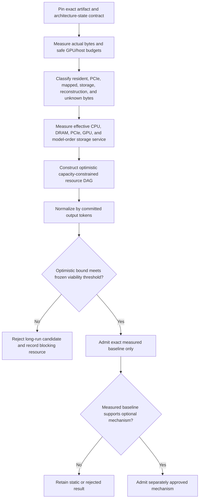

# 9B, 30B, 70B, and 90B Capacity and Bandwidth Admission

Status: program-entry study; execution of a large-model candidate is gated by
this analysis.

## Purpose

Answer early whether an exact artifact has a plausible path on the current
16 GiB GPU / approximately 32 GiB host before optional kernels, compression,
routing, or speculation consume implementation effort.

This is not a parameter-count-only calculator. Exact artifact and architecture
state bytes control the decision.

## Required Inputs Per Artifact

```text
source/checkpoint and GGUF hashes
parameter count and architecture
modality scope
main GGUF, mmproj, MTP and auxiliary artifact bytes
tensor bytes by type/layer/operator
quant metadata, alignment and padding
tokenizer/template/parser artifacts
full-attention layer set and KV layout
linear-attention/recurrent/convolution state layout
workspace requirements by phase/backend
context and batch
quality cell and quantization recipe
```

For Ornith/Qwen3.5, do not use a uniform 32-layer KV formula. Account
separately for full-attention KV, Gated DeltaNet recurrent/convolution state,
MTP state, and optional vision/mmproj memory.

## Safe Capacity Budgets

### GPU

```text
safe_gpu_payload =
  min(user_cap, observed_device_total, current_wddm_local_budget)
- CUDA context/runtime reserve
- backend pools and graph reserve
- architecture state/KV reserve
- activation/kernel workspace
- instrumentation reserve
- fragmentation/safety margin
```

### Host

```text
safe_host_payload =
  physical_ram
- OS/application reserve
- backend/process/runtime reserve
- host KV/recurrent state
- pinned staging
- CPU workspace
- non-model working-set reserve
```

Commit/pagefile does not increase safe physical host payload for a resident-RAM
claim.

## Byte Residency Classification

Every active byte belongs to exactly one category at the relevant epoch:

```text
durably resident in VRAM
durably resident in physical host RAM
resident in bounded pinned staging
transferred over PCIe in the cycle
read from mapped file/OS cache
read from physical storage in the cycle
reconstructed/decoded with workspace
unknown or ambiguous
```

Unknown/ambiguous bytes block a promoted lower-bound conclusion except an
explicit conservative worst case.

## Resource DAG Lower Bound

An additive time sum is wrong when work overlaps. Build a dependency DAG with:

- CPU core pools and memory bandwidth;
- GPU compute streams/SMs;
- copy engines and PCIe;
- DRAM and storage service;
- staging slots and workspace capacity;
- model/state dependencies;
- target/draft verification cycles;
- commit points.

For task nodes \(i\) with start/finish \(s_i,f_i\):

\[
f_i=s_i+t_i,
\qquad
s_j\ge f_i\quad\text{for every dependency }i\rightarrow j.
\]

Tasks sharing a capacity-limited resource cannot exceed its measured effective
capacity. The optimistic lower bound is the minimum feasible makespan of this
DAG under optimistic measured intervals, not the sum of all task times and not
storage bytes divided by a headline bandwidth alone.

## Committed Output Normalization

Let \(G\) be committed target-distributed output tokens in a target cycle:

- accepted draft tokens that are committed;
- plus the target correction/extra token emitted by exact speculative decoding;
- minus any token later rolled back or quarantined.

Use:

\[
committed\ output\ tokens/s=\frac{\mathbb E[G]}{\mathbb E[T_{cycle}]},
\]

and:

\[
external\ bytes/committed\ output\ token=
\frac{\mathbb E[B_{PCIe}+B_{storage}+B_{other\ external}]}{\mathbb E[G]}.
\]

Accepted draft length and acceptance rate remain diagnostics.

## Admission Procedure



## Model Ladder Decisions

### Llama 3.1 8B preferred foundation

Purpose:

- validate ordinary GGUF weight, KV, llama/GGML, and optimizer contracts;
- avoid hybrid-state/multimodal confounders in the first controller proof.
- require accepted license/access, pinned source/runtime support and a
  self-produced immutable GGUF before admission.

Expected candidates:

- CPU-only;
- full-GPU where feasible;
- static contiguous split;
- upstream public-control sweep.

### Ornith-1.0-9B hybrid stress

Purpose:

- validate architecture-state generality, hybrid operators, modality scope,
  optional mmproj/MTP, and capability fixtures.

Admission requires pinned converter/load/operator coverage. Its result is not a
generic full-attention KV result.

### 30B

Purpose:

- first real heterogeneous capacity and static placement proof.

Run a static contiguous CPU/GPU sweep immediately after the Phase 7 static
controller. Do not wait for progressive weights, routers, or a custom kernel.

### 70B and 90B

On this host, common q4-effective byte counts are likely to exceed safe host
resident capacity once model-specific metadata/state/workspace/reserves are
included. That is a hypothesis confirmed or corrected by exact artifact bytes.

Do not create/activate ordinary implementation work until the lower-bound issue
admits the exact artifact. Allowed outcomes:

- rejected before run;
- simulated lower-bound;
- measured-offload slow/offline;
- quality-gated exact cell;
- validated exact cell.

## Frozen Provisional Viability Policy

Use threshold registry entries T-060 through T-065:

```text
committed output throughput >=1.0 token/s
TTFT p95 <=120 s
ITL p95 <=2 s
throughput CV <=10%
quality regression <=5%
complete evidence for the claim class
```

These values are provisional research targets with metric-specific sample plans,
not deployment SLAs.

## Mechanism Credit

Optional mechanisms may change the lower bound only using evidence-backed terms:

- speculation: measured committed tokens per target cycle and observed bytes;
- conditional compute: held-out full-continuation block coverage and actual
  structured kernel/IO savings;
- progressive representation: exact effective bytes and decoder/workspace;
- native MoE: actual experts/bytes active for the exact model;
- cache/prefetch: measured hit rate and exposed wait.

Do not credit an aspirational compression ratio, router sparsity, or acceptance
rate before the mechanism passes its isolated gate.

## Required Output

For each size cell, publish:

```text
exact artifact and architecture-state bytes
safe GPU and host capacity breakdown
minimum unavoidable external bytes per committed output token
resource DAG and optimistic makespan interval
dominant resource and sensitivity analysis
static CPU/GPU baseline candidates
admission/rejection decision
which optional mechanism, if any, could change the decision
claim classification and evidence limitations
```

The correct result may be that a 70B or 90B dense artifact needs more physical
RAM, a lower-bit quality cell, a native sparse architecture, or different
hardware. PrismInfer's value is making that conclusion early and truthfully.
