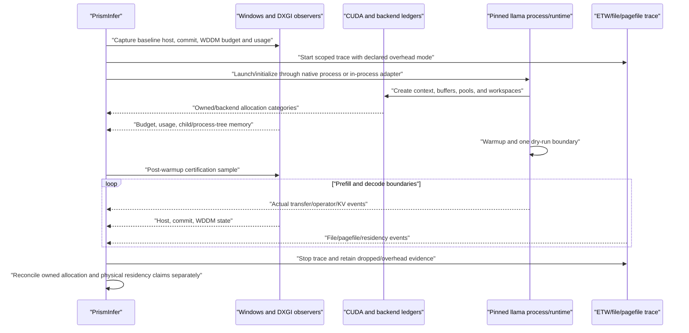

# Windows, WDDM, Host, File, and Transfer Evidence Protocol

Status: normative entry requirement for cap, offload, and large-model claims on
the primary Windows target.

## Why This Protocol Exists

The current code samples only the PrismInfer parent process and records several
offload values supplied by configuration. That cannot certify a child
`llama-cli`, WDDM residency, actual file/pagefile traffic, or tensor transfers.

Windows/WDDM also distinguishes an allocation from physical local-memory
residency. A run can remain below nominal VRAM while exceeding the process's
current local video-memory budget, causing eviction and stutter.

## Separate Claims

### Owned-allocation cap

Claims only that PrismInfer/backend-owned GPU allocations and bounded unknowns
stay below the declared cap.

Required:

- PrismInfer allocator ledger;
- backend buffer/pool/workspace ledger;
- CUDA allocation observations;
- process/device corroboration;
- explicit unknown/unreconciled bytes;
- lifecycle and peak boundaries.

### Physical-residency/no-oversubscription claim

Adds evidence that the process remained within WDDM local-memory budget without
material eviction/non-local residency.

Required in addition:

- `DXGI_QUERY_VIDEO_MEMORY_INFO` local budget/current usage/available reserve;
- local versus non-local segment evidence where available;
- eviction/residency/fault/stutter evidence through an approved Windows trace;
- ordinary unprofiled run, because tracing can change memory/timing;
- no reliance on unified memory or oversubscription for the promoted path.

Failure of the second claim does not falsify the owned-allocation ledger, but it
blocks a physical-residency or deployable-profile claim.

## Evidence Sources

| Resource | Primary source | Corroboration | Known limitation |
|---|---|---|---|
| PrismInfer-owned GPU memory | Capped allocator and explicit pool ledger | CUDA events/allocator stats | Does not see backend/driver allocations. |
| GGML/backend GPU memory | In-process buffer/pool/workspace reports | scheduler reservations, CUDA observations | Requires embedded adapter/hook. |
| WDDM local budget/usage | DXGI adapter video-memory query | device/process telemetry, Windows trace | Budget can change over time. |
| CUDA free/total | `cudaMemGetInfo` at controlled boundaries | NVML/device delta | Does not establish owner or physical residency alone. |
| NVML | process/device GPU telemetry where supported | DXGI/CUDA/ledger | WDDM ownership/residency caveats apply. |
| Child host memory | Native process handle plus Job Object/process-tree accounting | process working set/private/commit samples | Sampling can miss short peaks unless peak counters/events are used. |
| System host capacity | `GetPerformanceInfo` / `PERFORMANCE_INFORMATION` physical and commit page counts | `GlobalMemoryStatusEx` physical fields and performance counters/ETW | Available memory is volatile; `MEMORYSTATUSEX` pagefile fields are process-bounded and cannot authorize system commit. |
| GGUF/derived file IO | Open-handle file identity plus ETW/file events | process IO counters | Aggregate process IO cannot separate file and pagefile. |
| Pagefile pressure | ETW/hard-fault/pagefile and commit evidence | system counters | A generic hard fault may be executable, mapped file, or pagefile. |
| H2D/D2H | Instrumented actual copy submission/completion | CUDA events/CUPTI/Nsight | Logical tensor bytes are not transfer events. |
| NVMe/model-order reads | File-identity-aware events and storage trace | device counters | Warm OS cache is a separate cell. |

## Secure Child-Process Evidence Boundary

The external baseline must be launched with a native Windows API, not
`std::system` or a shell string.

Required behavior:

- explicit canonical executable path;
- correctly constructed Windows argument vector/command line without shell
  interpretation;
- controlled current directory and environment;
- restricted inherited handles;
- child created suspended, with its process handle retained;
- child assigned before any ordinary execution to a non-breakaway, kill-on-close
  Job Object with explicit process-count, memory, and wall-clock limits;
- child resumed only after the complete Job assignment and bounded IPC/handle
  setup succeed; any setup failure terminates the suspended child and is
  retained as non-promotable evidence;
- stdout/stderr directed to pre-created opaque handles;
- child/process-tree lifetime and exit captured;
- timeout/termination/cleanup policy;
- peak working set, private commit, IO, and failure retained.

Run IDs are schema-safe identifiers and never path components. Log/artifact
filenames are securely generated opaque values.

## Measurement Lifecycle



## Required GPU Fields

```text
hard_vram_cap_bytes
owned_allocator_current/peak/rejected_attempted_peak
backend_buffer_current/peak
backend_pool_reserved/current/high_watermark
kernel/activation/KV/graph/profiler workspace current/peak
cuda_context_runtime_bytes
cuda_mem_info_free/total at declared boundaries
dxgi_local_budget/current_usage/available_for_reservation
dxgi_nonlocal_budget/current_usage where available
nvml_process/device values and availability/caveat
eviction/nonlocal/residency/fault indicators
unknown_or_unreconciled_gpu_bytes
claim_scope = owned_allocation | physical_residency
```

`unknown_or_unreconciled_gpu_bytes == 0` remains required for a promoted owned
allocation claim. A physical-residency claim additionally requires the WDDM
evidence and no material oversubscription/eviction according to the versioned
policy.

## Required Host and File Fields

```text
parent and child/process-tree identities
working_set_current/peak
private_commit_current/peak
job/process-tree commit and memory limits where configured
host_admission_lane and promotion_requested
system_physical_total/available and physical_reserve
system_commit_total/limit/headroom and commit_reserve
system_commit_source = get_performance_info
planned_incremental_resident_peak and resident_uncertainty
planned_incremental_commit_peak and commit_uncertainty
physical_payload, commit_payload and separate admission decisions
pinned_host_bytes and pinned_host_cap
pagefile configuration and observed pagefile IO
hard faults with source classification or ambiguity
file identity for source GGUF, mmproj, derived artifacts, and logs
mapped bytes versus resident proxy
file read/write bytes by identity
storage device/volume mapping
cold/warm protocol and cache-state classification
unknown_or_ambiguous_host_or_file_bytes
```

A mapping size is never reported as resident RAM. Aggregate IO is never
reported as GGUF or NVMe bytes without file identity.

## Required Transfer Fields

```text
transfer_event_id and plan_entry_id
actual source/destination allocation identities
actual submitted/completed bytes
pageable or pinned host memory
copy stream/engine and event correlation
submit/start/finish timestamps
queue wait, transfer duration, exposed wait, overlap window
logical object/tile identity
retry/fallback/partial transfer
instrumentation mode and dropped records
```

Configured transfer values use `*_declared_bytes` or `*_budget_bytes` and can
never populate an observed event or `*_peak_bytes`.

## Large-Model Capacity and Bandwidth Admission

This is a program-entry study, not a Phase 9 afterthought.

For each exact 9B/30B/70B/90B artifact:

1. Read actual tensor, metadata, tokenizer, mmproj/MTP, and file sizes.
2. Calculate safe VRAM payload after context, pools, KV/state, workspace,
   instrumentation, fragmentation, and margin.
3. Calculate safe host payload after OS reserve, context/state, mapped resident
   pages, staging, workspaces, and pagefile policy. There is no fixed free-RAM
   threshold: calculate the T-101 lane reserves from live physical total,
   physical available, system commit charge and commit limit, then admit the
   exact incremental resident and commit peaks independently.
4. Classify every active byte as durably resident in VRAM, durably resident in
   RAM, transferred across PCIe, read from storage, reconstructed, or unknown.
5. Measure model-order DRAM/PCIe/NVMe bandwidth under representative contention.
6. Build a resource-constrained critical-path lower bound, not a single
   storage-bandwidth division.
7. Normalize external traffic by committed output tokens per target pass.
8. Reject a candidate if its optimistic bound misses the frozen viability
   threshold.

`MEMORYSTATUSEX.ullTotalPageFile` and `ullAvailPageFile` are process-bounded and
cannot be the sole source for system commit admission. On Windows, convert
`GetPerformanceInfo` page counts to bytes with checked arithmetic and retain
the source identity. Pagefile capacity may contribute to commit headroom but
never to physical resident payload. A development-lane result is explicitly
non-promotable and requires a fresh evidence-lane sample and token before
promotion.

Rough parameter arithmetic is a sanity check only; exact GGUF bytes decide.

## Classification Rules

| Evidence state | Maximum classification |
|---|---|
| Configured budgets only | simulated/policy-only |
| Real execution but child/backend/transfer gaps | measured-non-certified |
| Owned allocations reconciled under cap | owned-allocation-cap-certified exact cell |
| Owned plus WDDM residency/no-oversubscription evidence | physical-residency-cap-certified exact cell |
| File/pagefile ambiguity in an offload claim | measured-non-certified or storage-ambiguous |
| Lower bound misses frozen target | rejected before long execution |

The current offload planner must not automatically label every non-`none` policy
`measured-offload`.

## Fault and Validation Tests

- Shell/metacharacter paths prove no shell interpretation.
- Child tree creates/grandchildren and all remain Job-accounted.
- Child exits early, hangs, is terminated, and cleanup is complete.
- Short memory peak is captured or explicitly bounded.
- WDDM local budget changes during the run.
- CUDA/backend/ledger values disagree.
- Desktop/another GPU process causes eviction/non-local use.
- Pageable fallback replaces pinned transfer.
- File mapping is large but working set remains small.
- Pagefile traffic is injected under commit pressure.
- GGUF reads are separated from unrelated/log/pagefile IO.
- Warm cache is mislabeled cold and rejected.
- ETW/CUPTI drops records and classification downgrades.
- Profiled and ordinary run have different peaks and remain separate cells.

## Exit Gate

Before a Phase 7 cap/offload claim:

- native child or in-process handle exists;
- configured and observed schemas are separated;
- owned GPU memory categories reconcile;
- child/process-tree and host memory are measured;
- DXGI/WDDM budget evidence is retained for a physical-residency claim;
- source/derived/pagefile IO is distinguishable or ambiguity is declared;
- actual H2D/D2H events exist for transfer claims;
- ordinary-run and profiler-run results are separated; and
- every missing source produces a fail-closed or downgraded classification.
