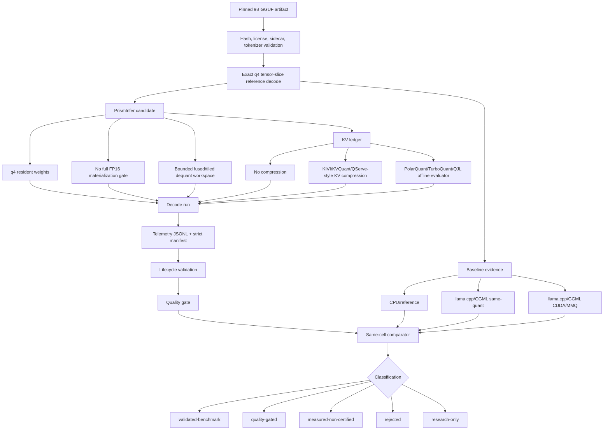

# Phase 6 Compression Architecture

Phase 6 uses compression as an evidence-gated inference path, not as a claim by
itself. A 9B constrained-VRAM result is valid only for one exact validation
cell until more retained cells pass.

## Claim Boundary

The following statements remain true until retained Phase 6 artifacts prove
otherwise:

- No 9B constrained inference claim.
- No custom-kernel speedup claim.
- No deployable-profile claim.
- No Tensor Core claim.
- No bucket-wide `>5B-10B` claim from one model.
- No constrained-VRAM claim if full FP16 weights are materialized.

## Architecture Goal

Run one exact dense 9B-class GGUF model under the current <=16 GiB project cap,
with 8 GiB as the primary constrained target, by combining pinned q4 resident
weights, exact GGUF/GGML q4 tensor semantics, bounded fused dequantization
workspace, paged KV accounting, optional KV compression, strict memory ledger
certification, and same-cell quality and performance comparison.

## Workflow



```text
Pinned 9B GGUF artifact
  -> model sidecar and hash validation
  -> exact q4 tensor-slice reference decode
  -> baseline runs
       -> CPU/reference
       -> llama.cpp/GGML same-quant
       -> llama.cpp/GGML CUDA/MMQ
       -> PrismInfer no-custom path
  -> candidate compression profile
       -> q4 resident weights
       -> no full FP16 materialization
       -> bounded dequant workspace
       -> KV block ledger
       -> optional KV compression
  -> candidate decode run
  -> telemetry JSONL + strict manifest
  -> lifecycle validation
  -> quality gate
  -> same-cell comparator
  -> claim classification
```

## Memory Ledger

The candidate is certified only when peak accounted memory fits the declared
cap and no required allocation class is unknown.

```text
peak_vram =
  cuda_context_runtime_bytes
+ resident_quant_weight_bytes
+ weight_metadata_bytes
+ dequant_workspace_peak_bytes
+ activation_workspace_peak_bytes
+ kv_payload_bytes
+ kv_metadata_bytes
+ kv_residual_or_sketch_bytes
+ backend_retained_pool_bytes
+ allocator_fragmentation_bytes
+ unknown_or_unreconciled_bytes
```

Certification requires:

```text
peak_vram <= hard_vram_cap_bytes
unknown_or_unreconciled_bytes == 0
full_dequant_materialized == false
```

If the run completes but allocation evidence is incomplete, the maximum allowed
classification is `measured-non-certified`.

## Compression Lanes

Phase 6 separates compression lanes so novelty does not hide failures.

| Lane | Purpose | Promotion rule |
|---|---|---|
| q4 resident weights | Establish the first practical 9B baseline using pinned GGUF q4 weights. | May promote only with real q4 semantics, same-cell baselines, and no full FP16 materialization. |
| KV accounting-only | Prove KV bytes, metadata, block reuse, and peak KV pressure before changing runtime behavior. | Never promotes to compression success by itself. |
| KIVI/KVQuant/QServe-style KV compression | First implementation candidate for compressed KV because the algorithms expose concrete quantization axes and quality precedents. | Requires task quality, effective-bit, metadata, and decode-overhead evidence. |
| PolarQuant/TurboQuant/QJL reference | Research lane for rotated/vector KV compression and residual sketch correction. | Starts offline/reference-only; cannot enter hot path until attention error, reconstruction cost, and quality pass. |
| Low-rank/sparsity/MoE accounting | Future model-structure lane. | Metadata/accounting only until the exact model and kernels support the representation. |

## Hot Path Shape

The first candidate hot path remains batch-1 decode:

```text
token embedding / activation vector
  -> q4 weight block fetch
  -> fused block-local dequantization
  -> GEMV accumulation
  -> attention over KV ledger
       -> uncompressed KV blocks, or
       -> compressed KV block load
       -> optional reconstruct/dequantize
       -> attention score calculation
  -> logits and sampling
```

Dequantization or reconstruction may use registers, shared memory, or a bounded
scratch buffer. It must not materialize the full FP16 weight matrix in VRAM.

## Quality Evidence

Compression must pass quality gates against the same-model same-quant baseline:

- deterministic temperature-0 prompt equivalence or accepted tolerance,
- prompt fixture pass rate `>= 95%`,
- task-quality regression `<= 5%`,
- attention logit error distribution,
- attention top-k overlap,
- retrieval or needle-in-a-haystack checks,
- long-context checks when KV compression is enabled.

Perplexity-only evidence is insufficient for promoted Phase 6 claims.

## Performance Evidence

The first 9B validated-benchmark target requires:

- 8 GiB primary VRAM tier, with 12 GiB and 16 GiB as reference tiers,
- context length 2048,
- batch size 1,
- at least 128 decode tokens per retained run,
- warm-cache decode p50 `>= 3 tokens/sec`,
- p95 inter-token latency `<= 750 ms`,
- TTFT p95 `<= 30 seconds`,
- three-run sustained decode coefficient of variation `<= 10%`,
- end-to-end decode speedup `>= 1.10x` versus same-cell llama.cpp/GGML
  CUDA/MMQ only when claiming custom-kernel benefit.

Isolated `kernel_ms` improvement is diagnostic only.

## Manifest Fields

Phase 6 compression manifests should add:

```text
compression_profile_id
quantization_scope
algorithm_family
payload_bits_per_value
effective_bits_per_value
metadata_bits_per_value
key_quant_axis
value_quant_axis
pre_rope_or_post_rope
group_size
residual_fp_window_tokens
outlier_policy
rotation_policy
rotation_seed
projection_policy
qjl_residual_bits
dequant_workspace_peak_bytes
kv_payload_bytes
kv_metadata_bytes
kv_residual_or_sketch_bytes
attention_logit_error_p95
attention_logit_error_p99
attention_topk_overlap
quality_gate_id
quality_result_path
full_dequant_materialized
cap_certification_status
```

Unknown or missing required fields fail closed for promoted claims.

## Implementation Order

1. Preserve the Phase 6 claim boundary in docs and evidence status.
2. Add strict manifest ingestion for baseline and candidate benchmark files.
3. Split validation-cell identity from implementation-variant fields.
4. Validate Phase 6 config and compression profile schemas.
5. Add CUDA launch correctness tests for the existing q4 kernel scaffold.
6. Replace toy q4 blocks with exact selected GGUF/GGML q4 tensor-slice decode.
7. Add compression manifest fields and KV ledger accounting.
8. Build an offline KV compression evaluator.
9. Add quality fixture runner and retained fixture hashes.
10. Build the kernel/compression benchmark runner.
11. Add self-hosted CUDA kernel workflow artifact upload.
12. Collect retained 9B baselines.
13. Run the PrismInfer candidate compression/kernel profile.
14. Run Phase 6 exit audit and classify the result.

## Classification

| Result | Meaning |
|---|---|
| `research-only` | Docs, scaffolding, or offline ideas only. |
| `measured-non-certified` | Real run exists, but cap evidence has unknown or unreconciled bytes. |
| `quality-gated` | Cap and quality pass, but performance or repeatability does not promote. |
| `validated-benchmark` | Cap, quality, performance, repeatability, and artifact gates pass for the exact cell. |
| `rejected` | A declared gate fails with retained reason and artifacts. |

`validated-benchmark` is still not `deployable-profile`.

## Source Anchors

- KIVI: https://arxiv.org/abs/2402.02750
- KVQuant: https://arxiv.org/abs/2401.18079
- QServe: https://arxiv.org/abs/2405.04532
- PolarQuant: https://arxiv.org/abs/2502.02617
- TurboQuant: https://arxiv.org/abs/2504.19874
- Google Research TurboQuant summary: https://research.google/blog/turboquant-redefining-ai-efficiency-with-extreme-compression/
