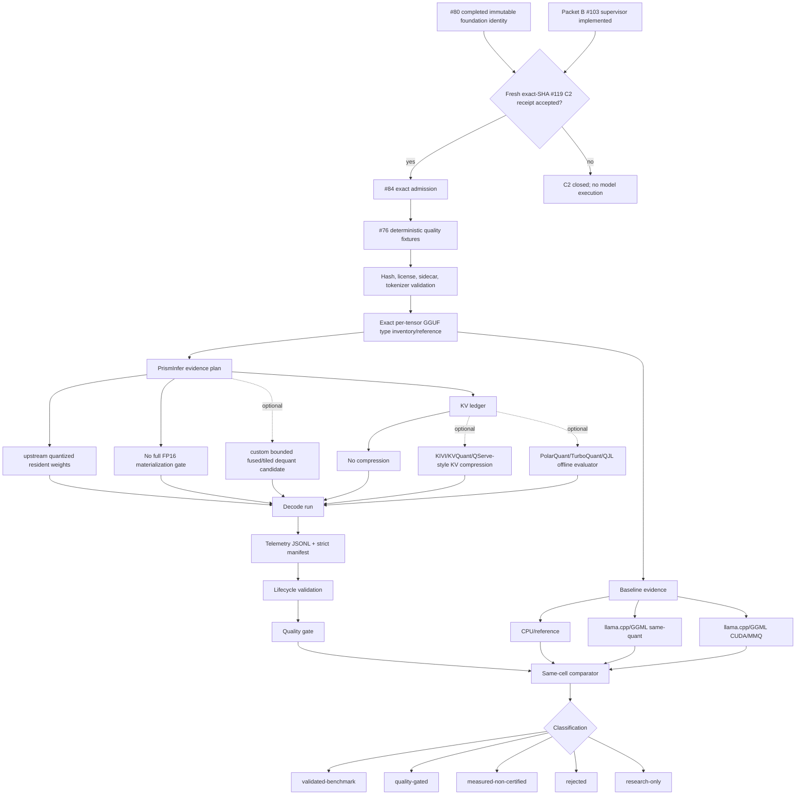

# Phase 6 Compression Architecture

Phase 6 treats ordinary upstream quantized-weight residency as the core
foundation path and compression as an optional evidence-gated hypothesis, not
as a claim by itself. A constrained-VRAM result is valid only for one exact
validation cell until more retained cells pass.

## Claim Boundary

The following statements remain true until retained Phase 6 artifacts prove
otherwise:

- No selected-foundation or 9B-stress constrained-inference claim.
- No custom-kernel speedup claim.
- No deployable-profile claim.
- No Tensor Core claim.
- No bucket-wide `>5B-10B` claim from one model.
- No constrained-VRAM claim if full FP16 weights are materialized.

## Architecture Goal

Use the immutable Llama 3.1 8B Q4_K_M foundation identity completed by
[#80](https://github.com/Gravelaw/prisminfer/issues/80) for the first conventional
model-backed cell under a device-admitted cap, with requested 10 GiB and 12 GiB
as the primary constrained research tiers and 8 GiB as stress-only. The #80 pin
was retained under the recorded one-time acquisition exception; it establishes
source, tokenizer, recipe, artifact, and per-tensor `ggml_type` identity, but it
does not establish a self-produced-artifact claim or authorize execution. Ornith
9B remains a separate unsupported-converter hybrid-state stress record rather
than part of the conventional foundation claim.

The core path uses upstream quantized weights, exact artifact identity, KV/state
accounting, strict memory certification, and same-cell quality/performance
comparison. Custom fused dequantization and KV compression are optional,
nonblocking branches.

[#103](https://github.com/Gravelaw/prisminfer/issues/103) implemented the Packet B
hardware supervisor and staged pre-context admission boundary. C2 nevertheless
remains closed. Model-backed Phase 6 execution requires a fresh exact-SHA
hardware authorization and independently accepted
[#119](https://github.com/Gravelaw/prisminfer/issues/119) C2 receipt, followed by
the retained `#84 -> #76 -> #77 -> #78` Packet C sequence.

## Workflow



```text
#80 completed immutable foundation identity
  -> fresh exact-SHA #119 hardware authorization and accepted C2 receipt
  -> #84 exact admission
  -> #76 deterministic quality fixtures
  -> model sidecar and hash validation
  -> exact recipe plus per-tensor ggml_type inventory/reference
  -> baseline runs
       -> CPU/reference
       -> llama.cpp/GGML same-quant
       -> llama.cpp/GGML CUDA/MMQ
       -> PrismInfer no-custom path
  -> core upstream profile
       -> quantized resident weights
       -> no full FP16 materialization
       -> optional custom bounded dequant workspace
       -> KV block ledger
       -> optional KV compression/evaluator
  -> admitted decode run
  -> telemetry JSONL + strict manifest
  -> lifecycle validation
  -> quality gate
  -> same-cell comparator
  -> claim classification
```

## Memory Ledger

The candidate is certified only when peak accounted memory fits the declared
cap and no required allocation class is unknown.

```text
peak_vram =
  resident_compressed_weight_bytes
+ active_request_compressed_state_bytes
+ weight_and_state_representation_metadata_bytes
+ admitted_decode_reconstruction_kernel_workspace_peak_bytes
+ runtime_context_bytes
+ scheduler_queue_peak_bytes
+ batching_chunking_pool_peak_bytes
+ retained_shared_prefix_kv_cache_bytes
+ shared_cache_metadata_index_bytes
+ cache_eviction_workspace_peak_bytes
+ allocator_fragmentation_bytes
+ instrumentation_bytes
+ unknown_or_unreconciled_bytes
+ telemetry_safety_margin_bytes
```

The categories are mutually exclusive and map without overlap into the
authoritative capacity terms in
[`adaptive-runtime-v2/optimizer-mathematics.md`](adaptive-runtime-v2/optimizer-mathematics.md#capacity-constraints).
Active per-request state is not a retained shared prefix/KV cache; no byte may
appear in both, and an undifferentiated backend retained-pool value blocks
promotion.

Certification requires:

```text
peak_vram <= effective_live_cap_bytes <= hard_vram_cap_bytes
hard_vram_cap_bytes <= 16 GiB claim ceiling
effective_live_cap_bytes <= admitted live WDDM local budget - required reserve
unknown_or_unreconciled_bytes == 0
full_dequant_materialized == false
```

If the run completes but allocation evidence is incomplete, the maximum allowed
classification is `measured-non-certified`.

## Compression Lanes

Phase 6 separates compression lanes so novelty does not hide failures.

| Lane | Purpose | Promotion rule |
|---|---|---|
| Quantized resident weights | Establish the practical foundation baseline using the pinned upstream GGUF path. For `Q4_K_M`, retain the mixed recipe and every tensor's actual `ggml_type`; never treat the recipe as a single block type. | May promote with exact artifact/type identity, same-cell baselines, and no full FP16 materialization. |
| KV accounting-only | Prove KV bytes, metadata, block reuse, and peak KV pressure before changing runtime behavior. | Never promotes to compression success by itself. |
| KIVI/KVQuant/QServe-style KV compression | First implementation candidate for compressed KV because the algorithms expose concrete quantization axes and quality precedents. | Requires task quality, effective-bit, metadata, and decode-overhead evidence. |
| PolarQuant/TurboQuant/QJL reference | Research lane for rotated/vector KV compression and residual sketch correction. | Starts offline/reference-only; cannot enter hot path until attention error, reconstruction cost, and quality pass. |
| Low-rank/sparsity/MoE accounting | Future model-structure lane. | Metadata/accounting only until the exact model and kernels support the representation. |

The uncompressed KV ledger is the core baseline. A KV codec may pass, fail, or
remain unimplemented without blocking the foundation result.

## Optional Custom Hot-Path Shape

If the independent custom-kernel hypothesis proceeds, its first candidate hot
path remains batch-1 decode:

```text
token embedding / activation vector
  -> q4 weight block fetch
  -> fused block-local dequantization
  -> GEMV accumulation
  -> attention over KV ledger
       -> uncompressed KV blocks, or
       -> compressed KV block load
       -> optional reconstruct/dequantize
       -> attention score calculation
  -> logits and sampling
```

Dequantization or reconstruction may use registers, shared memory, or a bounded
scratch buffer. It must not materialize the full FP16 weight matrix in VRAM.

## Quality Evidence

Compression must pass quality gates against the same-model same-quant baseline:

- deterministic temperature-0 prompt equivalence or accepted tolerance,
- prompt fixture pass rate `>= 95%`,
- task-quality regression `<= 5%`,
- attention logit error distribution,
- attention top-k overlap,
- retrieval or needle-in-a-haystack checks,
- long-context checks when KV compression is enabled.

Perplexity-only evidence is insufficient for promoted Phase 6 claims.

## Performance Evidence

The first foundation validated-benchmark target requires:

- requested 10 GiB and 12 GiB primary tiers, an 8 GiB stress-only tier, and a
  physical/live device-reference tier under the 16 GiB policy ceiling; no tier
  is an allocation target,
- context length 2048,
- batch size 1,
- at least 128 decode tokens per retained run,
- warm-cache decode p50 `>= 3 tokens/sec`,
- p95 inter-token latency `<= 750 ms`,
- TTFT p95 `<= 30 seconds`,
- three-run sustained decode coefficient of variation `<= 10%`,
- no mandatory speedup over the strongest same-cell upstream baseline.

Isolated `kernel_ms` improvement is diagnostic only. If an optional custom-
kernel speedup is advertised, its separately frozen claim gate may require
`>=1.10x` end-to-end; failure rejects that claim without blocking Phase 6.

## Manifest Fields

Phase 6 compression manifests should add:

```text
compression_profile_id
quantization_scope
algorithm_family
payload_bits_per_value
effective_bits_per_value
metadata_bits_per_value
key_quant_axis
value_quant_axis
pre_rope_or_post_rope
group_size
residual_fp_window_tokens
outlier_policy
rotation_policy
rotation_seed
projection_policy
qjl_residual_bits
dequant_workspace_peak_bytes
kv_payload_bytes
kv_metadata_bytes
kv_residual_or_sketch_bytes
attention_logit_error_p95
attention_logit_error_p99
attention_topk_overlap
quality_gate_id
quality_result_path
full_dequant_materialized
cap_certification_status
```

Unknown or missing required fields fail closed for promoted claims.

## Implementation Order

1. **Implemented:** preserve the claim boundary and `research-only` status.
2. **Implemented scaffolding:** strict manifest ingestion and same-cell versus
   implementation-variant comparison.
3. **Implemented scaffolding:** Phase 6 gate/config schemas and compression
   manifest/parser fields.
4. **Synthetic only:** guarded CUDA launch correctness source, verification
   flag, and manual self-hosted workflow for toy `Q4Block` semantics.
5. **Implemented prerequisite:** #103 supplies the Packet B supervisor and
   staged admission boundary; this implementation alone grants no C2 credit.
6. **Completed identity prerequisite:** #80 retains the exact Llama 3.1 8B
   foundation source, tokenizer, recipe, artifact, and per-tensor inventory
   under the recorded one-time acquisition exception. It grants neither a
   self-produced-artifact claim nor execution clearance.
7. **Blocking clearance and sequence:** obtain a fresh exact-SHA #119 hardware
   authorization and independently accepted C2 receipt, then follow
   `#84 -> #76 -> #77 -> #78` without skipping admission or fixture ownership.
8. Inventory the selected GGUF's actual per-tensor `ggml_type`, block layout,
   shape, and bytes; implement exact tensor-slice reference semantics where a
   custom path consumes them.
9. Add foundation quality fixtures and retained hashes.
10. Collect retained CPU/no-custom and llama.cpp/GGML CUDA same-cell baselines.
11. Audit and classify the core foundation result.
12. **Optional:** build/run a strict custom-kernel benchmark candidate.
13. **Optional:** build/run an offline KV compression evaluator.
14. **Optional:** evaluate progressive, speculative, or router hypotheses only
    in their later independently gated phases.

## Classification

| Result | Meaning |
|---|---|
| `research-only` | Docs, scaffolding, or offline ideas only. |
| `measured-non-certified` | Real run exists, but cap evidence has unknown or unreconciled bytes. |
| `quality-gated` | Cap and quality pass, but performance or repeatability does not promote. |
| `validated-benchmark` | Cap, quality, performance, repeatability, and artifact gates pass for the exact cell. |
| `rejected` | A declared gate fails with retained reason and artifacts. |

`validated-benchmark` is still not `deployable-profile`.

## Source Anchors

- KIVI: https://arxiv.org/abs/2402.02750
- KVQuant: https://arxiv.org/abs/2401.18079
- QServe: https://arxiv.org/abs/2405.04532
- PolarQuant: https://arxiv.org/abs/2502.02617
- TurboQuant: https://arxiv.org/abs/2504.19874
- Google Research TurboQuant summary: https://research.google/blog/turboquant-redefining-ai-efficiency-with-extreme-compression/
