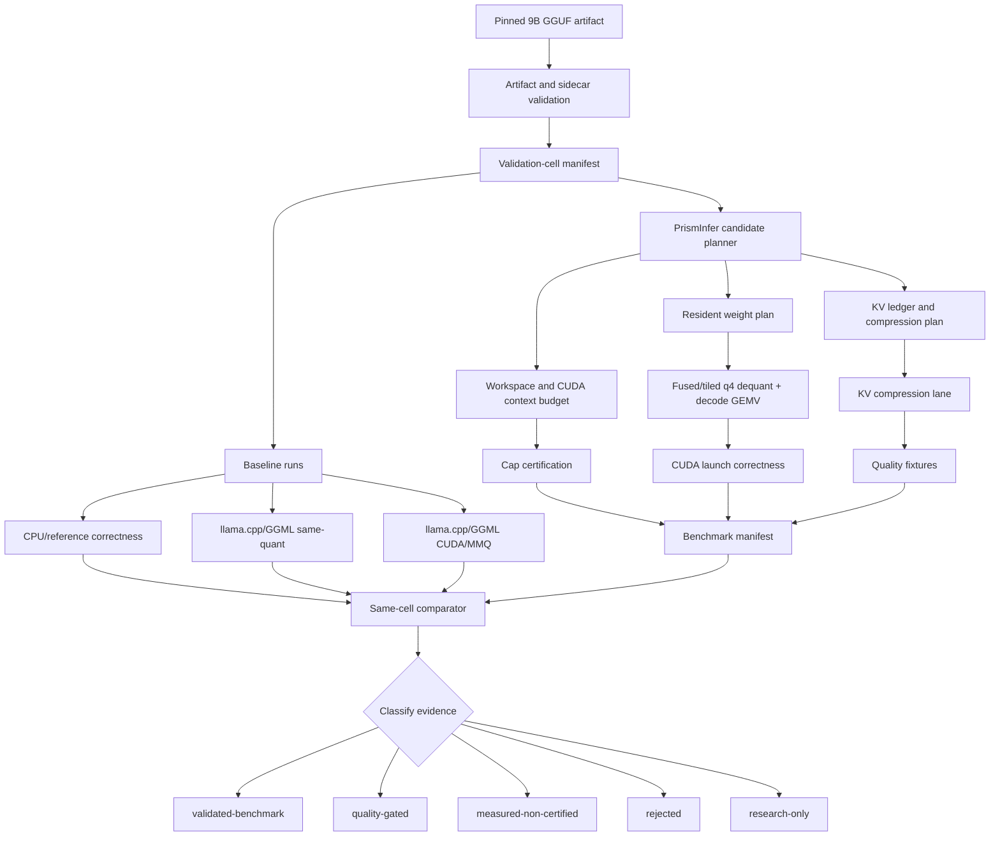

# Phase 6 Implementation Plan: 9B Compression and Kernel Evidence

Phase 6 turns the Phase 5 CUDA-kernel scaffold and the Phase 2 compression
governance into retained evidence for one representative 9B constrained-VRAM
validation cell. It does not create a bucket-wide `>5B-10B` claim, a Tensor
Core claim, or a deployable profile.

The phase is deliberately evidence-first: PrismInfer must prove exact artifact
identity, exact quantization semantics, no full FP16 materialization, memory
accounting, quality retention, and same-cell performance before any 9B
constrained-inference claim can be promoted.

The detailed compression workflow, memory ledger, and lane classification are
kept in `docs/phase6-compression-architecture.md`.

## Goal

Build a manifest-backed evidence path for one exact `>5B-10B` / 9B-class dense
GGUF model under the current <=16 GiB GPU cap, with 8 GiB as the primary
constrained target.

Phase 6 answers:

Can PrismInfer run one exact 9B q4 GGUF validation cell with governed
compression and a guarded CUDA decode path while preserving task quality,
staying inside the declared VRAM cap, avoiding full FP16 materialization, and
beating the same-cell llama.cpp/GGML CUDA/MMQ baseline by at least 10%
end-to-end?

## Current Evidence Baseline

Phase 5 already provides:

- strict `kernel_benchmark_manifest.schema.json`,
- benchmark comparator scaffolding,
- kernel evidence validation policy,
- `PRISMINFER_ENABLE_CUDA_KERNELS=OFF` by default,
- Visual Studio 2026 CUDA preset for `sm_120`,
- compiling guarded `q4_decode_gemv.cu`,
- CPU q4 decode-GEMV reference harness,
- `configs/9b-constrained-kernel-gate.json`.

Phase 2 already provides:

- KV ledger and compression-governance concepts,
- `none`, `accounting-only`, `reference`, and `experimental` compression
  policy labels,
- fail-closed quality-gate behavior for compression claims.

Phase 6 does not yet provide:

- manifest-file ingestion for comparator evidence,
- exact GGUF/GGML `Q4_K_M` block semantics,
- CUDA launch correctness tests,
- compression-specific 9B manifest fields,
- retained 9B GGUF artifact hashes,
- same-cell llama.cpp/GGML CUDA/MMQ baseline,
- measured PrismInfer candidate kernel/compression benchmark,
- profiler artifacts,
- validated 9B constrained-inference claim.

## Claim Boundary

Until Phase 6 exits with retained evidence, all of the following remain
disallowed:

- 9B constrained inference claim,
- custom-kernel speedup claim,
- deployable-profile claim,
- Tensor Core claim,
- bucket-wide `>5B-10B` claim from one model,
- constrained-VRAM claim if full FP16 weights are materialized in VRAM.

A single 9B pass can promote only the exact validation cell:

```text
model_hash
quant_artifact_sha256
quantization_format
context_tokens
batch_size
prompt_fixture_hash
os
gpu_name
driver_version
cuda_runtime_version
hard_vram_cap_bytes
compression_policy
kernel_backend
```

## Architecture Workflow

The constrained-VRAM path is a governed pipeline, not a single compression
trick. Weight residency, KV cache size, workspace, transfer pressure, quality,
and kernel performance are all separate gates.

`docs/phase6-compression-architecture.md` is the canonical architecture note
for this workflow. This section summarizes the same control flow for the
implementation plan.



Operationally:

1. The model is never loaded as full FP16 weights in VRAM.
2. Resident weights stay in the selected GGUF quantized format or a documented
   compressed representation.
3. Dequantization is fused or tiled into bounded registers/shared memory/global
   scratch, then measured as workspace.
4. KV cache is first accounted uncompressed, then compressed only through a
   policy with effective bits, metadata, reconstruction cost, and quality
   evidence.
5. The candidate result is compared against same-model, same-quant, same-cell
   llama.cpp/GGML baselines.

## Compression Architecture

Phase 6 uses four compression lanes. They must be tested separately before any
combined profile is trusted.

| Lane | Purpose | First implementation | Promotion rule |
|---|---|---|---|
| Weight q4 residency | Keep 9B weights resident without FP16 expansion. | Exact GGUF/GGML q4 tensor-slice decode, preferably selected `Q4_K_M`. | Correctness against CPU reference and no full FP16 materialization. |
| KV accounting | Measure memory pressure before compressing KV. | Uncompressed KV ledger with per-layer/head/token/block bytes. | Ledger agrees with telemetry; no compression claim yet. |
| Proven KV quantization | Reduce context-growth memory. | KIVI/KVQuant/QServe-style reference policy before hot CUDA path. | Quality pass, effective-bit report, metadata overhead, decode overhead, and memory savings. |
| PolarQuant/TurboQuant/QJL | Explore dot-product-preserving KV/vector compression. | Offline evaluator over captured KV tensors before runtime integration. | Attention-logit error, top-k overlap, task quality, and overhead all pass. |

Compression does not remove the need for q4 weight residency. TurboQuant,
PolarQuant, QJL, KIVI, and KVQuant primarily address KV/vector compression
pressure; they do not make a full FP16 9B weight load a constrained-VRAM run.

## Memory Certification Model

Phase 6 manifests must report the constrained run as:

```text
peak_vram =
  cuda_context_runtime_bytes
+ resident_weight_bytes
+ weight_metadata_bytes
+ dequant_workspace_peak_bytes
+ activation_workspace_peak_bytes
+ resident_kv_bytes
+ kv_metadata_bytes
+ kv_residual_or_sketch_bytes
+ kernel_workspace_peak_bytes
+ allocator_fragmentation_bytes
+ retained_pool_bytes
+ unknown_gpu_bytes
```

Certification requires:

- `peak_vram <= hard_vram_cap_bytes`,
- `hard_vram_cap_bytes <= 17179869184`,
- `full_dequant_materialized = false`,
- no unreconciled unknown GPU/process/backend/workspace allocation,
- host RAM, pinned memory, mmap, pagefile, and IO pressure reported whenever
  CPU/offload participates.

If useful measurements exist but allocation reconciliation is incomplete, the
result can be retained only as `measured-non-certified` or `rejected`.

## Role Ownership

| Role | Primary concern | Phase 6 responsibility |
|---|---|---|
| Architect | Claim integrity and evidence boundaries | Keep `research-only` until retained artifacts pass; update risks and audit. |
| Principal software engineer | Manifest ingestion, CI, tools, tests | Build comparator file mode, config schemas, workflows, and verification flags. |
| CUDA kernel engineer | Correctness, memory, launch, profiler | Replace toy q4 semantics, add CUDA correctness harness, measure kernel costs. |
| LLM systems expert | Model cell, baselines, quality | Select and pin exact 9B GGUF, define fixtures, collect same-cell baselines. |
| Compression researcher | KV and vector representation | Stage KIVI/KVQuant/QServe before PolarQuant/TurboQuant/QJL runtime claims. |

## Stage Plan

| Stage | Work | Candidate files | Exit gate |
|---|---|---|---|
| P6-00 | Preserve Phase 6 claim boundary | `docs/phase6-evidence.md`, `docs/risk-register.md` | Current status is `research-only`; no 9B, Tensor Core, deployable, or bucket-wide claim is made. |
| P6-01 | Add kernel manifest ingestion | `include/prisminfer/kernel_benchmark_manifest.h`, `src/benchmark/kernel_benchmark_manifest.cpp`, `tools/prism-compare-benchmark/main.cpp` | Comparator accepts `--baseline-manifest` and `--candidate-manifest`; missing required fields fail closed. |
| P6-02 | Split validation-cell identity from implementation variant | `benchmark_comparator` | Baseline and candidate may differ by `kernel_backend`, `kernel_name`, `kernel_version`, and compression implementation fields; model/quant/context/prompt/OS/GPU/driver/CUDA/cap mismatches still fail. |
| P6-03 | Add Phase 6 config schema | `schemas/prism_config.schema.json` or `schemas/phase6_kernel_gate.schema.json`, `configs/9b-constrained-kernel-gate.json` | 9B gate fields are typed and required: artifact hashes, cap tier, context, compression policy, q4 format, no-FP16 flag, and quality gate id. |
| P6-04 | Add compression manifest fields | `schemas/kernel_benchmark_manifest.schema.json`, `src/benchmark/manifest_writer.cpp` | Manifest records effective bits, metadata bytes, decode overhead, KV payload bytes, quality gate, and compression status. |
| P6-05 | Add CUDA kernel verification workflow | `.github/workflows/cuda-kernel-self-hosted.yml`, `scripts/verify.ps1` | Self-hosted runner builds `vs2026-cuda-sm120`, runs guarded CUDA correctness tests, and uploads artifacts. |
| P6-06 | Add CUDA launch correctness harness | `tests/cuda/`, `include/prisminfer/kernels/`, `src/kernels/cuda/` | Device launch, sync, error checks, H2D/D2H bytes, and CPU-reference comparison pass. |
| P6-07 | Implement exact selected GGUF q4 block reference | `src/kernels/`, `tests/fixtures/` | CPU reference decodes real tensor slices for the selected q4 format; toy `Q4Block` no longer drives model relevance. |
| P6-08 | Add kernel benchmark runner | `tools/prism-kernel-bench/`, `src/benchmark/` | Emits strict kernel manifest with timing, correctness, workspace, and artifact hashes. |
| P6-09 | Add offline KV compression evaluator | `tools/prism-kv-compress-eval/`, `src/kv/`, `src/quality/` | Captured KV tensors can be evaluated for KIVI/KVQuant/QServe-style policies and PolarQuant/TurboQuant/QJL research policies without runtime claims. |
| P6-10 | Add 9B quality fixture runner | `tools/prism-quality-gate/`, `tests/fixtures/quality/` | Deterministic decode, retrieval/needle, long-context, and task fixtures emit retained pass/regression evidence. |
| P6-11 | Collect 9B baseline artifacts | external artifact store, retained manifests | Exact model hash, quant artifact hash, prompt fixture hash, CPU/no-custom and llama.cpp/GGML CUDA/MMQ baselines retained. |
| P6-12 | Run PrismInfer q4 candidate evidence | external artifact store, retained manifests | Candidate manifest compares same-cell, quality passes, cap is certified or explicitly `measured-non-certified`. |
| P6-13 | Run compression candidate evidence | external artifact store, retained manifests | Compression profile proves memory savings, quality preservation, and bounded overhead for the exact validation cell. |
| P6-14 | Phase 6 exit audit | `docs/phase6-evidence.md`, `docs/risk-register.md` | Result is `validated-benchmark`, `quality-gated`, `measured-non-certified`, `rejected`, or `research-only`; no broader claim is implied. |

## 9B Evidence Cell

The first Phase 6 model cell remains:

```text
model_parameter_bucket: >5B-10B
parameter_count: exact metadata value, approximately 9B
context_tokens: 2048
batch_size: 1
decode_sample_tokens: 128
quantization_format: one pinned q4 GGUF format, preferably Q4_K_M
primary_vram_tier_gib: 8
hard_cap_bytes <= 17179869184
```

The candidate model must be dense and exact-model pinned. A council-suggested
candidate is a Gemma 2 9B instruction-tuned GGUF q4 artifact, but Phase 6 must
verify the actual artifact source, license, hash, quantization format, and
availability at selection time.

## Required Artifacts

Phase 6 evidence requires retained paths and hashes for:

- model GGUF artifact,
- model sidecar,
- prompt fixture,
- tokenizer or tokenizer metadata,
- q4 tensor-slice correctness fixture,
- captured KV tensor fixture when testing compression,
- CPU reference correctness result,
- no-custom PrismInfer baseline,
- llama.cpp/GGML CUDA/MMQ baseline,
- candidate PrismInfer CUDA-kernel run,
- candidate compression run when applicable,
- telemetry JSONL,
- strict kernel benchmark manifest,
- comparator output,
- quality result,
- lifecycle result,
- profiler artifact when hardware-path claims are made.

## Acceptance Gates

Phase 6 can mark the 9B cell `validated-benchmark` only when all are true:

- strict kernel/compression manifest validates with no unknown fields,
- comparator proves same validation cell,
- correctness passes against CPU reference,
- quality fixture pass rate is `>= 95%`,
- task-quality regression is `<= 5%` versus same-model same-quant baseline,
- retrieval/needle and long-context fixtures pass,
- warm-cache decode p50 is `>= 3 tokens/sec`,
- p95 inter-token latency is `<= 750 ms`,
- TTFT p95 is `<= 30 seconds`,
- three-run sustained decode coefficient of variation is `<= 10%`,
- end-to-end decode speedup is `>= 1.10x` versus same-cell llama.cpp/GGML
  CUDA/MMQ when a speedup claim is made,
- full FP16 materialization is absent,
- workspace and retained allocations remain within the declared cap,
- no hidden host RAM, pagefile, mmap, NVMe, pinned-memory, backend, KV, or
  workspace pressure is unreported.

Intermediate classifications:

| Classification | Meaning |
|---|---|
| `quality-gated` | Memory and task quality pass, but profitability or repeatability is not yet proven. |
| `measured-non-certified` | Useful measurements exist, but allocation reconciliation is incomplete. |
| `rejected` | A required gate failed. |
| `research-only` | Artifact, implementation, baseline, or quality evidence is incomplete. |

## Stop Gates

Reject or keep research-only if:

- the comparator uses CLI-only fields for promoted evidence,
- required manifest fields are absent or empty,
- model or quantization hashes are missing,
- the candidate and baseline differ by model, quantization, prompt fixture,
  context, batch, OS, GPU, driver, CUDA version, or cap tier,
- only isolated `kernel_ms` improves,
- CUDA launch correctness is untested,
- GGUF block semantics are approximated by toy q4 blocks,
- hidden host RAM, pagefile, mmap, NVMe, backend, KV, or workspace pressure is
  not accounted,
- compression reports nominal bits but omits effective bits, metadata overhead,
  reconstruction overhead, or task quality,
- any deployable-profile, Tensor Core, attention, MLA, MoE, or bucket-wide 9B
  claim is attempted.

## Verification Commands

Default verification remains:

```powershell
powershell -NoProfile -ExecutionPolicy Bypass -File scripts\verify.ps1
```

Phase 6 should add:

```powershell
powershell -NoProfile -ExecutionPolicy Bypass -File scripts\verify.ps1 -WithCudaKernels -CudaArchs 120
cmake --preset vs2026-cuda-sm120
cmake --build --preset vs2026-cuda-sm120
```

The self-hosted kernel workflow should run the same CUDA-kernel verification
lane and upload manifests, logs, comparator output, quality results,
compression-evaluator outputs, and profiler artifacts.
