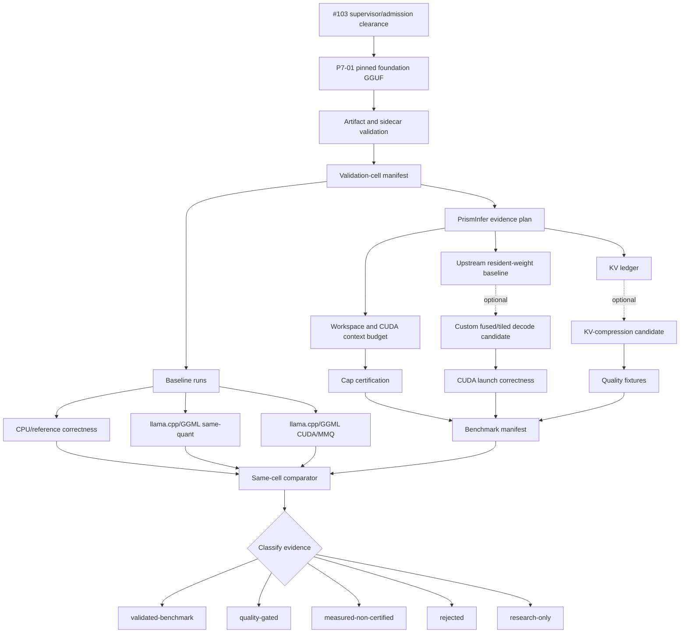

# Phase 6 Implementation Plan: Foundation-Model Evidence and Optional Mechanisms

Phase 6 builds retained evidence for one exact constrained-VRAM foundation cell
and preserves optional Phase 5 kernel and Phase 2 compression research lanes.
It does not create a bucket-wide `>5B-10B` claim, a Tensor Core claim, or a
deployable profile.

The phase is deliberately evidence-first: PrismInfer must prove exact artifact
identity, exact quantization semantics, no full FP16 materialization, memory
accounting, quality retention, and same-cell performance before any 9B
constrained-inference claim can be promoted.

The detailed compression workflow, memory ledger, and lane classification are
kept in `docs/phase6-compression-architecture.md`.

## Goal

Build a manifest-backed evidence path for one exact `>5B-10B` foundation GGUF
under an admitted device-specific GPU cap, with requested 10 GiB and 12 GiB as
the primary constrained research tiers and 8 GiB as stress-only. P7-01 owns
the exact model selection; Meta Llama 3.1
8B is preferred pending license acceptance, access, exact pin, converter
support, and reproducible hashes. Ornith-1.0-9B remains a separate hybrid stress
cell.

Phase 6 answers:

Can PrismInfer establish one exact, cap-safe, quality-retaining same-cell
baseline whose identity, per-tensor representation, memory, and runtime path are
retained correctly? A custom-kernel speedup, KV-compression win, progressive
representation, speculation, or router is not required to answer yes. They are
separate nonblocking hypotheses.

## Safety Gate

[#103](https://github.com/Gravelaw/prisminfer/issues/103) gates all model-backed
Phase 6 CUDA, calibration, and evidence collection. Only CPU/simulation work and
the bounded attended synthetic CUDA fixture may run before #103 closes with
pre-context admission, exclusive lease, watchdog, cancellation, cleanup, and
fault-injection evidence.

## Current Evidence Baseline

The repository currently provides:

- strict `kernel_benchmark_manifest.schema.json`,
- strict manifest-file ingestion and same-cell comparator scaffolding,
- kernel evidence validation policy,
- `PRISMINFER_ENABLE_CUDA_KERNELS=OFF` by default,
- Visual Studio 2026 CUDA preset for `sm_120`,
- guarded `q4_decode_gemv.cu` and a bounded synthetic CUDA correctness test,
- CPU q4 decode-GEMV reference harness,
- `configs/9b-constrained-kernel-gate.json`,
- `phase6_kernel_gate.schema.json`,
- compression-oriented manifest fields and parser tests, and
- a manual self-hosted CUDA workflow plus `-WithCudaKernels` verification lane.

Phase 2 already provides:

- KV ledger and compression-governance concepts,
- `none`, `accounting-only`, `reference`, and `experimental` compression
  policy labels,
- fail-closed quality-gate behavior for compression claims.

Phase 6 does not yet provide:

- the #103 supervisor/admission clearance for model-backed work,
- exact GGUF/GGML semantics for every actual per-tensor `ggml_type` encountered
  in a selected mixed-recipe artifact,
- retained selected-foundation GGUF artifact hashes,
- same-cell llama.cpp/GGML CUDA/MMQ baseline,
- a strict manifest-emitting kernel benchmark runner,
- an offline KV-compression evaluator or retained quality-fixture runner,
- measured PrismInfer candidate kernel/compression benchmark,
- profiler artifacts,
- validated foundation/9B-stress constrained-inference claim.

## Claim Boundary

Until Phase 6 exits with retained evidence, all of the following remain
disallowed:

- selected-foundation or 9B-stress constrained-inference claim,
- custom-kernel speedup claim,
- deployable-profile claim,
- Tensor Core claim,
- bucket-wide `>5B-10B` claim from one model,
- constrained-VRAM claim if full FP16 weights are materialized in VRAM.

A single foundation pass can promote only the exact validation cell:

```text
model_hash
quant_artifact_sha256
quantization_format
quantization_recipe
per_tensor_ggml_type_manifest_hash
context_tokens
batch_size
prompt_fixture_hash
os
gpu_name
driver_version
cuda_runtime_version
hard_vram_cap_bytes
compression_policy
kernel_backend
```

## Architecture Workflow

The constrained-VRAM path is a governed pipeline, not a single compression
trick. Weight residency, KV cache size, workspace, transfer pressure, quality,
and runtime performance are separate evidence dimensions. Kernel and KV
experiments are optional branches, not core phase gates.

`docs/phase6-compression-architecture.md` is the canonical architecture note
for this workflow. This section summarizes the same control flow for the
implementation plan.



Operationally:

1. The model is never loaded as full FP16 weights in VRAM.
2. Resident weights stay in the selected GGUF quantized format or a documented
   compressed representation.
3. Dequantization is fused or tiled into bounded registers/shared memory/global
   scratch, then measured as workspace.
4. KV cache is first accounted uncompressed. It is compressed only in an
   optional candidate lane through a
   policy with effective bits, metadata, reconstruction cost, and quality
   evidence.
5. The candidate result is compared against same-model, same-quant, same-cell
   llama.cpp/GGML baselines.

## Compression Architecture

Phase 6 preserves four representation lanes. The first establishes the ordinary
upstream quantized-weight baseline; the others are optional and must be tested
separately before any combined profile is trusted.

| Lane | Purpose | First implementation | Promotion rule |
|---|---|---|---|
| Quantized weight residency | Establish the upstream quantized foundation without FP16 expansion. | Prefer a reproducibly produced `Q4_K_M` recipe if P7-01 selects it; record and honor every tensor's actual `ggml_type` rather than treating the recipe as one block type. | Same-cell correctness, exact artifact/type identity, and no full FP16 materialization. |
| KV accounting | Measure memory pressure before compressing KV. | Uncompressed KV ledger with per-layer/head/token/block bytes. | Ledger agrees with telemetry; no compression claim yet. |
| Proven KV quantization | Reduce context-growth memory. | KIVI/KVQuant/QServe-style reference policy before hot CUDA path. | Quality pass, effective-bit report, metadata overhead, decode overhead, and memory savings. |
| PolarQuant/TurboQuant/QJL | Explore dot-product-preserving KV/vector compression. | Offline evaluator over captured KV tensors before runtime integration. | Attention-logit error, top-k overlap, task quality, and overhead all pass. |

Compression does not remove the need for q4 weight residency. TurboQuant,
PolarQuant, QJL, KIVI, and KVQuant primarily address KV/vector compression
pressure; they do not make a full FP16 9B weight load a constrained-VRAM run.

`Q4_K_M` is a mixed quantization recipe. Any custom tensor-slice reference or
kernel candidate must dispatch on the exact per-tensor `ggml_type`, block
layout, shape, and byte count present in the selected artifact.

## Memory Certification Model

Phase 6 manifests must report the constrained run as:

```text
peak_vram =
  cuda_context_runtime_bytes
+ resident_weight_bytes
+ weight_metadata_bytes
+ dequant_workspace_peak_bytes
+ activation_workspace_peak_bytes
+ resident_kv_bytes
+ kv_metadata_bytes
+ kv_residual_or_sketch_bytes
+ kernel_workspace_peak_bytes
+ allocator_fragmentation_bytes
+ retained_pool_bytes
+ unknown_gpu_bytes
```

Certification requires:

- `peak_vram <= hard_vram_cap_bytes`,
- `hard_vram_cap_bytes <= min(17179869184, admitted live WDDM local budget -
  required reserve)`,
- `full_dequant_materialized = false`,
- no unreconciled unknown GPU/process/backend/workspace allocation,
- host RAM, pinned memory, mmap, pagefile, and IO pressure reported whenever
  CPU/offload participates.

If useful measurements exist but allocation reconciliation is incomplete, the
result can be retained only as `measured-non-certified` or `rejected`.

## Role Ownership

| Role | Primary concern | Phase 6 responsibility |
|---|---|---|
| Architect | Claim integrity and evidence boundaries | Keep `research-only` until retained artifacts pass; update risks and audit. |
| Principal software engineer | Manifest ingestion, CI, tools, tests | Build comparator file mode, config schemas, workflows, and verification flags. |
| CUDA kernel engineer | Correctness, memory, launch, profiler | Replace toy q4 semantics, add CUDA correctness harness, measure kernel costs. |
| LLM systems expert | Model cell, baselines, quality | Complete the P7-01-selected foundation pin, define fixtures, collect same-cell baselines, then treat Ornith as a separate stress cell. |
| Compression researcher | KV and vector representation | Stage KIVI/KVQuant/QServe before PolarQuant/TurboQuant/QJL runtime claims. |

## Stage Plan

| Stage | Current state | Work and exit gate |
|---|---|---|
| P6-00 | Implemented | Preserve `research-only`; make no 9B, Tensor Core, deployable, or bucket-wide claim. |
| P6-01 | Implemented scaffolding | Strict reader and comparator accept `--baseline-manifest` and `--candidate-manifest`; malformed/unknown evidence fails closed. |
| P6-02 | Implemented scaffolding | Same-cell identity is separated from allowed implementation-variant fields; mismatch tests exist. |
| P6-03 | Partially implemented | `schemas/phase6_kernel_gate.schema.json` and `configs/9b-constrained-kernel-gate.json` define typed gate fields. Exact artifact values remain unset, and mixed-recipe/per-tensor-type identity still needs a schema extension. |
| P6-04 | Partially implemented | Schema/parser carry compression evidence fields and tests. No manifest-emitting benchmark runner or retained model evidence exists. |
| P6-05 | Implemented, unproven on retained runner evidence | Manual self-hosted workflow and `-WithCudaKernels` verification lane exist; a workflow definition is not a hardware result. |
| P6-06 | Synthetic implementation only | Guarded CUDA launch/sync/error/reference test source exists for toy `Q4Block`; it is not model-relevant GGUF evidence. |
| P6-07 | Pending | Decode real selected-artifact tensor slices by actual per-tensor `ggml_type`; mixed recipe names such as `Q4_K_M` are metadata, not block semantics. |
| P6-08 | Pending, optional-mechanism support | Add a strict manifest-emitting kernel runner if the optional custom-kernel hypothesis proceeds. |
| P6-09 | Pending, optional | Add an offline KV evaluator; its pass, failure, or rejection does not block Phase 6. |
| P6-10 | Pending | Add deterministic foundation quality fixtures; KV-specific fixtures are required only for a KV claim. |
| P6-11 | Blocked by P7-01 and #103 | Retain exact source/model/recipe/per-tensor-type hashes plus CPU, no-custom, and llama.cpp CUDA same-cell baselines. |
| P6-12 | Optional after core baseline | Run custom q4 candidate evidence only if pursued; no kernel win is required for Phase 6 exit. |
| P6-13 | Optional after core baseline | Run compression candidate evidence only if pursued; no KV/compression win is required for Phase 6 exit. |
| P6-14 | Pending | Audit the core exact-cell evidence and independently classify each optional result. No broader claim is implied. |

## Foundation Evidence Cell

P7-01 owns the exact pin. The preferred first cell is:

```text
model_parameter_bucket: >5B-10B
preferred_model: Meta Llama 3.1 8B, pending license/access/pin
parameter_count: exact metadata value
context_tokens: 2048
batch_size: 1
decode_sample_tokens: 128
quantization_recipe: reproducibly produced q4 recipe, preferably Q4_K_M if selected
tensor_types: exact per-tensor ggml_type manifest
primary_vram_tier_gib: 8
hard_cap_bytes: admitted device-specific value, never a nominal allocation target
```

The model must be exact-model pinned. Meta Llama 3.1 8B remains a preference,
not an approved artifact, until P7-01 records license acceptance, source and
tokenizer revisions, converter support, the conversion/quantization recipe,
per-tensor `ggml_type` inventory, and hashes. Ornith-1.0-9B is evaluated later as
a separate hybrid stress cell. Gemma 2 is not treated as globally full-attention;
if retained as an optional comparison, its sliding-window/global-attention
pattern is part of the validation identity.

## Required Artifacts

Phase 6 evidence requires retained paths and hashes for:

- model GGUF artifact,
- model sidecar,
- prompt fixture,
- tokenizer or tokenizer metadata,
- exact tensor-slice correctness fixture only when a custom path consumes that
  tensor type,
- captured KV tensor fixture only when testing KV compression,
- CPU reference correctness result,
- no-custom PrismInfer baseline,
- llama.cpp/GGML CUDA/MMQ baseline,
- candidate PrismInfer CUDA-kernel run only when claiming that optional path,
- candidate compression run only when claiming that optional path,
- telemetry JSONL,
- applicable strict baseline/evidence manifest,
- comparator output,
- quality result,
- lifecycle result,
- profiler artifact when hardware-path claims are made.

## Acceptance Gates

Phase 6 can mark the foundation cell `validated-benchmark` only when all core
gates are true:

- the applicable strict baseline manifest validates with no unknown fields;
  kernel/compression manifests are required only for those optional claims,
- comparator proves same validation cell,
- correctness passes against CPU reference,
- quality fixture pass rate is `>= 95%`,
- task-quality regression is `<= 5%` versus same-model same-quant baseline,
- retrieval/needle and long-context fixtures pass,
- warm-cache decode p50 is `>= 3 tokens/sec`,
- p95 inter-token latency is `<= 750 ms`,
- TTFT p95 is `<= 30 seconds`,
- three-run sustained decode coefficient of variation is `<= 10%`,
- full FP16 materialization is absent,
- workspace and retained allocations remain within the declared cap,
- no hidden host RAM, pagefile, mmap, NVMe, pinned-memory, backend, KV, or
  workspace pressure is unreported.

No fixed speedup, custom-kernel win, or KV-compression win is required for Phase
6 completion. A separately advertised `>=1.10x` custom-kernel speedup must pass
its frozen same-cell claim gate, but failure simply rejects that optional claim.

Intermediate classifications:

| Classification | Meaning |
|---|---|
| `quality-gated` | Memory and task quality pass, but profitability or repeatability is not yet proven. |
| `measured-non-certified` | Useful measurements exist, but allocation reconciliation is incomplete. |
| `rejected` | A required gate failed. |
| `research-only` | Artifact, implementation, baseline, or quality evidence is incomplete. |

## Stop Gates

Reject or keep research-only if:

- the comparator uses CLI-only fields for promoted evidence,
- required manifest fields are absent or empty,
- model or quantization hashes are missing,
- the candidate and baseline differ by model, quantization, prompt fixture,
  context, batch, OS, GPU, driver, CUDA version, or cap tier,
- only isolated `kernel_ms` improves when an end-to-end speedup is claimed,
- CUDA launch correctness is untested when a custom CUDA path is claimed,
- a custom GGUF path substitutes toy q4 blocks for the selected artifact's
  exact per-tensor `ggml_type` semantics,
- hidden host RAM, pagefile, mmap, NVMe, backend, KV, or workspace pressure is
  not accounted,
- compression reports nominal bits but omits effective bits, metadata overhead,
  reconstruction overhead, or task quality,
- any deployable-profile, Tensor Core, attention, MLA, MoE, or bucket-wide 9B
  claim is attempted.

## Verification Commands

Default verification remains:

```powershell
powershell -NoProfile -ExecutionPolicy Bypass -File scripts\verify.ps1
```

The synthetic CUDA lane is implemented but may run only under the repository's
attended safety rules; model-backed invocations require #103 clearance:

```powershell
powershell -NoProfile -ExecutionPolicy Bypass -File scripts\verify.ps1 -WithCudaKernels -CudaArchs 120
cmake --preset vs2026-cuda-sm120
cmake --build --preset vs2026-cuda-sm120
```

The self-hosted kernel workflow runs the bounded synthetic correctness lane.
Model manifests, logs, comparator output, quality results, optional evaluator
outputs, and profiler artifacts are uploaded only by later #103-cleared runs.
