# PrismInfer Runtime State Machine

Status: final council lifecycle contract

This document is normative for the P6-04A safety gate (GitHub issue #103) and
all later CUDA or model-backed execution. The trusted outer supervisor owns the
state machine and terminal evidence. CUDA, llama.cpp/GGML, providers, parsers,
model state, and workload execution live in a separate contained worker.

## Trust and Process Boundary

- The supervisor is CPU-only and must not initialize a CUDA context.
- The supervisor owns the immutable run contract, exclusive GPU lease,
  pre-context and post-context admission, Windows Job, hardware/process
  watchdog, cancellation/abort deadlines, cleanup reconciliation, and terminal
  artifact.
- The worker is created suspended, assigned to a non-breakaway kill-on-close
  Job with explicit process/memory/time limits, connected through bounded
  versioned IPC, and only then resumed.
- The worker cannot grant clearance, alter thresholds, release the lease,
  publish a promoted terminal result, or disable the watchdog.
- A worker crash, hang, corrupted message, or context-fatal CUDA error must not
  destroy the supervisor's ability to terminate the tree and publish evidence.

## Normative State Graph

```mermaid
stateDiagram-v2
  [*] --> RunStart
  RunStart --> ContractValidated
  ContractValidated --> FailedClosed: "Invalid contract, artifact identity, or clearance"
  ContractValidated --> LeaseAcquire: "GPU requested"
  ContractValidated --> WorkerCreate: "CPU-only admitted"

  LeaseAcquire --> FailedClosed: "Unavailable or stale lease"
  LeaseAcquire --> PreContextPreflight: "Exclusive lease held"
  PreContextPreflight --> PreContextAdmission
  PreContextAdmission --> FailedClosed: "Reject before worker CUDA initialization"
  PreContextAdmission --> WorkerCreate: "Conservative peak admitted"

  WorkerCreate --> JobAssign: "Created suspended"
  JobAssign --> FailedClosed: "Containment/limit assignment failed"
  JobAssign --> WorkerResume
  WorkerResume --> ContextCreate: "GPU path"
  WorkerResume --> ModelArtifactValidate: "CPU-only path"

  ContextCreate --> CancelRequested: "Context-fatal or deadline failure"
  ContextCreate --> ContextReconciliation: "Minimal context created"
  ContextReconciliation --> PostContextAdmission
  PostContextAdmission --> CancelRequested: "Unknown bytes, disagreement, or effective-cap failure"
  PostContextAdmission --> ModelArtifactValidate: "Admitted before model load"

  ModelArtifactValidate --> CancelRequested: "Identity/parser/trust failure"
  ModelArtifactValidate --> ModelLoad
  ModelLoad --> CancelRequested: "Load failure or guard breach"
  ModelLoad --> BackendReconciliation
  BackendReconciliation --> CancelRequested: "Unknown bytes/path or reserve breach"
  BackendReconciliation --> WorkloadAdmission
  WorkloadAdmission --> CancelRequested: "Plan/actuator/host/cap mismatch"
  WorkloadAdmission --> WatchdogActive

  WatchdogActive --> BackendWarmup
  BackendWarmup --> PrefillStart
  PrefillStart --> PrefillEnd
  PrefillEnd --> DecodeStart
  DecodeStart --> Decode
  Decode --> Decode: "Bounded token/epoch; watchdog sample"
  Decode --> CancelRequested: "Breach, deadline, R2, or context-fatal error"
  Decode --> QualityGateResult: "Bounded request completes"
  QualityGateResult --> CleanupReconciliation

  CancelRequested --> CooperativeCancel
  CooperativeCancel --> CleanupReconciliation: "Worker exits by T-105"
  CooperativeCancel --> AbortJob: "T-105 deadline exceeded"
  AbortJob --> CleanupReconciliation

  FailedClosed --> CleanupReconciliation: "If worker/lease/resources exist"
  CleanupReconciliation --> Quarantined: "Unknown resource, cleanup mismatch, or context-fatal"
  CleanupReconciliation --> Completed: "Terminal evidence complete"
  Quarantined --> RunEnd
  Completed --> RunEnd
  RunEnd --> [*]
```



`FailedClosed` before worker creation proceeds directly through a zero-resource
cleanup record. A CPU-only path skips the GPU lease/context states but still
uses the supervisor, Job, bounded worker, cancellation, and cleanup states.

## Ordered Event Contract

Each event contains `run_id`, monotonic sequence number, supervisor monotonic
timestamp, process/Job identity where applicable, clearance stage, and the
hashes of the run contract and threshold registry.

```text
run_start
contract_validated | failed_closed
clearance_validated
gpu_lease_acquired, if GPU requested
pre_context_preflight, if GPU requested
pre_context_admission_result, if GPU requested
worker_created_suspended
worker_job_assigned
worker_resumed
cuda_context_create_start, if GPU requested
cuda_context_created, if GPU requested
context_reconciliation, if GPU requested
post_context_admission_result, if GPU requested
model_artifact_validated
model_load_start
model_load_result
backend_allocation_reconciliation
workload_admission_result
watchdog_started
backend_warmup
prefill_start
prefill_end
decode_start
decode_token, repeated within admitted bounds
decode_end
quality_gate_result
cancel_requested, if needed
cooperative_cancel_result, if needed
job_abort, if needed
cleanup_reconciliation
gpu_lease_released, if acquired
completed | failed_closed | quarantined
run_end
```

The following ordering invariants are release-active:

- `pre_context_admission_result=reject` implies no worker CUDA-context event.
- `post_context_admission_result=reject` implies no model-load event.
- `backend_allocation_reconciliation=pass` and
  `workload_admission_result=pass` precede `watchdog_started` and warmup.
- `watchdog_started` precedes every GPU workload submission.
- `quality_gate_result` precedes a promotable cap/classification decision.
- `cleanup_reconciliation` precedes lease release and every terminal result.
- A missing, duplicate, out-of-order, stale, or contradictory mandatory event
  fails closed; the worker cannot fill a missing supervisor event.

## Two-Stage Admission

### Pre-context preflight and admission

Without calling CUDA Runtime APIs that may initialize a context, the supervisor
must acquire the exclusive lease and freeze:

```text
policy_ceiling_bytes
requested_tier_bytes
physical_or_reportable_local_bytes
dxgi_local_budget/current_usage and observation age
predicted context/runtime/backend/model/state/workspace/fragmentation bytes
GPU reserve and T-101 host admission lane
authoritative system physical total/available and commit charge/limit/headroom
planned incremental resident/commit peaks, uncertainty and pinned bytes
separate host physical/commit reserves and payload decisions
thermal target/slowdown/stop values and sensor freshness
artifact, quantization-profile, tensor-inventory, runtime and plan hashes
clearance stage and run deadline
```

The conservative predicted peak must fit the reserve-adjusted effective live
cap. Unknown or stale required input is a rejection, not an estimate of zero.
Host admission has no fixed free-RAM threshold. A smaller exact workload may
pass when 8-15 GiB is available, while a 24 GiB incremental plan rejects or is
downscaled. Development-lane tokens are non-promotable and cannot transition
to evidence execution without a fresh evidence-lane admission.

### Context reconciliation and post-context admission

The admitted worker may create only the minimal CUDA context and telemetry
channel. Before model load it reports actual context/runtime bytes and CUDA
free/total observations. The supervisor reconciles them with the owned ledger
and a fresh DXGI/WDDM sample, then recomputes:

```text
pre_context_live_capacity_bytes = min(
  physical_or_reportable_local_bytes,
  dxgi_local_budget_bytes)

pre_context_gpu_reserve_bytes = max(
  1 GiB, ceil(0.10 * pre_context_live_capacity_bytes))

pre_context_effective_cap_bytes = min(
  requested_tier_bytes,
  max(0, min(policy_ceiling_bytes, pre_context_live_capacity_bytes)
    - pre_context_gpu_reserve_bytes))

post_context_live_capacity_bytes = min(
  physical_or_reportable_local_bytes,
  fresh_dxgi_local_budget_bytes,
  reconciled_owned_gpu_bytes + cuda_free_bytes)

gpu_reserve_bytes = max(
  pre_context_gpu_reserve_bytes,
  1 GiB,
  ceil(0.10 * post_context_live_capacity_bytes))

effective_live_cap_bytes = min(
  pre_context_effective_cap_bytes,
  requested_tier_bytes,
  max(0, min(policy_ceiling_bytes, post_context_live_capacity_bytes)
    - gpu_reserve_bytes))
```

Post-context rejection enters cancellation before model load. After model load,
actual backend/context/state/workspace/pool bytes are reconciled again before
warmup. The watchdog continuously refreshes the live envelope; a shrinking
budget never silently preserves old clearance.
The watchdog can shrink the accepted cap but cannot grow it during the run.

## Watchdog, Cancellation, Abort, and Cleanup

The safety thresholds are T-100 through T-105 in the
[V2 evidence and threshold contract](adaptive-runtime-v2/evidence-thresholds-and-security.md#hardware-safety-and-admission-thresholds). The state-machine
requirements are:

1. Stop admitting and submitting new work immediately on a guard breach.
2. Record `cancel_requested` outside the worker and request cooperative stop.
3. If the worker does not acknowledge and exit within T-105, terminate the
   complete Job. No same-context automatic retry is allowed.
4. Treat illegal address/instruction, device assertion, launch timeout, device
   lost/reset, unexplained worker death, or forced Job abort as context-fatal.
5. Reconcile Job exit, child tree, CUDA/process-owned ledgers where observable,
   host/pinned/file handles, output publication state, and lease ownership.
6. Publish `quarantined` when cleanup or device state cannot be proven safe.
   Another hardware run requires review, cooldown, and fresh preflight.

Terminal evidence is written by the supervisor to a trusted bounded temporary
artifact and atomically published after cleanup. A worker-written success
record is never by itself terminal evidence.

### Packet B implementation binding

The CPU-only implementation binds the normative states through
`GpuAdmissionSession`: an owned OS-wide lease precedes Stage A, then the
session itself launches the approved image suspended, assigns the non-
breakaway kill-on-close Job, retains the process/Job/control handles, and only
then resumes it. A nonce-bound `CONTEXT_READY` message permits Stage B; the
session delivers one exact-cell token once and requires one matching
`TOKEN_CONSUMED` acknowledgement before accepting monotonic heartbeats.
The raw supervised runner additionally requires a session-private access
capability, so another caller cannot substitute an always-admit protocol
authority. Context evidence, watchdog evidence, and the live WDDM process
sample run under the receipt's maximum-age bound; timeout terminates the Job
even when an evidence provider is stuck. Token consumption has the same
explicit bound and an unconsumed token enters cancellation. Protocol deadlines
come from the immutable receipt. Every rejected or stale
watchdog sample blocks submissions and causes `CANCEL`, a bounded
`CANCEL_ACK`, and Job termination when the worker does not exit. Only the
runner's observed process exit, empty Job tree, accounting, and closed artifact
handles can permit final cleanup; caller booleans cannot advance those states.
These are CPU/simulation contracts and do not themselves record live device or
model evidence.

## Clearance Binding

The runtime accepts only the exact clearance and workload scope permitted by
the sole clearance matrix in [`../Plan.md`](../Plan.md). This state-machine
contract intentionally does not reproduce or renumber that matrix.

Clearance is a signed/hashed evidence reference in the run contract, not a
boolean command-line flag. The supervisor rejects a workload kind, model
identity, requested tier, duration, or provider outside its exact clearance.

## Legacy Event Compatibility

The earlier Phase 0 sequence (`config_validated`, `telemetry_probe`, optional
`cuda_context_probe`, `cap_semantics_resolved`, `host_prepare`,
`backend_warmup`, `cap_certification_result`) remains historical schema input.
It does not satisfy P6-04A or grant C2 and above. Migrated readers may map those
events into diagnostic fields, but promoted model/CUDA evidence requires the
supervisor-owned ordering above.
